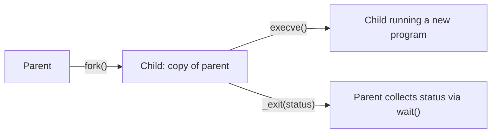
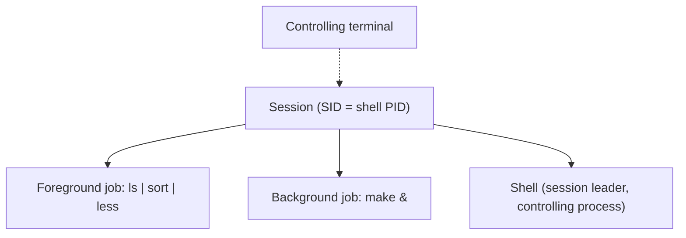

# TLPI 02 - Fundamental Concepts

> [!abstract] Chapter at a glance
> A map of the whole book. Nearly every idea here gets its own chapter later, so the aim is to know the vocabulary and how the pieces fit together, not the details.
>
> **Previous:** [[TLPI 01 - History and Standards]] · **Next:** [[TLPI 03 - System Programming Concepts]]

> [!tip] Big ideas to carry forward
>
> 1. **The kernel mediates everything.** "A process creates a pipe" is shorthand for "a process _asks the kernel_ to create a pipe."
> 2. **Hardware modes protect the kernel.** User mode can't touch kernel memory.
> 3. **Universality of I/O.** One set of calls (`open`, `read`, `write`, `close`) works on every file type. Files are byte streams, and EOF is a `read()` that returns 0.
> 4. **`fork()` copies, `execve()` replaces.** Children inherit cwd, environment, credentials, resource limits and mappings.
> 5. **Permissions use _effective_ IDs.** Root is EUID 0, and Linux splits root's power into [[#Capabilities|capabilities]].
> 6. **Nesting:** session ⊃ process group (job) ⊃ process ⊃ thread.

---

## 2.1 The core operating system: the kernel

"Operating system" has two meanings:

- the **whole package**: kernel plus shells, GUIs, file utilities and editors
- the **central software** that manages CPU, RAM and devices, also called the **kernel**. This is the meaning the book uses.

The kernel binary usually lives at `/boot/vmlinuz`. The name evolved from `unix` to `vmunix` (virtual memory) to `vmlinuz`, where _z_ marks it as compressed.

### Tasks performed by the kernel

|Task|What it means|
|---|---|
|Process scheduling|**Preemptive multitasking.** Many processes are in memory at once, and the _scheduler_ decides who gets the CPU and for how long, not the processes themselves.|
|Memory management|**Virtual memory** (see [[TLPI 06 - Processes]], §6.4): (1) processes are isolated from each other and from the kernel; (2) only part of a process needs to be in RAM, so more processes fit and CPU use improves.|
|File system|Create, retrieve, update and delete files on disk.|
|Process creation/termination|Loads programs, gives them resources, frees resources on exit.|
|Device access|A standard interface to devices, and arbitration between processes.|
|Networking|Sends and receives packets for processes, including routing.|
|System call API|Kernel entry points that processes call. **The subject of this book.** See [[TLPI 03 - System Programming Concepts]], §3.1.|

A multiuser OS also gives each user a **virtual private computer**: their own home directory, a share of the CPU, and a separate virtual address space for each program.

### Kernel mode and user mode

- **User mode:** the CPU can access only _user-space_ memory. Touching kernel space causes a **hardware exception**.
- **Kernel mode** (also called _supervisor mode_): the CPU can access user and kernel space.
- Only kernel mode can halt the system, access the memory-management hardware, or start device I/O.

### Process view vs kernel view

|A process…|The kernel…|
|---|---|
|doesn't know when it will next run|decides who runs, when, and for how long|
|doesn't know where it is in RAM or whether pages are in swap|maps each process's virtual memory to RAM and swap|
|refers to files only by name|translates names to physical disk locations|
|can't talk to other processes directly|provides every IPC mechanism|
|can't create a process or even end itself|creates and terminates processes on request|
|can't talk to devices directly|does all device I/O (through device drivers)|

> [!important]
> When later chapters say "a process can terminate by calling `exit()`", read it as "a process can **request that the kernel** terminate it."

> [!example]- Try it
>
> ```bash
> uname -r              # kernel version
> ls -l /boot/vmlinuz*
> strace -c ls          # count the system calls a simple command makes
> ```

---

## 2.2 The shell

A **shell** (_command interpreter_) reads commands and runs programs in response. On UNIX the shell is an **ordinary user process**, not part of the kernel, so different users can run different shells at once. The **login shell** is the process created to run a shell when you log in.

|Shell|Author|Notable for|
|---|---|---|
|`sh` (Bourne)|Steve Bourne|The oldest widely used shell. Redirection, pipelines, globbing, variables, command substitution, background jobs, functions. Present on every UNIX.|
|`csh` (C shell)|Bill Joy, UC Berkeley|C-like flow control. Added history, line editing, job control, aliases. **Not** Bourne compatible, so scripts stayed in `sh`.|
|`ksh` (Korn)|David Korn, AT&T|Bourne compatible plus csh-style interactive features. Basis of the POSIX.2 shell.|
|`bash`|Brian Fox, Chet Ramey (GNU)|GNU reimplementation of Bourne with interactive features. The most common shell on Linux. `sh` on Linux is usually bash emulating sh.|

Shells also run **shell scripts**: text files of commands, with variables, loops, conditionals, I/O commands and functions.

> [!example]- Try it
>
> ```bash
> echo $SHELL      # your login shell
> cat /etc/shells  # shells installed here
> ls -l /bin/sh    # often a link to bash or dash
> ```

---

## 2.3 Users and groups

### Users

Each user has a unique **login name** and numeric **user ID (UID)**, defined by a line in `/etc/passwd`, which also contains:

- **Group ID**: the GID of the user's first group
- **Home directory**: where you start after login
- **Login shell**: the program that interprets your commands

The encrypted password is usually kept in the **shadow password file** (`/etc/shadow`), which only privileged users can read.

```text
# name:password:UID:GID:comment:home:shell
mtk:x:1000:100:Michael Kerrisk:/home/mtk:/bin/bash
```

### Groups

Groups organize users for controlling access to shared files. Early UNIX allowed one group per user. BSD introduced membership in multiple groups, which POSIX.1-1990 adopted. Each line of `/etc/group` has:

- **Group name**
- **Group ID (GID)**
- **User list**: comma-separated login names of members, apart from users whose `/etc/passwd` GID already names this group

### Superuser

- **UID 0**, normally named `root`.
- Bypasses **all** permission checks: can access any file and signal any process.

> [!example]- Try it
>
> ```bash
> id                          # your UID, GID and groups
> grep "^$USER:" /etc/passwd
> ls -l /etc/passwd /etc/shadow
> ```

---

## 2.4 Single directory hierarchy, directories, links, and files

Linux has **one** directory tree rooted at `/`, unlike Windows, where each drive has its own tree.

### File types

Every file has a type: **regular** (plain), **directory**, **symbolic link**, **device**, **pipe** or **socket**. "File" can mean any of these.

### Directories and links

- A **directory** is a special file holding a table of _filename → reference to file_.
- Each entry is a **link**, also called a **hard link**. A file can have many links, so many names, in the same or different directories.
- Every directory contains `.` (itself) and `..` (its parent). For `/`, `..` points to itself, so `/..` is `/`.

### Symbolic links

- A **symbolic (soft) link** is a specially marked file whose contents are the **name of another file**, its _target_.
- The kernel usually **dereferences** (_follows_) symlinks in pathnames automatically and recursively, with a limit to stop circular chains.
- A symlink to a file that doesn't exist is a **dangling link**.

||Hard link|Symbolic link|
|---|---|---|
|What it is|A directory entry pointing to the file|A small file containing a pathname|
|If the original name is removed|File survives while any hard link remains|Link becomes dangling|

Why both exist: [[TLPI 18 - Directories and Links]].

### Filenames

- Up to **255 characters** on most Linux file systems.
- Any character except `/` and `\0`.
- Use the SUSv3 **portable filename character set** `[-._a-zA-Z0-9]` (65 characters). Other characters may need _escaping_ with `\`.
- Don't start names with `-`, because commands will read them as options.

### Pathnames

- A string with an optional leading `/` followed by filenames separated by `/`.
- **Directory part** = everything before the last `/`. **Base part** = the final component.
- **Absolute pathname**: starts with `/` and is resolved from root, e.g. `/home/mtk/.bashrc`.
- **Relative pathname**: no leading `/`, resolved from the current working directory, e.g. `../mtk/.bashrc` from `/home/avr`.

### Current working directory

- Each process has one. It's where relative pathnames are resolved from.
- **Inherited from the parent.** A login shell starts in the home directory from `/etc/passwd`, and `cd` changes it.

### File ownership and permissions

Each file has an owner UID and a GID. There are three user classes, **user (owner)**, **group** and **other**, each with **r / w / x** bits, for 9 bits in total.

```text
-  rwx  r-x  ---
│  │    │    └── other
│  │    └─────── group
│  └──────────── user (owner)
└─────────────── file type
```

|Bit|On a file|On a directory|
|---|---|---|
|`r`|read contents|list filenames|
|`w`|modify contents|add, remove, rename entries|
|`x`|execute (program or script)|_search_: access files inside|

> [!warning] Common mix-up
> Deleting a file needs **write permission on the directory**, because it changes the directory's table, not the file.

> [!example]- Try it
>
> ```bash
> ls -la ~                           # . and .. and permission strings
> ls -di / /..                       # same inode number: /.. is /
> ln -s nowhere dangle && ls -l dangle   # make a dangling link
> ```

---

## 2.5 File I/O model

**Universality of I/O:** the same system calls, `open()`, `read()`, `write()` and `close()`, work on **all** file types, including devices. The kernel translates them into file-system or device-driver operations.

- The kernel provides one file type: a **sequential stream of bytes**. Disk files, disks and tapes can also be accessed randomly with `lseek()`.
- Newline (ASCII 10, _linefeed_) ends a line. That's a convention of applications and libraries.
- **There is no end-of-file character.** EOF is a `read()` that returns no data.

### File descriptors

An open file is referred to by a **file descriptor**: a small non-negative integer, usually returned by `open()`. A process started by the shell inherits three:

|fd|Name|stdio stream|
|---|---|---|
|0|standard input|`stdin`|
|1|standard output|`stdout`|
|2|standard error|`stderr`|

### The stdio library

`fopen()`, `fclose()`, `scanf()`, `printf()`, `fgets()`, `fputs()` and friends are **layered on top of** the I/O system calls. The book assumes you already know stdio.

> [!example]- Try it
>
> ```bash
> ls -l /proc/self/fd     # fds 0, 1, 2 of the ls process itself
> ls nope 2> err.txt      # redirect fd 2 only
> ```

---

## 2.6 Programs

- **Source code:** human-readable text, e.g. C.
- **Binary machine code:** produced by compiling and linking. It is treated as the same program as its source.
- **Script:** a text file of commands processed directly by an interpreter such as the shell.

### Filters

A **filter** reads `stdin`, transforms the data, and writes `stdout`. Examples: `cat`, `grep`, `tr`, `sort`, `wc`, `sed`, `awk`.

### Command-line arguments

```c
int main(int argc, char *argv[])
/* argc    : number of arguments, including the program name
   argv[0] : the program's own name
   argv[1..argc-1] : the arguments, as strings */
```

---

## 2.7 Processes

A **process** is an instance of an executing program. When a program runs, the kernel loads its code into virtual memory, allocates space for variables, and sets up bookkeeping such as the PID, termination status, user IDs and group IDs.

- **Limited resources** such as memory are allocated and adjusted over the process's lifetime.
- **Renewable resources** such as CPU and network bandwidth are shared fairly.
- Everything is released when the process terminates.

### Process memory layout

```text
 high addresses
┌──────────────┐
│    Stack     │  grows/shrinks with function calls; locals + call linkage
├──────────────┤
│      ↓       │
│      ↑       │
├──────────────┤
│     Heap     │  dynamic allocation (malloc)
├──────────────┤
│     Data     │  static / global variables
├──────────────┤
│     Text     │  program instructions (read-only)
└──────────────┘
 low addresses
```

### Process creation and program execution

- `fork()` creates a **child** as a duplicate of the **parent**. The child gets **copies** of the data, stack and heap. The read-only **text is shared**.
- The child then either runs other functions in the same code, or calls `execve()` to load a new program. That **destroys** the existing text, data, stack and heap and replaces them.
- Library wrappers such as `execl` and `execvp` all start with _exec_. "`exec()`" is shorthand, and **no function is actually named `exec()`**.



### Process ID and parent process ID

- **PID:** a unique integer process ID.
- **PPID:** the PID of the process that asked the kernel to create this one.

### Process termination

- A process ends by calling `_exit()` (or the library function `exit()`), or by being **killed by a signal**.
- It yields a **termination status**, a small non-negative integer the parent reads with `wait()`.
- The **exit status** is specifically the argument given to `_exit()`. The _termination status_ is either that value or an indication of the signal that killed the process.
- By convention **0 = success** and nonzero = error. The shell stores the last status in `$?`.

### Credentials

|ID|Purpose|Comes from|
|---|---|---|
|Real UID / GID|Who the process belongs to|Parent. A login shell gets them from `/etc/passwd`.|
|Effective UID / GID|**Used for permission checks**, together with supplementary GIDs|Usually equal to the real IDs. Can be changed, e.g. by set-user-ID.|
|Supplementary GIDs|Additional groups|Parent. A login shell gets them from `/etc/group`.|

> [!warning] Common mix-up
> Permission checks use the **effective** IDs. A **privileged process** is one whose **effective UID is 0**.

### Privileged processes

A process becomes privileged by being created by a privileged process (e.g. a login shell started by root), or through the **set-user-ID** mechanism. That gives the process an effective UID equal to the UID of the program file it is executing.

### Capabilities

- Since kernel 2.2, root's privileges are split into distinct **capabilities**.
- A privileged operation is allowed only if the process has the matching capability. EUID 0 means all capabilities.
- Names start with `CAP_`, e.g. `CAP_KILL`. Details in [[TLPI 39 - Capabilities]].

### The init process

- Created by the kernel at boot from `/sbin/init`. It is the "parent of all processes".
- Always **PID 1**, runs with superuser privileges, and **can't be killed, even by root**. It ends only at shutdown.
- Creates and monitors the processes a running system needs.

### Daemon processes

A **daemon** is a special-purpose process that is:

- **long-lived**, often running from boot to shutdown
- **in the background** with **no controlling terminal**

Examples: `syslogd` (system log) and `httpd` (web server).

### Environment list

- A set of `NAME=value` **environment variables** stored in the process's **user-space** memory.
- `fork()` gives the child a **copy**, which is one way a parent passes information to a child.
- On `exec()` the new program either keeps the old environment or receives a new one.
- Shell: `export MYVAR='Hello world'` (`setenv` in csh). C: `extern char **environ;`
- Examples: `HOME` and `PATH`.

### Resource limits

- Set with `setrlimit()`. Each resource has a **soft limit**, which is the actual cap, and a **hard limit**, which is the ceiling for the soft limit.
- An unprivileged process can set the soft limit anywhere from 0 to the hard limit, but can **only lower** the hard limit.
- Inherited across `fork()`. The shell command is `ulimit` (`limit` in csh).

> [!example]- Try it
>
> ```bash
> echo $$; ps -o pid,ppid,cmd     # your shell's PID and its parent
> false; echo $?                  # prints 1
> ps -p 1 -o pid,user,cmd         # init (often systemd)
> ls -l /usr/bin/passwd           # the 's' bit = set-user-ID root
> ulimit -Sn; ulimit -Hn          # soft and hard open-file limits
> env | head                      # your environment list
> ```

---

## 2.8 Memory mappings

`mmap()` creates a new mapping in the calling process's virtual address space.

||File mapping|Anonymous mapping|
|---|---|---|
|Backed by|A region of a file|Nothing|
|Initial contents|File data, loaded page by page on demand|Zeros|

Sharing happens when two processes map the same file region, or when a child inherits a mapping through `fork()`.

||Private mapping|Shared mapping|
|---|---|---|
|Changes visible to other processes?|No|Yes|
|Changes written to the file?|No|Yes|

**Uses:** loading a program's text from its executable, allocating zero-filled memory, memory-mapped file I/O, and IPC through shared mappings.

---

## 2.9 Static and shared libraries

An **object library** is a file of compiled object code for a set of related functions.

||Static library (_archive_)|Shared library|
|---|---|---|
|At link time|Linker **copies** the needed modules into the executable (_statically linked_)|Linker just **records** that the library is needed|
|At run time|Nothing extra|The **dynamic linker** loads the library and resolves the calls|
|Disk and memory|Duplicated in every program|One copy on disk and one in memory, shared|
|Updating a function|**Relink** every program|Rebuild the library; programs pick it up on their next run|

> [!example]- Try it
>
> ```bash
> ldd /bin/ls     # shared libraries ls needs at run time
> ```

---

## 2.10 Interprocess communication and synchronization

Files can carry data between processes, but they're slow and inflexible, so Linux provides:

|Mechanism|Used for|
|---|---|
|Signals|Indicating that an event occurred|
|Pipes (`\|`) and FIFOs|Transferring data|
|Sockets|Transferring data on the same host or across a network|
|File locking|Locking file regions against other processes|
|Message queues|Exchanging messages (packets of data)|
|Semaphores|Synchronizing processes|
|Shared memory|Sharing memory; changes are visible immediately|

> [!info] Why so many overlapping mechanisms?
> History. **FIFOs came from System V** and **sockets came from BSD**, and both survived although they do much the same job for unrelated local processes.

---

## 2.11 Signals

- "**Software interrupts**": a notification that an event or exceptional condition happened.
- Each type is an integer with a symbolic name `SIGxxxx`.
- Sent by the **kernel**, **another process** (with permission), or the **process itself**.

The kernel sends a signal when, for example:

- the user types the interrupt character (**Control-C**)
- a **child terminates**
- a **timer** set by the process expires
- the process accesses an **invalid memory address**

Send from the shell with `kill`, or from C with `kill()`.

**Default actions** (depending on the signal): ignore it, be killed, or be suspended until resumed by a special signal. For most signals a program can instead **ignore** the signal or install a **signal handler**, a function run automatically when the signal is delivered.

- **Pending:** generated but not yet delivered. Normally delivered at the process's next scheduling, or immediately if it's running.
- **Blocked:** a signal in the **signal mask** stays pending until it is unblocked.

> [!example]- Try it
>
> ```bash
> kill -l            # list signal names and numbers
> sleep 100 &
> kill -TERM %1      # send SIGTERM to that job
> ```

---

## 2.12 Threads

- A process can have multiple **threads**. Think of them as processes sharing one virtual memory.
- Threads **share** code, data and heap, but **each has its own stack**.
- They communicate through shared globals, synchronized with **mutexes** and **condition variables**, and can also use any mechanism from [[#2.10 Interprocess communication and synchronization|§2.10]].
- **Advantages:** easy data sharing; some algorithms fit threads more naturally than multiple processes; parallelism on multiprocessor hardware.

---

## 2.13 Process groups and shell job control

- Each command the shell runs gets its own process. `ls -l | sort -k5n | less` creates **three**.
- **Job control** is in every major shell except Bourne. It lets you run and manage multiple commands at once.
- A pipeline's processes are placed in one **process group** (a _job_). Members share a **process group ID** equal to the PID of the **process group leader**.
- The kernel can signal a **whole group** at once. That's how the shell suspends or resumes an entire pipeline.

---

## 2.14 Sessions, controlling terminals, and controlling processes

- A **session** is a collection of process groups. All members share a **session ID**, the PID of the **session leader** that created it. With job control, the shell is the session leader.
- The **controlling terminal** is established when the session leader first opens a terminal device. A terminal controls **at most one** session.
- The session leader becomes the **controlling process** and receives **`SIGHUP`** if the terminal disconnects, e.g. when the window closes.
- One **foreground process group** can read from and write to the terminal. **Control-C** kills it and **Control-Z** stops (suspends) it.
- Any number of **background jobs**, started by ending a command with `&`.



> [!example]- Try it
>
> ```bash
> sleep 100 | cat &
> ps -o pid,pgid,sid,tty,cmd    # both share a PGID; all share your shell's SID
> jobs; fg %1                   # then Ctrl-Z, then bg
> ```

---

## 2.15 Pseudoterminals

- A **pseudoterminal** is a connected pair of virtual devices, **master** and **slave**, forming a two-way IPC channel.
- The slave **behaves like a terminal**, so a terminal-oriented program runs on it while a _driver program_ on the master acts as the user.
- Data goes through normal terminal processing. For example, in the default mode a carriage return becomes a newline.
- Used by terminal windows and network logins such as `ssh` and `telnet`.

> [!example]- Try it
>
> ```bash
> tty      # e.g. /dev/pts/0: you're on a pseudoterminal slave
> ```

---

## 2.16 Date and time

- **Real time**
    - **Calendar time:** seconds since **the Epoch**, midnight 1 January 1970 UTC.
    - **Elapsed (wall-clock) time:** measured from some point, typically when the process started.
- **Process (CPU) time:** total CPU used since the process started.
    - **System CPU time:** time in **kernel mode** (system calls and kernel services).
    - **User CPU time:** time in **user mode** (your code).
- The `time` command reports real, user and sys time.

> [!example]- Try it
>
> ```bash
> date +%s                              # seconds since the Epoch
> time find / -name x 2>/dev/null       # real vs user vs sys
> ```

---

## 2.17 Client-server architecture

- **Client:** sends a _request_ message asking for a service.
- **Server:** examines the request, acts, and sends back a _response_.
- Usually many clients talk to one or a few servers, on the same host or across a network, using [[#2.10 Interprocess communication and synchronization|IPC]].
- Services include databases, remote files, business logic, shared hardware (printers) and web pages.

**Why put a service in a server:**

- **Efficiency:** one managed resource is cheaper than one per machine.
- **Control, coordination and security:** one place to prevent conflicting updates and restrict access.
- **Heterogeneous environments:** clients and server can run on different hardware and OSes.

---

## 2.18 Realtime

- **Realtime applications** must respond to input within a **guaranteed deadline**. Examples: assembly lines, ATMs, aircraft navigation.
- Speed alone isn't the definition. The _guarantee_ is.
- Traditional UNIX isn't realtime, because realtime needs conflict with multiuser time-sharing. Realtime Linux variants exist, and mainline Linux is moving toward native support.
- **POSIX.1b** added asynchronous I/O, shared memory, memory-mapped files, memory locking, realtime clocks and timers, alternative scheduling policies, realtime signals, message queues and semaphores.

> [!note] Terminology
> **real time** (two words) = calendar or elapsed time · **realtime** (one word) = guaranteed-response systems

---

## 2.19 The /proc file system

- A **virtual file system** mounted at `/proc` that exposes **kernel data structures** as files and directories.
- `/proc/PID` holds information about each running process.
- Files are mostly human-readable text, so programs and scripts just open, read and write them. Modifying usually requires privilege.
- **Linux-specific** and not standardized. More in [[TLPI 12 - System and Process Information]], §12.1.

> [!example]- Try it
>
> ```bash
> head /proc/self/status    # info about the head process itself
> head /proc/cpuinfo
> ls /proc | head           # numeric names are PIDs
> ```

---

## Self-test

> [!question]- Preemptive vs multitasking: what's the difference?
> **Multitasking:** many processes are in memory and share the CPU. **Preemptive:** the kernel scheduler, not the processes, decides who runs and for how long.

> [!question]- How does a program detect end-of-file?
> `read()` returns 0. There is no EOF character. A return of -1 means an error.

> [!question]- Which permission do you need to delete a file?
> Write (and execute/search) permission on the **directory** containing it.

> [!question]- After `fork()`, what does the child share rather than copy?
> The read-only **text** segment. Data, stack and heap are copies.

> [!question]- Which IDs are used for permission checks?
> Effective UID, effective GID, and supplementary GIDs.

> [!question]- What happens to a blocked signal?
> It stays **pending** until it is removed from the signal mask.

> [!question]- What is the difference between exit status and termination status?
> Exit status is the value passed to `_exit()`. Termination status is either that value or an indication of the signal that killed the process.

> [!question]- Who receives SIGHUP when a terminal window closes?
> The **controlling process**, i.e. the session leader, usually the shell.

---

## Further reading (from the chapter)

- Tanenbaum (2007); Tanenbaum & Woodhull (2006): OS concepts and design
- Vahalia (1996): UNIX internals, detailed on virtual memory
- Goodheart & Cox (1994): System V Release 4
- Maxwell (1999): annotated Linux 2.2.5 kernel source
- Lions (1996): Sixth Edition UNIX source
- Bovet & Cesati (2005): Linux 2.6 kernel implementation
- Kernighan & Ritchie (1988); Harbison & Steele (2002); Plauger (1992); Stevens & Rago (2005): the stdio library
