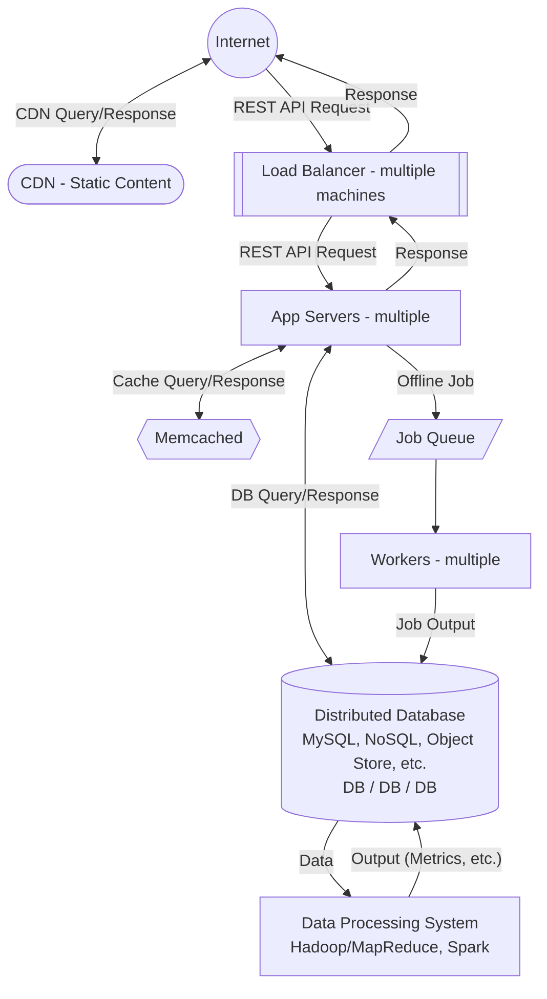

# Anatomy of a Scalable Web Application

> [!info] Source
> Interview Camp, Chapter 3: System Design Intro. This note uses only what is on the lecture page: the lesson text, the "Diagram for a Scalable Web Backend", and the instructor's (Harsh Goel) answers in the discussion. The two videos are not transcribed here, so add your own notes from them under [[#Video notes]].

## 1.1 Why this lecture matters

- Look at how web backends are **generally designed** before tackling system design interviews.
- **Learn the diagram**, because it extends to many different backends.
- The course reuses it later for **Uber/Lyft**, **e-commerce stores**, **social networks** and **messaging backends**.
- You can use the diagram **directly in your interviews**.

## 1.2 The two videos

| Video | Topic | Key idea |
|---|---|---|
| 1 | **Single server** | Interviewers often want you to **start small with one machine** and scale from there. Clients (phone, laptop) → Internet → HTTP request → one server. |
| 2 | **Scalable backend (multiple machines)** | **Separate out each component** of the single-machine architecture onto its own machines to make it more scalable. |

> [!tip] Interview move
> Start with one machine, then scale by splitting each component out.

## 1.3 Diagram for a Scalable Web Backend

### Flows to memorize

1. **Static content:** Internet ↔ **CDN** (CDN query/response).
2. **Main request path:** Internet → REST API request → **Load Balancer** → **App Servers** → response back the same way.
3. **Caching:** App Servers ↔ **Memcached** (cache query/response).
4. **Storage:** App Servers ↔ **Distributed Database** (DB query/response).
5. **Async work:** App Servers → *offline job* → **Job Queue** → **Workers** → *job output* → Database.
6. **Analytics:** Database → *data* → **Data Processing System** (Hadoop/MapReduce, Spark) → *output (metrics, etc.)* → Database.

## 1.4 Component by component (from the instructor's answers)

### CDN (static content)
- CDNs are **3rd-party servers located around the world** that serve cached content.
- Typically host **images and videos**, and give **quicker access to users in different locations**.
- Example company: **Akamai**.
- It is separate from the rest of the diagram because it's run by a third party and sits close to users, not in your backend.

### Load Balancer
- Drawn as a stack because it **can consist of several machines**, depending on **load and redundancy** needed.
- It sends each request to **any** app server (1 to N).
- **How does a client pick a load balancer machine?** It can be **assigned one randomly**. If that machine is overloaded it can reassign, but the better approach is usually to **add more machines and keep assignment random**.
- Load can also be spread across several load balancers **using DNS** (a student's answer the instructor +1'd).

### App Servers
- **Stateless.** They just handle requests, whether you have 1 or N.
- **The same version of the application runs on every app server**, so any request is handled the same way.
- Adding servers raises **throughput**, the number of requests the system can process.
- They **manage the cache** (see below).

### Memcached (in-memory cache)
- **Managed by the app servers.** The app server decides what to cache (for example the most frequently used items) and puts it there.
- The cache holds a **subset of the DB data**, usually loaded from the DB, with the app servers coordinating the loading.
- Read flow: app server checks Memcached first, and **on a miss reads the DB**.
- **The web application handles cache misses, not the cache server.** A cache that queried the DB itself would need its own code, monitoring and network access to the DB, and would be tied to one database. At that point it's an app server, not a cache.
- **Memcached or Redis?** Either works. Memcached was picked because it's universally known. **In an interview just say "in-memory cache".**
- Workers **may** use Memcached too, depending on the situation. Workers and Memcached are **independent systems**, not connected, and may or may not share a cluster.

### Distributed Database
- Can be **MySQL, NoSQL, an object store, etc.**
- Several DB boxes in the diagram means **sharding**.

### Job Queue
- Takes **offline jobs** from the app servers so they happen asynchronously.
- In large systems it is **its own system with its own machines** (often a separate cluster), not something in app-server memory.
- The queue itself **can be distributed**. Examples: **Kafka, RabbitMQ**.
- **It needs redundancy.** Queues have built-in replicas, so if a machine goes down another replica has the same data.
- Queue + workers can follow a **publish-subscribe** model.
- **Kafka vs RabbitMQ** is product-specific knowledge that interviews don't usually ask about unless you specialize in them.

### Workers
- Consume and process tasks from the queue, then write **job output** to the DB.
- Typically **run software provided by the queue system**, for example Kafka's `KafkaConsumer` client.
- Think of them as another fleet of app servers dedicated to async tasks (a student's answer the instructor +1'd).
- **If a worker fails:** **retry**. If it still fails, **notify the user**, for example by writing to a **per-user error table** that the app server checks and returns to the user with a mitigation action.

### Data Processing System
- **Hadoop/MapReduce, Spark.**
- Reads **data** from the DB and writes **output (metrics, etc.)** back.
- Data collection can be added to **pretty much every component**, not just the DB.

## 1.5 Concepts from the discussion

> [!note] Distributed system
> Any system **split across different machines and coordinating to work as a single system**. Examples: a distributed file system, a distributed cache, a group of web server machines serving requests.

> [!note] Monolith/microservices vs single/multiple servers
> Different concepts.
> - **Microservices** are *one level above*: how logic is grouped, i.e. **software architecture**.
> - **Single vs multiple servers** is *one level below*: **infrastructure design**.
> - Once you've decided on X servers, you can split the logic into smaller services if needed.

> [!note] REST
> REST is **not a component**, it's an **architecture style**. You should know the basics of how the other components work.

> [!example] Consistency trap: `addFriend` through a queue
> **Problem:** if adding a friend is queued and the queue lags, a user who visits their page right away won't see the new friend yet. That's a consistency/latency issue.
> - **Safest:** **acknowledge only after the relationship is actually updated** in the DB.
> - **Trick to avoid the delay:** write the relationship to **Memcached/Redis**, add the task to the queue, and acknowledge. An immediate read hits the cache.
> - **If the DB update later fails:** retry, then send the user an error.
> - For a sensitive action like adding a friend, **returning only after the DB update is the better choice**.

> [!tip] New grads
> Expectations and the bar are lower for new grads, and it varies by company. Still know the basics of each component.

> [!question]- Self-test: draw the diagram from memory
> Internet → CDN (static) · Internet → LB → App Servers ↔ Memcached, App Servers ↔ Distributed DB · App Servers → Job Queue → Workers → DB · DB ↔ Data Processing (Hadoop/Spark) → metrics.

> [!question]- Self-test: why doesn't the cache load from the DB itself?
> The app handles misses. Otherwise the cache needs its own logic, monitoring and DB access, and gets tied to one database, which makes it an app server.

> [!question]- Self-test: what do you do when a worker keeps failing?
> Retry. If it still fails, write to a per-user error table that the app server checks and returns to the user with a mitigation action.

## Video notes

- Video 1 (single server):
- Video 2 (scalable backend):

---
