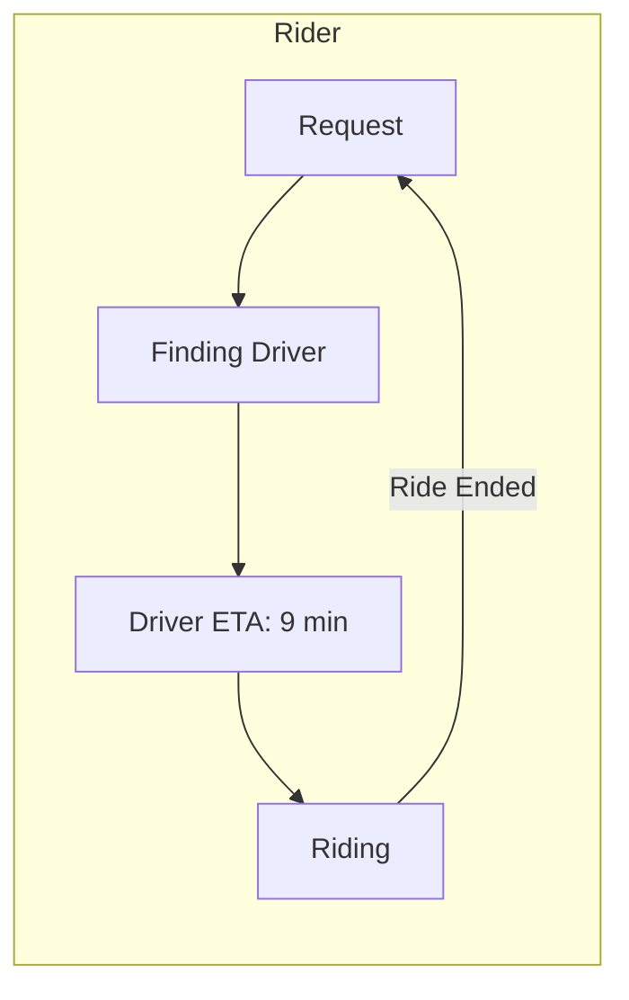
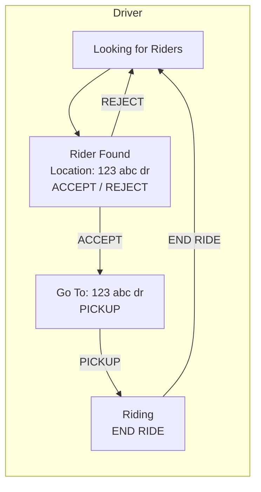
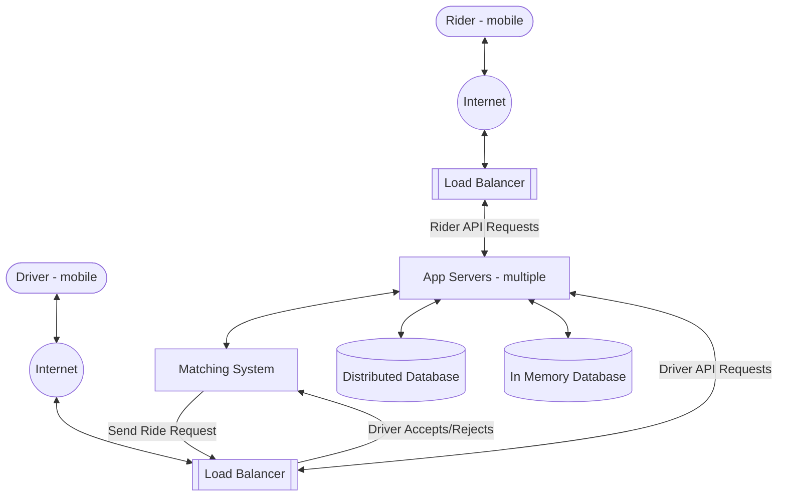

# Approach for System Design Interviews + Uber-Lyft Design

> [!info] Source
> Interview Camp, Chapter 3: System Design Intro. This note uses only the lecture page: the written walkthrough, its two diagrams (the screen flows and the high-level design), and the instructor's (Harsh Goel) answers in the discussion. The videos aren't transcribed, so add your own notes under [[#Video notes]].
> **Prerequisite:** [[Anatomy of a Scalable Web Application]]

## 2.1 The framework: FUSHD

System design interviews are subjective, but following this framework **avoids a lot of common pitfalls**.

| Step | What you do |
|---|---|
| **F**eatures | Pick **2-3 core features** and agree on them with the interviewer |
| **U**se cases | Walk through the flows (here, **states**) and sketch simple screens |
| *(Design assumption)* | Ask whether it must **scale to millions of users** |
| **S**tore | Quickly list the **essential data**, with no tables yet |
| **H**igh-level design | Extend the **scalable web backend** diagram to this problem |
| **D**etail design | Go deep on whichever component the interviewer picks |

> [!note] Scope
> This assumes a **general system design interview, which is mostly backend**. For a **frontend** role you'd focus more on the UI; ask the interviewer what they expect.

---

## 2.2 Features (2-3 core features)

- The question is **very open-ended**, so **narrow it to 2-3 core features**, design around those, and add more later.
- **Talk to the interviewer while negotiating features.** They may want a particular feature or not care about another.
- **Ask if it's OK to stick to these features and add more later.** It's implied, but saying it gets you on the same page.
- **Propose features yourself and ask for confirmation** rather than asking the interviewer what they want. They may then suggest features.

> [!tip] How to pick core features
> - Which features does a **Minimum Viable Product (MVP)** require?
> - Which feature would the system be **incomplete without**? A ride-hailing service is incomplete if you can't hail a ride and get in the cab.

**Uber/Lyft features chosen:**
1. **User (Rider) and Driver profiles.** These come for free with the scalable web application framework and help pin down what to store.
2. **Rider can hail a ride (find a nearby driver); driver can give a ride.**

## 2.3 Use cases (states)

A ride-hailing app is **very state-based**. Rider and driver move through states, and **the backend coordinates the transitions**.

| Rider | Driver |
|---|---|
| Request ride | Accept/reject request |
| Get ETA | Pick up rider |
| Ride to destination | Drive to destination |
| Ride ends | End ride |

- The **ETA** and **accept/reject** are extras that may not be in an MVP. Skip them to keep it simpler and add them later.
- For a mobile app, **draw simple screens for each state** (text and buttons). It makes the functionality clear, and you can improve the UI later.

### Screen flows (from the lecture sketch)

### How the flow works

1. The rider presses **"Request Ride"**, which starts the state machine.
2. The system finds an **available driver close to the rider** and sends that driver a request.
3. If the driver **accepts**, the system sends the rider the **driver's ETA** (updated periodically) and gives the driver the **rider's location**.
4. The driver presses **"Pickup"**, and both go to a **Riding** screen.
5. The driver presses **"End Ride"** after drop-off.

> [!note] Out of scope
> **No maps or directions** in this system. The driver is assumed to use Google Maps.

## 2.4 Design assumption: scale

- **Clarify whether the system must scale to millions of users.** If so, design for scalability, which is where the **Scalable Web Backend** fits best. Most interviews require it.
- **Skip detailed estimations up front** (memory for 1M users, bandwidth). If you want them, do them later during detail design. The reason: **if a system has to be scalable, the high-level design is the same anyway.**

> [!warning] Capacity estimation (from the discussion)
> - Most interviewers won't expect detailed estimations right away, but **about 20-25% do**, often because they learned it from Grokking.
> - Capacity estimation as a fixed opening step is specific to Grokking. **Don't treat Grokking as the standard interview format**, but **be prepared** in case you're asked.
> - The course has a separate "Capacity Estimation" lecture on why and how.

## 2.5 What to store

Defining what to store shows what the backend should look like. **Don't define DB models or tables yet**, just list the essential data.

| Driver | Rider |
|---|---|
| Name | Name |
| Email | Email |
| **Location** (to track them and send ETAs) | |
| **State** | **State** |

Also optional: a **Ride** object that summarizes each ride, useful later for **data analysis**.

### States (derived from the screen flow)

| Rider state | Meaning | Driver state | Meaning |
|---|---|---|---|
| `NOT_RIDING` | Not riding | `NOT_DRIVING` | Not driving |
| `REQUESTING` | Requesting a driver | `WAITING` | Waiting for riders |
| `WAITING` | Waiting for driver | `REQUESTED` | Ride request (accept/reject) |
| `RIDING` | Riding | `PICKING_UP` | Picking up |
| | | `RIDING` | Driving |

> [!warning] Same name, different meaning
> Rider `WAITING` = waiting for the driver to arrive. Driver `WAITING` = available and waiting for riders.

## 2.6 High-level design

It's the **scalable web application framework extended to cab hailing**.

| Component | Role |
|---|---|
| **Distributed Database** | **Rider and driver profiles** (name, email, etc.). Scales well as users are added. |
| **In-Memory Database** (e.g. **Redis**) | Fast lookups and updates for (1) **states of active riders and drivers** and (2) **driver locations** (for ETAs). Both change often in short periods. |
| **App Servers** | **Stateless REST API**, so any app server can handle any request and you scale by adding machines. |
| **Matching System** | Keeps a **pool of available drivers** (`WAITING`) and finds a driver near the rider. Stores active driver locations in a **spatial index**. |
| **Load Balancers** | Route rider and driver API requests. The matching system talks to drivers through a load balancer. |

### Flow: rider requests a ride

1. The app server sets the rider to **`REQUESTING`**.
2. It asks the **Matching System** to find a driver.
3. The Matching System picks a **nearby available driver** and sends a request. If the driver **rejects**, it keeps trying **new drivers until one accepts or it runs out of nearby drivers**.
4. When a driver accepts, the Matching System **returns the driver info to the app server**.
5. The app server sets the driver to **`PICKING_UP`** and the rider to **`WAITING`**, and **tells the rider a driver is on the way**.

> [!tip] Every state change sends a notification
> - **Tell the rider/driver about every state change** so the mobile UI updates.
> - **Include whatever data the device needs.** For example, when the rider moves to `WAITING`, calculate the **driver's ETA** and send it with the notification.

**General pattern for every API request:** request → app server, which then does some of:
- **state updates** in the in-memory DB
- **profile updates** in the NoSQL/distributed DB
- **calls to or from the Matching System**
- **notifying riders/drivers** of state changes

### Flow: driver location updates

- **Periodically ping the location of every active driver** (anyone not in `NOT_DRIVING`).
- The mobile app **calls an HTTP handler** with the current location.
- App servers **write it to the in-memory DB** and **also send it to the Matching System**.
- The Matching System keeps each active driver's location in a **spatial index** so it can find drivers near a user.

## 2.7 Detail design

After the high-level design, the interviewer usually asks you to **dig into one subsystem**. The course covers each one in its own section:

| Component | Course section |
|---|---|
| Load balancer, app servers | Load Balancer |
| Matching system | Spatial Indexing: Nearest Neighbors Search |
| Distributed database | Databases: Intro to Indexing and NoSQL; Wide Column Stores |
| In-memory DB | Key-Value Stores incl. Object Stores, In Memory DBs |

## 2.8 Additional question

> [!question]- How do you check that a rider is actually riding when the driver presses "Riding"?
> Check that the **rider's and driver's locations are the same**.

---

## 2.9 Instructor Q&A from the discussion

> [!note] In-memory DB vs cache
> 1. **Persistence:** an in-memory DB usually **persists data to disk**; a cache usually doesn't. "DB" implies the data is stored somewhere durable.
> 2. **Purpose:** a cache **speeds up common lookups** and takes no responsibility for storing data.
> - Just want faster requests? **Cache.** Using it to *store* data, with no separate DB? **In-memory DB.**

> [!note] What "memory" means
> The **RAM of the machine running the cache**. You can run Redis on dedicated machines or on machines that also do other work.

> [!note] What if the in-memory DB crashes?
> In-memory DBs **persist to disk**, so the states are saved there too.

> [!note] Isn't driver location stale in an in-memory DB?
> It's **overwritten with the latest value every time**. The in-memory DB keeps reads and writes fast for data that changes often.

> [!note] Why not WebSockets for location?
> WebSockets are good if you want location **pushed** to the device. This design is **pull-based**, which is why it uses the in-memory DB. See the Messaging Application section.

> [!note] How does the Matching System reach the driver?
> It's the server sending a message to a client: a **mobile push notification**, or better, a **WebSocket connection**. See the Messaging App section.

> [!note] When should something be its own system?
> When it's a **core part of the functionality and not simple CRUD**. Examples: the matching system, a **ranking system for feeds**.
> - The matching system only matches drivers with riders. **Every other call** (location updates, profile, etc.) **goes through the app servers**.

> [!note] Why does the Matching System talk to drivers through a load balancer?
> - It **interacts with the driver directly** and is assumed to have **its own API handlers**.
> - Routing it through the app servers would also work.
> - It could share the app servers' load balancers; it's just drawn separately.
> - It's a **black box** that can contain multiple machines, including for backup.
> - Putting matching inside the app servers, or scaling the matching service separately, is fine **as long as you can justify it**. There's no single right answer.

> [!note] Risks and what-if questions
> - Interviews may go into risks, usually as specific questions like **"How do you mitigate data loss?"** or **"How do you handle disk failure?"**
> - Scenarios like losing internet mid-ride, a car breaking down mid-ride, or a driver taking the wrong route are valid ways to **handle specific use cases**.
> - **Practice "self-mocks":** ask yourself what-if questions and solve them.
> - Example: a rider turns off location services, so the system can't check the ride. **Notify them to turn it back on.**

> [!note] Style
> - More diagrams are good if the interviewer is OK with them.
> - Interviewers **don't expect formal approaches** (C4, SEI); most people don't use them.

> [!tip] Frontend roles
> System design becomes **frontend design**: building with React/Angular, plus JavaScript-specific questions.

## Video notes

- Video 1 (approach):
- Video 2 (Uber/Lyft walkthrough):

---
