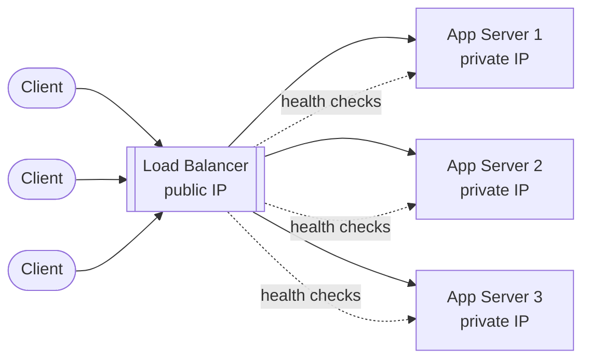
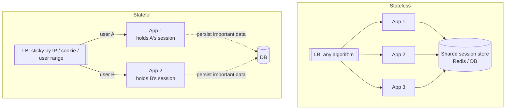

# Load Balancers and App Servers

> [!info] How this note is built
> - **🎓 Course:** the lecture page's outline and the instructor's (Harsh Goel) answers in the discussion.
> - **🌐 Outside:** material from other sources, used to fill in the videos I couldn't watch. It's cited under [[#Sources]].
> - Scenarios and case studies are at the end. Add your own notes under [[#Video notes]].
> - **Prerequisites:** [[Anatomy of a Scalable Web Application]], [[Approach for System Design Interviews + Uber-Lyft Design]]

## 3.1 What the lecture covers 🎓

| Video | Topic |
|---|---|
| 1 | **Intro to load balancing**: uses and benefits |
| 2 | **How to decide which server processes a request** (algorithms). Assumes requests are **REST**. |
| 3 | **Load balancing for stateful app servers** (persistence) |

Two small points from the discussion:

> [!note] What is an "app server"? 🎓
> - A **compute server, similar to Amazon EC2**. It can host a web service or a backend microservice.
> - The **application logic runs on the app server**.

> [!note] REST or SOAP? 🎓
> Requests don't have to be REST, but **REST is the industry standard** and interviewers strongly favor it.

---

## 3.2 What a load balancer is and why you use one

A load balancer sits between clients and a **pool of identical app servers** and decides **which server handles each request**.

🎓 **The LB is in the request path.** It forwards the client's request to an app server, gets the response and sends it back.
- It does **not** hand the client an app server's IP, because **exposing app server IPs is a security issue**.
- **DNS load balancing** is a different thing that happens *before* traffic reaches your backend. See [[#3.7 Making the load balancer itself redundant|Making the load balancer itself redundant]].

### Uses and benefits 🌐

| Benefit | What it means |
|---|---|
| **Horizontal scaling / throughput** | Add servers to the pool to handle more requests (🎓 the same point as in [[Anatomy of a Scalable Web Application]]) |
| **Redundancy and failover** | Health checks find dead servers and traffic goes to healthy ones |
| **No single overloaded server** | Load is spread by an algorithm (section 3) |
| **Security** | Clients only see the LB's public IP; app servers use private IPs |
| **SSL/TLS termination** | The LB does the encryption work so app servers don't have to |
| **Content-based routing** (L7) | Send `/video/*` to video servers, `/api/*` to API servers |
| **Zero-downtime deploys** | Drain a server, update it, add it back |
| **Buffering slow clients** | The LB absorbs slow uploads and downloads so app server threads free up faster |
| **DDoS protection** | e.g. SYN cookies against SYN floods |

> [!warning] What a load balancer does *not* do
> - 🎓 **An LB doesn't spin up a replacement when a server dies.** It just **stops sending it traffic**. Replacing servers is the job of an **orchestrator** such as **Kubernetes**, Docker Swarm or Nomad, or a cloud **autoscaling group**.
> - 🎓 **Sessions are managed by app servers**, not by NGINX or the LB.

### LB vs reverse proxy vs API gateway

- 🎓 Routing requests to microservices is often done by an **API gateway**. Commonly, **the gateway and the LB are the same software, e.g. NGINX**.
- 🎓 Whether a gateway server also load balances is **a design decision**: you can combine them or keep them separate.

🌐 How the three differ:

| | Main job | Useful with one backend? |
|---|---|---|
| **Reverse proxy** | Sits in front of servers: hides them, terminates TLS, caches, compresses | Yes |
| **Load balancer** | Spreads requests across **many servers that do the same job** | No |
| **API gateway** | A reverse proxy focused on APIs: authentication, rate limits, versioning, request/response changes | Yes |

NGINX, HAProxy and Envoy can do all three.

---

## 3.3 L4 vs L7 load balancers 🌐

| | **Layer 4 (transport)** | **Layer 7 (application)** |
|---|---|---|
| Looks at | Source/destination IP and port | HTTP path, headers, cookies, body |
| How | Forwards packets (NAT) without reading them | **Ends the connection**, reads the request, opens a new connection to the backend |
| Speed | Faster, less CPU | More CPU |
| Can do | Any TCP/UDP traffic | Route by URL, cookie-based stickiness, header rewrites |
| AWS / GCP | NLB / Network LB | ALB / Application LB |
| Software | LVS, Katran, GLB, HAProxy (TCP mode) | NGINX, HAProxy, Envoy |

> [!tip] Link to the course
> - **IP-based persistence works at L4**, since only the IP is needed.
> - **Session/cookie-based persistence needs L7**, because the LB has to read the cookie.
> - A student pointed out that IP addresses technically belong to **L3**. That's true, but L4 load balancers work with the IP + port 5-tuple, so "L4" is the usual label.

---

## 3.4 How the LB picks a server (algorithms)

🎓 The lecture covers algorithms, plus **capabilities** (server capacity) as a factor.
- 🎓 **"Capabilities" vs weighted round robin:** similar, since weighted RR takes capacity into account. But **capabilities is a general factor that can feed into any algorithm.**
- 🎓🌐 **Geography** (from a student, which the instructor agreed with): **GeoDNS** picks the LB **closest to the user**, and that LB spreads load over app servers in the same region.

| Algorithm | How it works | Best when | Watch out for |
|---|---|---|---|
| **Round robin** | Take turns: 1, 2, 3, 1, 2, 3… | Servers are the same and requests are short and similar | Ignores current load; a slow request still gets a turn |
| **Weighted round robin** | Turns in proportion to a weight (e.g. 3:1) | Servers have **different capacity** | Weights are fixed and ignore live load |
| **Random** | Pick any server | Simple, stateless LB nodes | Uneven over short windows |
| **Least connections** | Server with the fewest open connections | **Long-lived or uneven** connections (WebSockets, uploads) | The LB has to track connections |
| **Least response time** | Lowest latency plus fewest connections | Mixed request costs | Needs latency measurements |
| **Power of two choices (P2C)** | Pick 2 random servers, use the less loaded one | Many LB nodes with slightly stale info | Barely any downside; a popular modern default |
| **Resource-based** | Uses reported CPU/memory | Heavy, uneven workloads | Needs an agent on each server |
| **IP hash** | `hash(client IP) → server` | Simple stickiness at L4 | NAT and mobile users break it (section 4) |
| **Consistent hashing** | Servers and keys placed on a hash ring | Servers hold **per-key state** (caches, shards) | Uneven without virtual nodes |

> [!note] Why consistent hashing matters 🌐
> - With `hash(key) % N`, changing N from 4 to 5 **moves about 80% of keys**.
> - With consistent hashing, only about **1/N of keys** move.
> - That matters whenever servers hold state: cache servers, stateful app servers, shards.

**Static vs dynamic algorithms** 🌐
- **Static** (RR, weighted RR, hash): cheap, and they don't look at current load.
- **Dynamic** (least connections, least response time, P2C, resource-based): adapt to load, but need monitoring.

---

## 3.5 Stateless vs stateful app servers

### Definitions 🎓

> [!important] Stateless ≠ persistence
> - **Stateless:** the machine **stores no information about a user**, so **any request can go to any server**.
> - **Persistence (storage):** data survives a machine restart because it's on disk.
> - **Persistence (load balancing, "sticky sessions"):** the **same user keeps going to the same server**. This is the meaning used in video 3.
>
> The instructor says stateless and persistence are "completely different concepts." Keep all three meanings straight.

### Why stateless is the default

- 🎓 Any app server can handle any request, so **you scale by adding machines**.
- 🌐 Session data goes to a **shared store** (Redis/Memcached, or a DB) or into a **signed token** such as a JWT or encrypted cookie.
- 🌐 Failover is easy, since nothing is lost when a server dies.
- 🌐 Autoscaling is easy, since new servers get traffic right away.

### When stateful app servers make sense 🎓

- **Low latency with shared live data.** In a **multiplayer game session**, both players' data sits on **one app server**. That's faster than repeatedly querying a cache.
- **Long-lived connections.** In the course's **messaging app** design, the **chat server holds the user's connection**.
- **Avoiding consistency conflicts.** With stateful servers, **one machine handles all bookings for a given flight**, so two servers never try to book the same seat at once.
- 🎓 State on app servers is usually **session-based and temporary** (a shopping cart, a game session). **Anything that must last goes in a database.** Example: keep the cart on the server for fast lookups, **and** save it to the DB because the user might close the session.

### How to route stateful traffic (persistence methods)

| Method | How | Problems |
|---|---|---|
| **IP-based** (L4) 🎓 | All users from one IP go to one server, told apart by a `user_id` | 🎓 **IPs are shared** (NAT), so the IP can't identify a user. 🎓 When a user **moves, their IP changes** and the state can't be found. 🌐 Office NAT sends many users to one IP, which creates hot servers. |
| **Session ID / cookie-based** (L7) 🎓 | The LB reads a session ID or cookie and routes to the server holding that session | Tied to **one session**: a new device or cleared cookies starts over (fine, since session state is meant to be temporary) |
| **User partitioning via a master** 🎓 | A **master service assigns ranges of users to app servers**. Look up the master to find a user's server. **Any sharding technique** works here. | More complex, but works for state that must outlive one session, like a saved cart |

🎓 **Scaling stateful servers:** since the shopping cart lives on a particular server, you have to **track which server holds each user's cart**. Use a master/partitioner or cookie-based routing. The instructor notes cookies are fine for session-length data, but **a cart that must outlast a session calls for the master approach**.

🌐 **Problems with sticky sessions:**
- **No automatic failover.** If the server dies, its sessions are gone.
- **Uneven load.** Long sessions pile up on some servers.
- **Slow scale-out.** New servers only get *new* sessions.
- **Harder draining.** You have to wait for sessions to end before removing a server.
- **Alternatives:** a shared session store, client-side signed or encrypted cookies, or consistent hashing / DHT placement.

---

## 3.6 Consistency and scaling reads vs writes 🎓

> [!example] Flight booking race on stateless servers
> A student's walkthrough, which the instructor agreed with:
> 1. User A books seat 12C. App server X reads **"available"**, writes "booked by A" to the **primary DB** and returns success.
> 2. The replicas haven't caught up yet (**replication lag**, eventual consistency).
> 3. User B's request reaches app server Y, which reads a **stale replica** showing "available" and tries to book it for B.
> 4. **Conflict.** Two servers modified the same flight at the same time.
>
> **Fixes:**
> - 🎓 **Stateful routing:** one server owns each flight.
> - 🎓 **Quorum or strict consistency:** replicate writes to 3 nodes and read from a majority.
> - 🌐 Do the check-and-book as **one atomic operation on the primary**, e.g. `UPDATE seats SET owner=B WHERE id=12C AND owner IS NULL`, and treat "0 rows updated" as sold out.
> - 🌐 Use a **per-seat lock** or **optimistic concurrency** (a version number).

> [!tip] Pattern to remember 🎓
> - **To scale writes, shard.** Each machine owns fewer items, so it can take more writes.
> - **To scale reads, replicate** (sharding works too). Reads can go to any replica.

---

## 3.7 Making the load balancer itself redundant

🎓 In the course diagrams the LB is drawn as **several machines**. Clients can be **assigned one at random**, and **DNS** can spread traffic across load balancers.

🌐 Common ways to do it, from simple to large-scale:

| Technique | How it works | Tradeoff |
|---|---|---|
| **DNS round robin** | Several A records, one per LB | No health checks by default; clients **cache the answer for the TTL**, so failover is slow |
| **GeoDNS / latency DNS** (e.g. Route 53) | Returns the **nearest or healthiest region's** LB | Still limited by DNS caching |
| **Floating virtual IP (VRRP / keepalived)** | Active and standby LB share one IP; the standby **takes over the IP** when heartbeats stop | Failover in seconds; one box handles all traffic at a time |
| **ECMP** | The router spreads packets across **many LB nodes** sharing one IP | Needs consistent hashing so connections don't break (see case studies) |
| **Anycast (BGP)** | The **same IP is announced from many locations**; the network sends users to the nearest | Used by CDNs and global LBs (Google, Cloudflare) |
| **Managed cloud LB** | AWS ALB/NLB, GCP LB handle all of this for you | Less control; the provider becomes a dependency (see the 2012 AWS case) |

**In practice, big systems stack these layers:**
1. GeoDNS or anycast picks a **region**.
2. ECMP or a floating IP spreads traffic over **L4 LBs**.
3. The L4 LBs spread it over **L7 proxies** (NGINX/Envoy).
4. The L7 proxies spread it over **app servers**.

---

## 3.8 Scenarios to walk through

> [!example]- Scenario 1: Flash sale with stateless servers
> **Setup:** an e-commerce site, 10 app servers behind an L7 LB, traffic expected to jump 5x.
> - **Stateless servers:** carts and sessions live in Redis and the DB, so autoscaling can add 40 servers and **each one takes traffic immediately**.
> - **Algorithm:** least connections or P2C. Checkout requests take much longer than browsing, so round robin would overload some servers.
> - **Health checks:** an overloaded server that starts failing `/health` is taken out of rotation until it recovers.
> - **Interview point:** once the web tier scales out, the **bottleneck moves to Redis/DB connections**. Mention connection pooling and read replicas.

> [!example]- Scenario 2: Multiplayer game (stateful on purpose)
> **Setup:** 2-8 players per match, updates every 50 ms.
> - Keep the **match state in memory on one game server** (🎓 the instructor's example). Round trips to a cache for every update would add too much latency.
> - **Routing:** a matchmaking service assigns the match to a server and returns its address or match ID. Later requests are routed by **match ID** (L7, or consistent hashing on the ID).
> - **Failure:** if that server dies, the match is lost. You can accept that for casual games, or checkpoint state to a DB every few seconds.
> - **Scaling:** add game servers. Only **new** matches go to them; existing ones stay put.

> [!example]- Scenario 3: Sticky sessions at a company office (IP-hash trap)
> **Setup:** IP-hash persistence; 3,000 employees at one company come through **one NAT IP**.
> - All 3,000 users hash to **the same app server**, which gets overloaded while the others sit idle.
> - A mobile user moves from Wi-Fi to LTE, the IP changes, they land on a different server and **lose their session** (🎓 the instructor's point about changing location).
> - **Fix:** cookie-based persistence at L7, or better, make the servers stateless.

> [!example]- Scenario 4: An app server dies mid-traffic
> 1. The server stops responding to the LB's health checks. **Passive checks** notice failed requests; **active checks** notice missed probes.
> 2. After N failures the LB **marks it unhealthy and stops sending traffic** to it.
> 3. 🎓 The LB **doesn't** replace it. **Kubernetes or an autoscaling group** starts a new instance, which is added once it passes health checks.
> 4. **Stateless:** users see at most one failed or retried request. **Stateful:** those users' sessions are lost unless they were saved elsewhere.

> [!example]- Scenario 5: Servers with different hardware
> **Setup:** 4 old servers with 8 cores and 2 new ones with 32 cores.
> - Plain round robin gives each server the same share, so old servers max out while new ones idle.
> - **Weighted round robin** with weights 1:1:1:1:4:4 (🎓 "capabilities").
> - A dynamic algorithm such as least connections or P2C also adapts on its own.

> [!example]- Scenario 6: Long-lived WebSocket connections (chat)
> **Setup:** a chat app where each user holds a WebSocket for hours (🎓 like the course's messaging design).
> - Round robin at connect time works, but some servers end up with many more live connections as users leave. **Least connections** keeps them even.
> - Every connection is naturally **stateful**. To reach user X, other servers need to know **which chat server holds X's connection**, so keep a `user → server` map in Redis.
> - **Deploys:** drain a server by refusing new connections and letting clients reconnect elsewhere over time.

> [!example]- Scenario 7: Users worldwide
> **Setup:** users in the US, EU and Asia.
> - **GeoDNS** (🎓 from the discussion) sends each user to their region's LB, and that LB spreads load over app servers in the same region.
> - A whole region fails: DNS health checks remove it, but **clients cache DNS for the TTL**, so recovery takes about the TTL. Keep TTLs low for failover records, or use **anycast**.

> [!example]- Scenario 8: "Isn't the load balancer a single point of failure?"
> A classic follow-up question. Answer in layers:
> 1. **Run several LB nodes.** 🎓 The diagram already shows it as a stack of machines.
> 2. **Within a data center:** a floating VIP with keepalived (active/standby), or ECMP across active nodes.
> 3. **Across regions:** DNS or anycast.
> 4. **With a managed LB,** the provider handles redundancy, but you rely on their control plane (see the AWS 2012 case below).

---

## 3.9 Case studies 🌐

> [!example] Google Maglev: software L4 load balancing on ordinary servers
> - Routers use **ECMP** to spread packets evenly across many Maglev machines.
> - Each machine picks a backend with **consistent hashing plus connection tracking**, so a failed Maglev or backend disrupts very few connections.
> - One machine could fill a **10 Gbps** link with small packets, and Maglev has served Google's traffic **since 2008**.
> - **Lesson:** you can scale the LB tier out like any other tier, as long as routing is **consistent** so connections survive changes.

> [!example] Meta Katran: L4 LB with XDP/eBPF
> - **ExaBGP announces virtual IPs** at each point of presence, and switches use **ECMP** to spread packets across Katran instances. No dedicated LB hardware.
> - It uses **consistent hashing on the 5-tuple**, so every packet in a connection reaches the same backend **whichever Katran node receives it**, with **no shared state**.
> - **Direct Server Return:** backends reply straight to the client, skipping the LB. Responses are usually much bigger than requests.
> - It uses a **Maglev-style hash** to handle failures and servers of different sizes.
> - **Lesson:** a two-tier setup, with fast, simple L4 in front and smarter L7 proxies behind.

> [!example] GitHub GLB: removing servers without breaking connections
> - **Problem:** with plain ECMP, adding or removing a server makes routers re-hash, so some packets land on servers that don't know the connection and **connections break**.
> - **Fix:**
>   - A **rendezvous-hash** forwarding table (65k rows) that names a **primary and secondary** server for every flow.
>   - **"Second-chance" forwarding:** if the primary doesn't recognize a connection, it passes the packet to the secondary.
>   - The director stays **stateless**.
> - **Draining:** a server goes **active → draining → removed**. While it drains, new flows go to the secondary and existing ones finish on the primary.
> - GLB is an **L4 layer in front of HAProxy** (L7). It doesn't replace it.
> - **Lesson:** graceful draining and consistent hashing are what make the LB tier safe to change.

> [!example] AWS ELB outage, Christmas Eve 2012 (took down Netflix)
> - **What happened:** a maintenance process was **run against production ELB state data by mistake** and deleted part of it. Affected load balancers were then **misconfigured by the control plane**.
> - **Impact:** at peak, **6.8% of ELBs** were affected, and recovery ran into Christmas Day.
> - **Netflix:** its **services were healthy, but devices couldn't reach them** because the ELBs in front of them failed **across all availability zones**. TV devices were hit hardest.
> - **AWS changes:** per-incident approval for production data access, faster recovery tooling, and automatic reconciliation of LB state.
> - **Lesson:**
>   - The LB tier (and its **control plane**) is a critical dependency.
>   - Redundancy **across zones** doesn't help if every zone shares the same control plane.
>   - This pushed Netflix toward **multi-region** resilience.

---

## 3.10 Pitfalls to avoid in interviews

> [!warning] Common mistakes
> - Drawing a single LB box and not mentioning redundancy.
> - Using sticky sessions **by default** instead of stateless servers plus a shared session store.
> - Mixing up **stateless**, **persistence (storage)** and **persistence (sticky routing)**.
> - Claiming the LB replaces dead servers. That's the **orchestrator or autoscaler**.
> - Using round robin for **long-lived connections**.
> - Using `hash % N` for stateful routing instead of **consistent hashing**.
> - Saying DNS failover is instant. **TTL caching** delays it.
> - Forgetting that scaling out app servers **moves the bottleneck** to the cache or DB.
> - 🎓 Spending time on product-specific trivia. Interviews test concepts, not NGINX config.

## Video notes

- Video 1 (intro, uses and benefits):
- Video 2 (which server processes a request):
- Video 3 (stateful app servers):

## Sources

- 🎓 [Interview Camp – Load Balancers and App Servers](https://interview-academy.teachable.com/courses/101687/lectures/4053018) (lecture page and instructor answers)
- [Wikipedia – Load balancing (computing): Persistence and use cases](https://en.wikipedia.org/wiki/Load_balancing_(computing))
- [System Design Primer – Load balancer, reverse proxy](https://github.com/donnemartin/system-design-primer)
- [ByteByteGo – Scale From Zero to Millions of Users](https://bytebytego.com/courses/system-design-interview/scale-from-zero-to-millions-of-users)
- [Cloudflare – Types of load balancing algorithms](https://www.cloudflare.com/learning/performance/types-of-load-balancing-algorithms/)
- [Cloudflare – What is anycast](https://www.cloudflare.com/learning/cdn/glossary/anycast-network/)
- [NGINX – HTTP load balancing](https://docs.nginx.com/nginx/admin-guide/load-balancer/http-load-balancer/)
- [Envoy – Load balancers](https://www.envoyproxy.io/docs/envoy/latest/intro/arch_overview/upstream/load_balancing/load_balancers)
- [AWS – Elastic Load Balancing features](https://aws.amazon.com/elasticloadbalancing/features/)
- [AWS – Route 53 routing policies](https://docs.aws.amazon.com/Route53/latest/DeveloperGuide/routing-policy.html)
- [HAProxy – Active/standby with VRRP](https://www.haproxy.com/documentation/haproxy-enterprise/administration/high-availability/active-standby/)
- [Google Research – Maglev](https://research.google/pubs/maglev-a-fast-and-reliable-software-network-load-balancer/)
- [Meta Engineering – Open-sourcing Katran](https://engineering.fb.com/2018/05/22/open-source/open-sourcing-katran-a-scalable-network-load-balancer/)
- [GitHub Blog – GLB: GitHub's open source load balancer](https://github.blog/engineering/infrastructure/glb-director-open-source-load-balancer/)
- [AWS – Summary of the December 24, 2012 ELB event](https://aws.amazon.com/message/680587)
- [Netflix Tech Blog – A closer look at the Christmas Eve outage](https://netflixtechblog.com/a-closer-look-at-the-christmas-eve-outage-d7b409a529ee)

---
