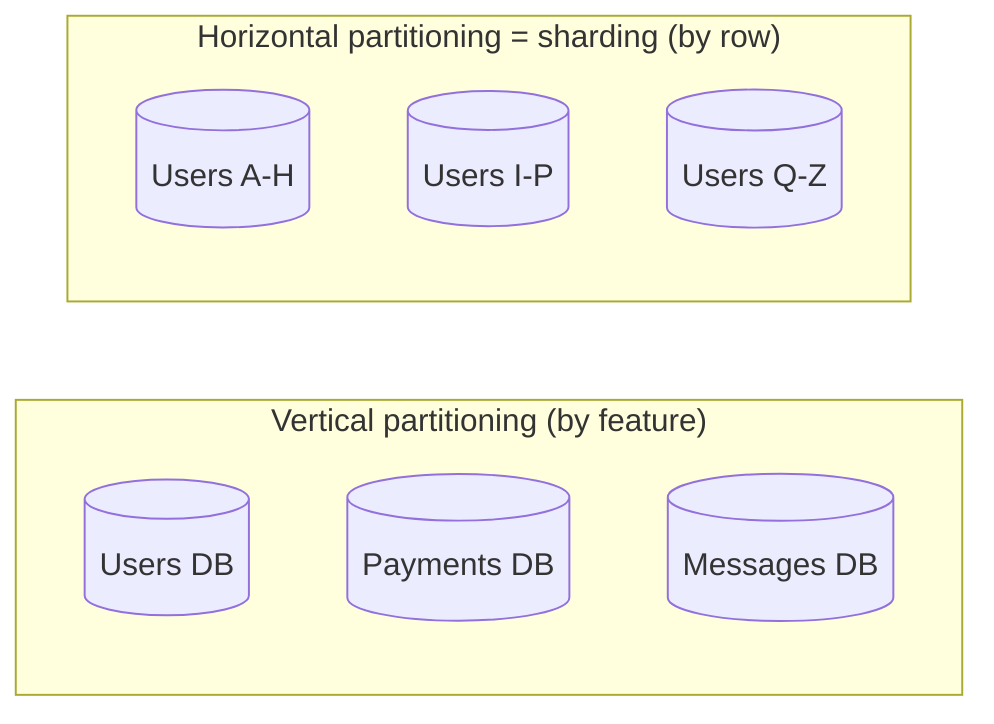
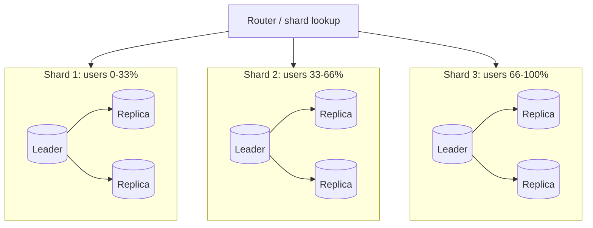
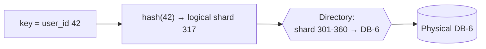

# Why Sharding is the Swiss Army Knife of System Design

> [!info] How this note is built
> - **🎓 Course:** the lecture text and the discussion, including the instructor (Harsh Goel).
> - **🌐 Outside:** sources listed under [[#Sources]], used to fill in how sharding actually works.
> - Scenarios and case studies are at the end.
> - Related: [[Anatomy of a Scalable Web Application]] (the distributed DB means sharding), [[Load Balancers and App Servers]] (shard to scale writes, replicate to scale reads)

## 4.1 The lecture in one breath 🎓

> [!quote] Core idea
> **Sharding means splitting things into small pieces and making them work together.** Each piece goes on a **different machine**, and you need **some logic to decide which piece is on which machine**.

- It's the **Swiss Army knife of scaling**, because one idea scales many different things.
- **Horizontal scaling:** scale by **adding more machines**. Sharding is horizontal scaling.
- **Vertical scaling:** scale by giving **one machine more memory or processing power**.

**What you can scale with sharding** 🎓
1. Distributed database
2. Distributed cache
3. Distributed hash table (DHT)
4. Distributed key-value stores
5. Even **relational databases**, by splitting them into shards

**How to use it in interviews** 🎓

| Interviewer asks | Answer with sharding |
|---|---|
| "Scale a social network" | Shard the **database**: user profiles, friend relationships, etc. |
| "Scale the in-memory cache" | Same idea: **shard the cache** across machines |
| "Spread your algorithm's work over many machines" | Same idea again, e.g. **MapReduce** (covered later in the course) |

**From the discussion** 🎓
- **Example of sharding:** a huge table of usernames and user properties (like Facebook profiles) that **doesn't fit on one machine**. **Split it across machines** and keep a **master table that records which key is on which machine**.
- **Not sharding:** agents that collect data on many machines and sync to a master DB every few hours. That's closer to **distributed load balancing**. Sharding means **dividing up data between machines**.
- **DHT vs key-value store:** "key-value store" is a broad term, and **a DHT is one type** of key-value store.
- An **in-memory** distributed key-value store used for caching **counts as a distributed cache**.
- **Example of a sharded cache: Memcached.** It uses sharding (see the optional Memcached article in the next section).

---

## 4.2 Horizontal vs vertical scaling

| | **Vertical (scale up)** | **Horizontal (scale out)** |
|---|---|---|
| How | Bigger machine: more CPU, RAM, disk | More machines |
| 🌐 Pros | Simple, no code changes, no distributed-system problems | Almost no upper limit; redundancy; cheaper commodity hardware |
| 🌐 Cons | **Hard hardware limit**, gets expensive, **single point of failure** | Complexity: routing, rebalancing, queries across shards |
| Example | Moving a DB from 16 GB to 512 GB RAM | Splitting the users table across 16 DB servers |

> [!warning] Two meanings of "vertical" 🌐
> - **Vertical *scaling*** = a bigger machine.
> - **Vertical *partitioning*** (also called federation or functional partitioning) = splitting **by table or feature**, e.g. a users DB, a payments DB and a messages DB.
> - **Horizontal partitioning = sharding** = splitting **the rows of one table** across machines.

---

## 4.3 Sharding vs replication

🎓 A student asked whether you pick sharding or replication by checking if the system is read-heavy or write-heavy. The best answer in the thread (from a student) was that **you usually need both**.

| | **Replication** | **Sharding** |
|---|---|---|
| What | **The same data copied** to several machines | **Different data** on each machine |
| Scales | **Reads** (any replica can answer) | **Writes** and **storage** (each shard owns fewer items) |
| Also gives | **Durability and availability**: survives a machine failure | Limits failures to one shard (others keep working) |
| Writes go to | Only the leader/main DB (in leader-follower setups) | The shard that owns the key |

> [!tip] Rule to memorize 🎓
> - **To scale writes, shard.**
> - **To scale reads, replicate** (sharding also helps).
> - In real systems **each shard is also replicated**, for durability and scale.

---

## 4.4 The "some logic": deciding which piece goes where 🌐

The course says you need **"some logic to determine which piece is in which machine."** Here are the standard options.

| Strategy | How | Pros | Cons | Used by |
|---|---|---|---|---|
| **Range-based** | Key ranges per shard: A-H, I-P… or IDs 0-1M, 1M-2M | **Range scans** are cheap; easy to understand | **Hot spots**: rising keys (timestamps, auto-increment IDs) send every new write to the last shard | Bigtable/HBase, Vitess (ranges of keyspace IDs) |
| **Hash mod N** | `shard = hash(key) % N` | Even spread; simple | Changing N **moves almost every key**; range queries must hit every shard | Simple setups |
| **Consistent hashing** | Shards and keys placed on a hash **ring**; each key goes to the next shard clockwise, and **virtual nodes** even out the spread | Adding or removing a shard moves only **about 1/N of keys** | Uneven without virtual nodes; still no range scans | Dynamo, Cassandra, Memcached clients, Discord |
| **Directory / lookup table** 🎓 | A **master table maps each key (or key range) to a shard**. This is the instructor's example. | Most flexible: move any key anywhere | Every request needs a lookup (cache it); the directory must be highly available | Instagram, Pinterest, Figma (logical-to-physical maps) |
| **Fixed hash slots** | Hash into a fixed number of slots and assign slots to nodes | Rebalance by **moving whole slots** | You pick the slot count up front | Redis Cluster (16,384 slots) |
| **Entity/tenant-based** | Everything for one workspace/org/user on one shard | Queries stay on **one shard**, no cross-shard joins | A very big tenant becomes a hot shard | Notion (workspace ID), Figma (user/file/org) |
| **Geographic** | Shard by region (EU users in the EU) | Lower latency, **data residency** rules | Users who move or travel; uneven regions | Global SaaS |

> [!note] Logical vs physical shards (the most important trick) 🌐
> - **Split into many logical shards up front** (e.g. 480 or 4,096), and **map them onto a few physical machines**.
> - To grow, **move whole logical shards to new machines**. You never re-hash keys.
> - Used by Instagram, Pinterest and Notion (see the case studies).

### Consistent hashing, step by step 🌐

1. Hash each **server** (several times, as virtual nodes) onto a ring from 0 to 2³²−1.
2. Hash each **key** onto the same ring.
3. Go **clockwise** from the key; the first server you reach owns it.
4. **Add a server:** it takes keys only from its clockwise neighbor, about **1/N of all keys**.
5. **Remove a server:** its keys move to the next server clockwise; nothing else moves.
6. **Compare with `hash % N`:** going from 4 to 5 servers moves about **80%** of keys.

---

## 4.5 Choosing a shard key 🌐

A good shard key:
- **Has lots of distinct values**, not "country" or "gender".
- **Spreads writes and reads evenly**, and isn't always increasing like a timestamp.
- **Matches your most common query**, so most requests touch **one shard**.
- **Keeps related data together**, so joins and transactions stay on one shard.

| System | Good key | Bad key | Why |
|---|---|---|---|
| Social network profiles 🎓 | `user_id` | `country` | Only a few countries, and the US would be a hot shard |
| Chat messages | `(channel_id, time_bucket)` | `message_timestamp` | Timestamps send every write to the newest shard |
| Multi-tenant SaaS | `workspace_id` / `org_id` | `document_id` alone | A workspace's documents should live together |
| URL shortener | `hash(short_code)` | Sequential ID with range sharding | Sequential IDs pile onto the newest range |
| Orders | `customer_id` | `order_date` | A customer's order history stays on one shard |

---

## 4.6 The hard parts (what interviewers ask next) 🌐

> [!warning] 1. Hot spots and the celebrity problem
> - **Problem:** one key gets huge traffic, like a celebrity's profile or a giant chat channel, and **overloads its shard whatever the scheme**.
> - **Fixes:**
>   - **Salt the key:** split it into `key#0…key#9` and combine them on read.
>   - **Cache** hot reads.
>   - **Coalesce requests:** merge identical in-flight reads into one.
>   - **Special-case heavy users.**
>   - Give hot tenants their own shard.

> [!warning] 2. Resharding and rebalancing
> - Moving data while serving traffic is the scariest operation.
> - **Fixes:**
>   - Many **logical shards** mapped to few machines, so you move whole shards.
>   - **Consistent hashing** to limit how many keys move.
>   - Tools that **copy, verify, then switch** (Vitess switches with **a few seconds of read-only time**).
>   - Double writes plus backfill.

> [!warning] 3. Queries that span shards
> - **Joins across shards** aren't possible in the DB. Do an **application-level join**: fetch IDs, then fetch the objects from their shards (Pinterest).
> - **Transactions across shards** need **two-phase commit** (slow, blocking) or **sagas**. Better: **design the key so a transaction stays on one shard.**
> - **Scatter-gather:** queries without the shard key hit **every** shard, which is slow and fragile.

> [!warning] 4. Secondary indexes
> - **Local index** (each shard indexes its own rows): cheap writes, but a lookup by that field asks **every shard**.
> - **Global index** (the index is sharded by the indexed value): fast lookups, but one write touches several shards.

> [!warning] 5. Unique IDs
> - Auto-increment doesn't work across shards.
> - **Fixes:**
>   - Put the **shard ID inside the ID.** Instagram: 41 bits of time, 13 of shard, 10 of sequence. Pinterest: 16 bits of shard, 10 of type, 36 of local ID.
>   - Snowflake-style ID generators.
>   - UUIDs, at the cost of size.

> [!warning] 6. Operations
> - More machines means more failures, more backups and more schema migrations.
> - Pinterest avoided `ALTER TABLE` by keeping fields in **JSON blobs**.

---

## 4.7 Applying the Swiss Army knife to each item 🎓🌐

| Thing to scale (🎓) | How it's sharded (🌐) |
|---|---|
| **Distributed database** | Shard rows by key (section 3), and replicate each shard. Examples: Cassandra, DynamoDB (partition key), MongoDB (shard key) |
| **Distributed cache** | **Memcached:** servers don't talk to each other; the **client hashes the key** (consistent hashing) to pick a server. **Redis Cluster:** 16,384 hash slots spread across nodes. |
| **Distributed hash table** | Keys spread over nodes with consistent hashing; each node knows how to find the owner of any key |
| **Distributed key-value store** | **Amazon Dynamo:** consistent hashing with virtual nodes, each key copied to N nodes (often N=3) |
| **Relational database** | Shard at the application level (Instagram, Pinterest, Notion, Figma) or use a sharding layer like **Vitess** (built at YouTube for MySQL) |
| **Computation** | **MapReduce:** input is split into chunks (16-64 MB in the original paper) spread across workers; intermediate keys are split into R partitions with `hash(key) mod R`, so each reducer owns one partition |

---

## 4.8 When to shard (and when not to) 🌐

**Try the cheaper options first, roughly in this order:**
1. Optimize queries and **indexes**.
2. **Scale vertically** (a bigger box).
3. **Cache.**
4. **Read replicas.**
5. **Vertical partitioning** (split by feature).
6. **Shard.**

**Rough numbers (rules of thumb, not exact):**
- One modern Postgres/MySQL node handles about **10-20k write transactions per second** and **tens of TB**.
- Old advice to shard at about 100 GB is outdated. Today the push often comes from **operations**: backup time, `VACUUM` (Postgres cleanup), maintenance windows.
- **Signs you need to shard:**
  - Writes saturate the primary.
  - The data doesn't fit on one machine (🎓 the Facebook profiles example).
  - A single table has billions of rows and multiple TB.
  - Maintenance jobs can't keep up.

> [!tip] In the interview
> - Say **what you'd shard**, **by which key**, **how the key finds its shard**, and **how you'd handle hot keys and resharding**.
> - That covers 90% of the follow-up questions.

---

## 4.9 Scenarios to walk through

> [!example]- Scenario 1: Scale a social network (🎓 the course's example)
> **Data:** user profiles and friend relationships.
> 1. **Profiles:** shard by `user_id` with consistent hashing or many logical shards. Almost every request is "get user X", so it hits one shard.
> 2. **Friendships:** store the edge `(user_id, friend_id)` **on the shard of `user_id`**, and also the reverse edge on `friend_id`'s shard. "List my friends" then stays on one shard. The cost is two writes per friendship.
> 3. **Replicate every shard** (leader plus 2 replicas) for durability and read scaling.
> 4. **Celebrities:** an account with 100M followers makes a hot shard. Cache it heavily, split its follower list into sub-shards, and fetch celebrity posts at read time.
> 5. **Growth:** start with 4,096 logical shards on 8 machines and move logical shards as you add machines.

> [!example]- Scenario 2: Scale the in-memory cache (🎓)
> **Setup:** 500 GB of hot data, but one cache box has 64 GB.
> 1. Run about 10 Memcached nodes. **The client hashes each key with consistent hashing** to pick a node, and the servers don't coordinate.
> 2. **A node dies:** only its keys (about 1/10) miss and get reloaded from the DB. The other 90% still hit.
> 3. **With `hash % N` instead:** losing one node changes N, so almost every key moves and the DB takes a flood of misses. This is why consistent hashing matters.
> 4. **A hot key** (the homepage feed) can overload one node. Keep a small local cache on the app servers or copy the key to several nodes (`key#1..k`).

> [!example]- Scenario 3: Spread an algorithm across machines (🎓 → MapReduce)
> **Task:** count word frequencies across 10 TB of logs.
> 1. **Split the input** into roughly 64 MB chunks and give each **map worker** a chunk; it emits `(word, 1)`.
> 2. **Split the intermediate keys** with `hash(word) mod R`, so every "the" goes to the same reducer.
> 3. Each **reducer** sums the counts for the words it owns.
> 4. Both the data and the work are sharded: the "shard key" is the chunk for mappers and the word for reducers.

> [!example]- Scenario 4: Chat message storage (Discord-style)
> - **Key:** `(channel_id, time_bucket)`. One channel's messages stay together and are bucketed by time, so no partition grows forever.
> - **Problem:** a huge server's channel gets orders of magnitude more traffic than small ones, creating **hot partitions**.
> - **Fix:** a service layer that **merges identical in-flight reads** and routes by channel with consistent hashing.

> [!example]- Scenario 5: Multi-tenant SaaS (Notion-style)
> - **Key:** `workspace_id`. Each block belongs to exactly one workspace, so most queries stay on one shard.
> - **Layout:** 480 logical shards on 32 databases. 480 divides evenly many ways, so you can grow to 40 or 48 hosts.
> - **Migration:**
>   1. Double-write through an audit log.
>   2. Backfill the existing data.
>   3. Do **"dark reads"** that compare the old and new data.
>   4. Switch over in a short maintenance window.

> [!example]- Scenario 6: A bad shard key
> - **Setup:** orders range-sharded by `created_at`.
> - **What goes wrong:** every new order goes to the newest shard, which runs at 100% while the rest sit idle.
> - **Fix:** shard by `hash(customer_id)`. Keep a separate time-sorted index or analytics store for "orders today" queries.

---

## 4.10 Case studies 🌐

> [!example] Instagram: logical shards in Postgres
> - **Several thousand logical shards** (Postgres schemas) mapped onto **a few physical servers**. Resharding means **moving schemas**, not re-bucketing rows.
> - **64-bit IDs:** 41 bits of timestamp (ms), **13 bits of logical shard ID**, 10 bits of sequence (1,024 IDs per shard per ms). The ID says which shard it lives on, and IDs sort by time.
> - **Lesson:** put the shard in the ID, and create more logical shards than you need.

> [!example] Pinterest: 4,096 MySQL shards, and data never moves
> - Started with **8 servers and 4,096 shards**. The 16-bit shard ID allows up to **65,536**.
> - **ID layout:** 16-bit shard, 10-bit type, 36-bit local ID.
> - **"Once a piece of data lands in a shard, it never moves outside that shard."** Growth means moving **whole shards** to new machines, with the config in ZooKeeper.
> - **No cross-shard joins.** Joins happen in the app, via mapping tables stored on the origin object's shard.
> - Chose **mature MySQL** over newer databases, and stored fields in JSON to avoid `ALTER TABLE`.

> [!example] Notion: 480 logical shards on 32 Postgres databases (2021)
> - **Why:** growth of **four orders of magnitude**, stalling `VACUUM` and the threat of **transaction ID wraparound**, which would stop all writes.
> - **Key:** `workspace_id`.
> - **Layout:** 480 logical shards, 15 per database.
> - **Migration:** double-write via an audit log, a 3-day backfill, dark-read verification, then a **5-minute maintenance window**.
> - **Lessons:** shard earlier, aim for zero-downtime migrations, and use composite primary keys.

> [!example] Figma: split by feature first, then shard
> - First did **vertical partitioning** (groups of tables in separate DBs) until single tables reached **multiple TB and billions of rows**.
> - Then built horizontal sharding on RDS Postgres. **"Colos"** keep tables that share a shard key together, so joins and transactions stay on one shard.
> - **Hash routing** avoids hot spots from auto-increment IDs, and a proxy (DBProxy) routes queries.

> [!example] Discord: hot partitions in a chat store
> - Messages keyed by `(channel_id, bucket)`. Big servers created **hot partitions** that slowed the whole cluster.
> - Moved from **177 Cassandra nodes to 72 ScyllaDB nodes**. p99 read latency went from **40-125 ms to 15 ms**.
> - Added a routing layer with **request coalescing**.

> [!example] Vitess (built at YouTube): sharding middleware for MySQL
> - A **keyspace** is a logical database. A **vindex** maps a column to a **keyspace ID**, and shards own **ranges** of keyspace IDs (e.g. `-80`, `80-`).
> - **Resharding** copies and verifies data on new shards while the old ones keep serving, then switches with **a few seconds of read-only time**.

---

## 4.11 Pitfalls to avoid in interviews

> [!warning] Common mistakes
> - Sharding **too early**: a 50 GB DB doesn't need it. Say what you'd try first.
> - Saying "shard it" without naming the **shard key** and **how keys find their shard**.
> - Using a **monotonic or low-variety** key (timestamp, country).
> - Using `hash % N` and then being asked "what happens when you add a server?"
> - Forgetting **replication**. Sharding alone loses data when a shard dies.
> - Ignoring **hot keys and celebrities**.
> - Putting **cross-shard joins or transactions** on the hot path.
> - Mixing up **vertical scaling** with **vertical partitioning**.
> - 🎓 Calling data sync or distributed load balancing "sharding". Sharding means **dividing data between machines**.

## Sources

- 🎓 [Interview Camp – Why Sharding is the Swiss Army Knife of System Design Interviews](https://interview-academy.teachable.com/courses/101687/lectures/5776645)
- [System Design Primer – Sharding, federation, replication](https://github.com/donnemartin/system-design-primer)
- [ByteByteGo – Scale From Zero to Millions of Users](https://bytebytego.com/courses/system-design-interview/scale-from-zero-to-millions-of-users)
- [Cassandra – Dynamo architecture (consistent hashing, vnodes)](https://cassandra.apache.org/doc/latest/cassandra/architecture/dynamo.html)
- [Werner Vogels – Amazon's Dynamo](https://www.allthingsdistributed.com/2007/10/amazons_dynamo.html)
- [Wikipedia – Consistent hashing](https://en.wikipedia.org/wiki/Consistent_hashing)
- [AWS – DynamoDB partition key design](https://docs.aws.amazon.com/amazondynamodb/latest/developerguide/bp-partition-key-design.html)
- [Instagram Engineering – Sharding & IDs at Instagram](https://instagram-engineering.com/sharding-ids-at-instagram-1cf5a71e5a5c)
- [Pinterest Engineering – Sharding Pinterest](https://medium.com/pinterest-engineering/sharding-pinterest-how-we-scaled-our-mysql-fleet-3f341e96ca6f)
- [Notion – Herding elephants: sharding Postgres at Notion](https://www.notion.com/blog/sharding-postgres-at-notion)
- [Figma – How Figma's databases team lived to tell the scale](https://www.figma.com/blog/how-figmas-databases-team-lived-to-tell-the-scale/)
- [Discord – How Discord stores trillions of messages](https://discord.com/blog/how-discord-stores-trillions-of-messages)
- [Vitess – Sharding](https://vitess.io/docs/archive/22.0/reference/features/sharding/)
- [Google Research – MapReduce](https://research.google/pubs/mapreduce-simplified-data-processing-on-large-clusters/)
- [Hello Interview – Numbers to know](https://www.hellointerview.com/learn/system-design/core-concepts/numbers-to-know)

---
