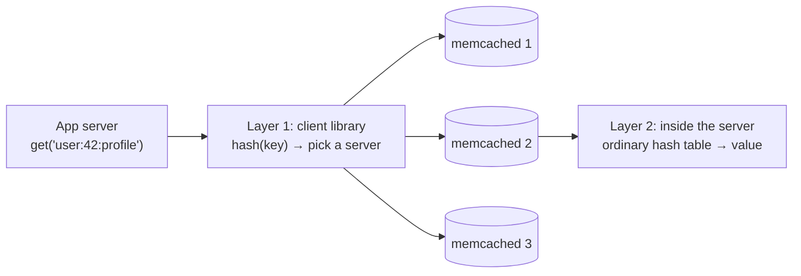

# Distributed Caching Using Memcached

> [!info] How this note is built
> - **🎓 Course:** the lecture page and discussion, plus the assigned Linux Journal article, "Distributed Caching with Memcached" by **Brad Fitzpatrick, Aug 2004**. He built memcached for LiveJournal.
> - **🌐 Outside:** sources listed under [[#Sources]], used to fill in what the article skips or what has changed since 2004.
> - Related: [[Anatomy of a Scalable Web Application]] (the Memcached box), [[Why Sharding is the Swiss Army Knife of System Design]] (a sharded cache)

## 5.1 What the lecture says 🎓

- **Memcached is one of the best ways to speed up lookups.** Most good systems have memcached or some other distributed cache.
- Later weeks use this to design faster web applications.
- The article is casual. It shows **how the author made sharding decisions** and **how it improved his site**.
- **Skim it. A lot of the details don't matter for interviews.**

> [!tip] What to focus on (from the instructor)
> - Focus on **how they used memcached and how it sped things up**, not LiveJournal's database setup.
> - What they built is basically a **distributed hash table (DHT)**.
> - **Memcached vs Redis:** Redis "also serves the same purpose." In interviews just say **"in-memory cache."**

---

## 5.2 The article, section by section 🎓

### The problem: LiveJournal in 2004
- A blogging site with **2.5 million accounts** on about **70 machines**.
- Pages were **dynamic and different for each viewer** (security levels, friends), so they **couldn't be pre-generated**. Every page view hit the DB hard.
- The DB servers' own caches were **limited by memory size and by address space** (32-bit machines at the time).

### Their database setup (background only)
- **10 DB clusters:** **9 user clusters**, each holding a partition of users, and **1 global cluster** with non-user data plus **the table that maps users to their cluster**.
- **Why:** independent clusters **spread writes**. One big cluster with hundreds of replicas "only spreads reads", because **every replica still has to apply every write** to stay current.
- 🎓 The instructor says not to dwell on this, but it's the **"shard to scale writes, replicate to scale reads"** rule from [[Load Balancers and App Servers]]. The user-to-cluster table is the **directory/lookup sharding** from [[Why Sharding is the Swiss Army Knife of System Design]].

### What memcached is
- A **"high-performance, distributed caching system"**: one big **key-value store spread across many machines**.
- It uses **spare memory across the network**, for example leftover RAM on the web servers, instead of relying only on the DB's cache.

### The two-layer hash (the key idea)

1. **The client library hashes the key to choose a server.** The same key always goes to the same server, and keys spread evenly.
2. **That server looks the key up in an ordinary in-memory hash table.**

- **Servers don't know about each other.** No replication, no coordination. All the sharding logic lives in the client.
- 🎓 This is **sharding a cache**, which is why the instructor called it a DHT.

### Eviction and memory
- When memory is full, it evicts the **least recently used** item by default.
- Early versions used glibc `malloc` and got **fragmented after about a week** of running.
- **The fix was a slab allocator:** grab big chunks of memory and cut them into fixed-size slots for different item sizes, with **slab classes for powers of two from 64 bytes to 1 MB**.

### Lockless and multi-versioned
- Objects are **multi-versioned and reference-counted**, so **no client blocks another**. Even a client on a bad connection doesn't make others wait.
- 🎓 **The instructor's explanation:**
  - Client A updates key K while 10 clients read it. A's update becomes **K-version2**; the readers keep getting **K-version1** until they read again.
  - **It isn't strongly consistent, and it isn't meant to be.** A cache value can be a little out of date.

### When a server fails
- Clients **can be configured to route around dead servers** and use the rest.
- This is optional, because the app must cope with **stale data from a "flapping" node** (one that keeps going down and coming back).
- Otherwise, requests to a dead server just **miss** and go to the DB.
- See Scenario 3 in section 3 below.

### The usage pattern (cache-aside)
- **Read:** check memcached → on a miss, read the DB → **store the result in memcached** → return it.
- **Write:** update the DB **and** update or delete the cache entry so the two stay in sync.

### Results
- **28 memcached instances on 10 hosts**, caching the **most popular 30 GB**.
- **Hit rate about 92%.**
- About **7,000 queries per second** per server with **low CPU**, running **4-5 months** without problems.
- **Memory budget on a 4 GB web node:** 3 × 1 GB memcached instances, 500 MB for the app (mod_perl) and 500 MB spare.

### Other uses at LiveJournal
- Clients in **Perl, PHP, Python and Java**, with each language's built-in serialization and optional compression.
- It was also used to **block duplicate form submissions** and **track IPs and sessions to slow down bots**. That data is **fine to lose** if a node dies.

---

## 5.3 Gaps the article leaves 🌐

### 5.3.1 How the client picks a server: `hash % N` vs consistent hashing

> [!warning] The problem with `hash % N`
> - The original clients used `server = servers[hash(key) % N]`.
> - **Add or remove a server and N changes, so almost every key maps to a different server.** Last.fm described this as having "effectively wiped the entire cache."
> - Every request then misses and **floods the DB**.

**The fix: consistent hashing (Last.fm's `ketama`, April 2007)**
- Put each server at **100-200 points** on a circle from 0 to 2³².
- Hash the key, then go **clockwise to the next server point**.
- Adding or removing a server moves only **a small share of keys (about 1/N)**.
- This became the standard for memcached clients. Same idea as in [[Why Sharding is the Swiss Army Knife of System Design#Consistent hashing, step by step 🌐]].

### 5.3.2 The commands you should know

| Command | What it does | Use it for |
|---|---|---|
| `get k1 k2…` | Fetch one or more keys | Batched reads (Facebook batches about 24 keys per request) |
| `set` | Store, overwriting | Filling the cache after a miss |
| `add` | Store **only if the key doesn't exist** | **Locks, duplicate-submission guards**, avoiding double fills |
| `replace` | Store **only if the key exists** | Updating without re-creating deleted keys |
| `append` / `prepend` | Add bytes to an existing value | Growing lists |
| `gets` + `cas` | Read with a version number; write **only if unchanged** | **Optimistic concurrency**, no lost updates |
| `delete` | Remove a key | **Invalidation on write** |
| `incr` / `decr` | Change an **unsigned 64-bit integer**; **fails if the key doesn't exist** | **Counters**, rate limits |
| expiry (TTL) | `0` = never expire; up to **30 days** in seconds, and larger values count as a Unix timestamp | Bounding staleness |

**Limits:** keys up to **250 bytes**, values up to **1 MB** by default (the largest slab class).

### 5.3.3 Writes: update or delete the cache?

**Common practice: update the DB first, then delete the cache key.** The next read reloads it.
- Facebook: "delete cached data instead of updating it because deletes are **idempotent**."
- Two writers doing `set` can arrive out of order and leave the **older** value in the cache. Deletes don't have that problem.

> [!warning] The "stale set" race (a favorite interview question)
> 1. Reader A misses and reads the **old** value from the DB.
> 2. Writer B updates the DB and **deletes** the key.
> 3. A **sets the old value** into the cache. It stays stale until the TTL expires.
>
> **Fixes:**
> - **Leases:** Facebook gives a token on a miss, and the `set` only works if no delete happened since.
> - `gets`/`cas`.
> - **Short TTLs** so staleness has a limit.

### 5.3.4 Caching patterns compared

| Pattern | Reads | Writes | Notes |
|---|---|---|---|
| **Cache-aside** (memcached's pattern) | The **app** checks the cache, reads the DB on a miss, then fills the cache | The app writes the DB, then deletes the key | Default. Works with a basic cache. If the cache dies, the app falls back to the DB. |
| **Read-through** | The **cache/library** loads from the DB on a miss | — | Needs a cache that knows how to load. Memcached can't. |
| **Write-through** | — | Write the cache and DB together | Fresh, but caches data nobody reads |
| **Write-around** | — | Write only the DB; the cache fills on read | Good for data written once and rarely read |
| **Write-back** | — | Write the cache; the DB is updated later | Fast writes, but **data is lost if the cache dies** |

🎓 This connects to [[Anatomy of a Scalable Web Application]]: **the app server handles misses, not the cache**, because memcached is a plain key-value store that can't talk to the DB.

### 5.3.5 Failure and load problems

| Problem | What happens | Fixes |
|---|---|---|
| **Node dies** | Its keys miss, and the DB takes that share of the load | Consistent hashing limits it to about 1/N. Facebook's **"gutter pool"** (about 1% of servers) takes over instead of re-hashing onto healthy nodes, cutting client-visible failures by **99%**. |
| **Re-hashing cascade** | A dead node's hot keys move to a neighbor and overload it too | Gutter pool; don't re-hash automatically |
| **Stampede / thundering herd** | A hot key expires and thousands of requests hit the DB at once | **Lock/lease** (one request refills, the others wait or get stale data), **random jitter on TTLs**, early refresh |
| **Hot key** | One key overloads one server | Split it into `key#1..N` copies, add a **local cache** on the app servers |
| **Cache penetration** | Requests for keys that **don't exist** always reach the DB | **Cache the "not found"** briefly, or put a **Bloom filter** in front |
| **Cold start** | A new or empty cache sends everything to the DB | Warm it from another cache (Facebook: **hours instead of days**) or pre-load |

### 5.3.6 Memcached vs Redis

| | **Memcached** | **Redis / Valkey** |
|---|---|---|
| Data | Strings/bytes | Strings plus **lists, sets, sorted sets, hashes, geo**… |
| Threads | **Multi-threaded** | Mostly single-threaded command execution (each command is atomic) |
| Sharding | **In the client** (consistent hashing) | **Redis Cluster: 16,384 hash slots** |
| Replication / failover | **None** | Yes |
| Saves to disk | **No** | Optional (RDB snapshots/AOF) |
| Server-side logic | None | Lua scripts, atomic operations, pub/sub |
| Pick it for | Simple, huge, pure caching | Counters, leaderboards, rate limiters, sessions, locks, queues |

🎓 Either is fine in interviews. Say **"in-memory cache"** and name one.

### 5.3.7 Numbers 🌐
- Memory reference **about 100 ns**; round trip within a datacenter **about 500 µs**; SSD random read **about 150 µs**; disk seek **about 10 ms**.
- A **remote** cache hit is mostly network time. Facebook's median get was **333 µs**.
- **Hit-rate math:** going from 90% to **99%** cuts DB reads **10×** (10% of requests miss vs 1%). The **miss rate** is what matters.
- LiveJournal: **92%** hit rate, **30 GB** hot data, **28 instances**, about **7k queries/s** per server (2004).

---

## 5.4 Scenarios to walk through

> [!example]- Scenario 1: Rendering a LiveJournal-style page
> 1. The app needs 40 items: the user profile, 20 posts, friends list, comment counts.
> 2. It builds 40 keys and sends **one batched `get`** per memcached server; the client groups keys by server.
> 3. 37 hit. The 3 misses are loaded from the DB (from the right user cluster), then `set` with a TTL.
> 4. The page is built almost entirely from memory, and the DB handled 3 queries instead of 40.

> [!example]- Scenario 2: Adding a 5th cache server
> - **With `hash % N`:** going from 4 to 5 servers remaps about **80% of keys**. The hit rate falls from about 92% to about 20%, and the DB gets about **10× its usual reads**, which is an outage risk.
> - **With consistent hashing:** only about **20%** (1/5) of keys move to the new server.
> - **Safer still:** add servers during low traffic, or warm the new server first.

> [!example]- Scenario 3: A flapping node (the question from the discussion)
> **Setup:** server M3 keeps dropping off the network and coming back.
> - **Route-around ON:**
>   1. Clients mark M3 dead and send its keys to other servers, where they miss and get re-filled.
>   2. A user updates their profile. The app updates the DB and deletes the key on the server that **currently** owns it.
>   3. **M3 comes back.** Clients route those keys to M3 again, and **M3 still has the old value**. That delete never reached it, so users see **stale data**.
>   4. This is the "possibly stale information from a flapping node" the article warns about.
> - **Route-around OFF:**
>   - Requests for M3's keys fail and are treated as **misses** that go to the DB.
>   - Nothing is re-hashed, so no other server fills up with duplicate copies.
>   - If M3 was only **unreachable** (not restarted), it may still return old values when it's back, because it missed deletes while it was away.
> - **Fixes:**
>   - Short TTLs.
>   - Wait for a node to stay healthy for a while before using it again.
>   - **Flush a node when it rejoins.**
>   - Use a **gutter pool** instead of re-hashing.

> [!example]- Scenario 4: Distributed counter in the cache (e.g. seats left or rate limits)
> The student question about counting in the cache:
> - **Rate limit:** `add ratelimit:{user}:{minute} 0 ttl=60`, then `incr`. It's atomic on the server, and the TTL resets it each minute.
> - **Watch out:** `incr` **fails if the key is missing**, so `add` first. The cache can **evict or lose** the counter, and memcached has no replication.
> - **Seats or money:** keep the **DB as the source of truth**. The cache counter is a fast **estimate or gate**, and the final booking is a DB transaction.
> - With Redis you get `INCR`/`DECRBY` plus persistence and replication, which is safer.
> - The instructor linked a live session on distributed counters (see [[#Sources]]).

> [!example]- Scenario 5: Homepage key expires (stampede)
> - `homepage:trending` takes 2 s to compute and gets 5,000 requests per second.
> - It expires, and **thousands of requests** miss and run the same query at once.
> - **Fixes:**
>   - `add lock:homepage` so **one request** rebuilds while the others serve the old copy or wait.
>   - Add jitter to TTLs.
>   - Refresh it in the background before it expires.
>   - Facebook's leases cut peak DB queries on hot keys from **17K/s to 1.3K/s**.

> [!example]- Scenario 6: Blocking duplicate submissions (LiveJournal's trick)
> - On submit, run `add submit:{user}:{hash(form)} 1 ttl=30`.
> - If `add` **fails**, the key exists, so it's a double-click or replay. Reject it.
> - Losing this data when a node dies is harmless, which makes it a good fit for a cache.

---

## 5.5 Case studies 🌐

> [!example] LiveJournal (2004): the origin story 🎓
> Pages were dynamic per viewer, and the DB was the bottleneck. **Memcached on spare web-server RAM** gave a **92% hit rate** on 30 GB of hot data across 28 instances. It was built as a simple **client-sharded DHT** with LRU eviction, a slab allocator and a lockless design.

> [!example] Last.fm ketama (2007)
> Adding or removing a memcached server with modulo hashing **wiped the effective cache**. **Consistent hashing** with 100-200 points per server fixed it, and ketama became the standard for memcached clients.

> [!example] Facebook: "Scaling Memcache at Facebook" (NSDI 2013)
> - **Scale:** **billions of requests per second**, **trillions of items**.
> - **Pattern:** a demand-filled **look-aside** (cache-aside) cache, with **delete-on-write**.
> - **Numbers:** an average page fetched **521 items**; median get latency was **333 µs**.
> - **Leases** fixed stale sets and stampedes.
> - **mcsqueal** reads MySQL's commit log and **broadcasts deletes**.
> - **Gutter pool** (about 1% of servers) for failures.
> - **Regional pools** for large, rarely-read items.
> - **Cold-cluster warmup** in hours.
> - **Lesson:** treat "how often we read stale data" as a setting you tune, like latency.

---

## 5.6 Pitfalls to avoid in interviews

> [!warning] Common mistakes
> - Saying the **cache loads from the DB by itself**. Memcached can't; the app does it (cache-aside).
> - Using `hash % N` for cache servers. Say **consistent hashing**.
> - Using the cache as the **only copy** of important data. Memcached has **no persistence or replication**.
> - Forgetting **TTLs** or **invalidation on write**, which leaves stale data forever.
> - Ignoring **stampedes, hot keys and cold starts**.
> - Updating the cache on write instead of **deleting**, which invites races.
> - 🎓 Spending interview time on LiveJournal's cluster layout or other product trivia.

## Video notes / my notes

-

## Sources

- 🎓 [Interview Camp – Optional Article: Distributed Caching Using Memcached](https://interview-academy.teachable.com/courses/101687/lectures/3967123)
- 🎓 [Brad Fitzpatrick – Distributed Caching with Memcached, Linux Journal (2004)](https://www.linuxjournal.com/article/7451)
- 🎓 [Interview Camp live session on distributed counters (linked by instructor)](https://www.youtube.com/watch?v=qhZUVPpDUPE)
- [memcached docs – Basic text protocol](https://docs.memcached.org/protocols/basic/)
- [Richard Jones (Last.fm) – libketama: consistent hashing for memcached clients](https://www.metabrew.com/article/libketama-consistent-hashing-algo-memcached-clients)
- [Nishtala et al. – Scaling Memcache at Facebook, NSDI 2013](https://www.usenix.org/system/files/conference/nsdi13/nsdi13-final170_update.pdf)
- [AWS – Database caching strategies (caching patterns)](https://docs.aws.amazon.com/whitepapers/latest/database-caching-strategies-using-redis/caching-patterns.html)
- [AWS – Caching best practices](https://aws.amazon.com/caching/best-practices/)
- [AWS ElastiCache – Choosing an engine](https://docs.aws.amazon.com/AmazonElastiCache/latest/dg/SelectEngine.html)
- [Redis – Cluster specification](https://redis.io/docs/latest/operate/oss_and_stack/reference/cluster-spec/)
- [Wikipedia – Cache stampede](https://en.wikipedia.org/wiki/Cache_stampede)
- [ByteByteGo – A crash course in caching](https://blog.bytebytego.com/p/a-crash-course-in-caching-final-part)
- [System Design Primer – Cache](https://github.com/donnemartin/system-design-primer)

---
