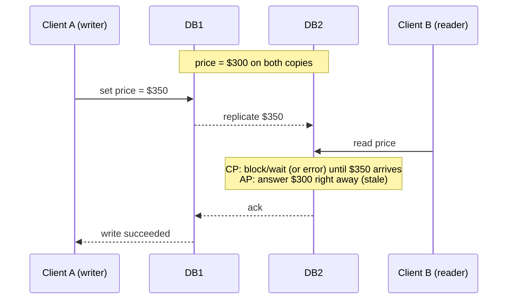

# CAP Theorem for Beginners

> [!info] How this note is built
> - **🎓 Course:** the lecture text (ACID vs BASE) and the discussion. The video isn't transcribed, but the discussion shows its running example: a **flight price changing from $300 to $350** on two database copies, **DB1 and DB2**.
> - **🌐 Outside:** sources listed under [[#Sources]], used to fill in the video's CAP content and the gaps.
> - Related: [[Load Balancers and App Servers]] (the flight double-booking race), [[Why Sharding is the Swiss Army Knife of System Design]] (replication)

## 6.1 What the lecture says 🎓

- **CAP is a fundamental concept** for system design discussions.
- **ACID and BASE are two contrasting categories of databases.**
- **The key property to remember is consistency.** Andrew asked if that's the main takeaway, and the instructor said "Yup, that's definitely the most important thing!"
  - **ACID databases are consistent.**
  - **BASE databases are eventually consistent.**
- **ACID gives more guarantees.** After a write, **every read sees the latest value**. With BASE, reads may take a while to return the latest write.
- **ACID isn't always better.** Looser guarantees make BASE databases **easier to scale** and **always available**, so they suit data that is **large, read-heavy and doesn't need ACID's guarantees**.
- **In an interview, look at the data you're storing and decide what consistency it needs.**

| Data | Needs | Why (🎓) |
|---|---|---|
| **Blog posts** | Eventual consistency is fine | Showing some readers a version **about 5 minutes old** while copies update is OK. **We'd rather the posts always be available.** |
| **User passwords** | **Strong consistency** | After a password change, **the old password must not work anywhere**, even for a few minutes |

---

## 6.2 CAP theorem (filling in the video) 🌐

**History:**
- **Eric Brewer** proposed it as a conjecture at **PODC 2000**.
- **Gilbert and Lynch (MIT)** proved it in **2002**.

| Letter | Means | In plain words |
|---|---|---|
| **C**onsistency | "Every read receives the **most recent write or an error**" | All nodes show the same data. No stale reads. |
| **A**vailability | "Every request received by a **non-failing node** … must result in a response" | Every working node answers, even if the data might be old |
| **P**artition tolerance | The system keeps running despite **lost or delayed messages between nodes** | The network between DB1 and DB2 can break, and the system still works in some way |

> [!important] The real rule
> - "Pick 2 of 3" is misleading; Brewer himself called it "somewhat misleading" in 2012.
> - **With more than one machine, network partitions will happen, so P isn't optional.**
> - The real choice: **when a partition happens, do you give up C or A?**
>   - **CP:** refuse or delay answers until the copies agree (return an error or wait).
>   - **AP:** answer with whatever this node has, which might be stale.
> - **When there's no partition, a system can have both C and A.**

### The course's flight-price example, step by step

- **CP choice:** while the copies are being updated, **DB2 doesn't answer reads** (it waits). The system gives up **availability** during that time.
  - 🎓 "We will sacrifice availability in order to update both values… the database will not respond (or wait) to read requests."
- **AP choice:** **DB2 returns $300 right away**, then updates to $350 afterwards. That's **eventual consistency**.
- 🎓 **What about a read before the lock reaches DB2?** A reader might still see $300, but **the $350 write hasn't been acknowledged yet**, so that's acceptable. The write only "happens" once it's confirmed.
- 🎓 **Can reads and writes happen at the same time?**
  - **Not on the same row on the same machine:** a row being written on machine A is locked.
  - **Yes across machines:** you can read row 123 on **machine B** while it's being written on A. That's what "reads and writes at the same time" means in AP.

> [!note] Why "CA" only works on one machine 🎓
> - A **single machine** can be **C and A**, because there's no network between copies to break.
> - 🎓 A student asked how a system without P can be "available". The instructor said CAP's A is about **normal operation, not machine failures**. If every machine fails, nothing is available anyway.
> - 🌐 In any real **distributed** database, claiming "CA" is a red flag, because partitions will happen.

### Common classifications 🌐
Most of these are **tunable**, so read the table as defaults.

| Type | Examples | When the network splits |
|---|---|---|
| **CP** | HBase, ZooKeeper/etcd, MongoDB (default: writes go to the primary), single-leader SQL with synchronous replicas | The minority side stops accepting writes or reads |
| **AP** | Cassandra, DynamoDB (default reads), CouchDB, Riak, DNS | Both sides keep answering; the copies are merged later |
| **"CA"** | A single-node PostgreSQL/MySQL | Not really a distributed system |

---

## 6.3 ACID 🎓 (with 🌐 notes)

| Letter | Course definition 🎓 | Extra detail 🌐 |
|---|---|---|
| **Atomic** | Everything in the write/update succeeds, **or the whole operation is rolled back** | All or nothing, e.g. debit and credit both happen or neither does |
| **Consistent** | The DB is **never in a state where two reads of the same data get different values** | ⚠️ See the warning below |
| **Isolated** | **Operations can't interfere with each other** | In practice there are isolation **levels**: read committed, repeatable read, serializable. Many DBs don't default to full serializable. |
| **Durable** | **Completed operations are saved** even if the machine restarts | Written to disk or a log before the write is acknowledged |

> [!warning] Two different "consistency"s 🌐
> - The course defines ACID's C as "two reads never disagree". That's really **CAP's C** (every reader sees the latest write).
> - In textbooks, **ACID's C** means **the data always follows its rules**: constraints, foreign keys, "balance ≥ 0".
> - Wikipedia notes CAP consistency "differs fundamentally" from ACID consistency.
> - **For interviews:** use the course's framing (ACID = consistent, BASE = eventually consistent), but be ready to say "CAP's C is about seeing the latest write; ACID's C is about valid data."

🎓 **Does replication break ACID?**
- A student asked whether replicas serving stale data break ACID.
- **Instructor:** a DB that guarantees ACID keeps those guarantees with replication. **A write returns success only after it's written to all the replicas.**
- 🌐 In practice, many SQL setups use **asynchronous** read replicas, which **can** serve stale reads. Know which kind you're describing.

---

## 6.4 BASE 🎓 (with 🌐 notes)

| Letter | Course definition 🎓 |
|---|---|
| **B**asically **A**vailable | The system **puts availability ahead of consistency** |
| **S**oft state | The DB's state **can change over time without user input**. For example, it keeps syncing copies **after** telling the client the write succeeded. |
| **E**ventual consistency | It's OK to **return different values until the update is eventually applied** everywhere |

> [!example] Soft state, explained (a student's answer the instructor +1'd)
> 1. DB1 has the new price, **$350**.
> 2. A client reads from DB2 and gets **$300** right away, prioritizing availability.
> 3. **After** replying, DB2 updates **itself** to $350 to match DB1.
>
> The state changed **without any client asking**. That's "soft state".

🌐 **Eventual consistency, formally:** "if no new updates are made to a given data item, **eventually all reads** of that item will return the last updated value."

🌐 **How copies that disagree get fixed:**
- **Last writer wins**, by timestamp. The most common approach, and it can silently drop a concurrent write.
- **Read repair:** fix stale copies while reading.
- **Anti-entropy:** background syncing (e.g. Merkle trees).
- **App-level merge** or **CRDTs**, which merge automatically without conflicts.

🎓 **Is all NoSQL BASE and all SQL ACID?** **No.**
- NoSQL DBs can be configured for **ACID-like** behavior, though not fully ACID.
- **Cassandra at a low consistency level** is BASE. It can run at high consistency, but may not be fully ACID.
- **PostgreSQL** is ACID.
- 🌐 MongoDB supports multi-document ACID transactions (4.0+), and DynamoDB has transactions.

---

## 6.5 Beyond CAP 🌐

### Quorums: R + W > N 🎓🌐
- A student suggested **R + W > N**, and the instructor said it works (with a Cassandra link).
- **N** copies; each write must reach **W** of them; each read asks **R** of them.
- If **R + W > N**, every read set **overlaps** the latest write set, so at least one copy you read has the newest value.
- **Common setting:** N=3, W=2, R=2 (Dynamo, Cassandra `QUORUM`).
- **Tuning:**
  - W=1, R=1 → fast and available, but may be stale (AP-ish).
  - W=3 or R=3 → consistent, but a single slow node stalls requests.
- Quorums **don't beat CAP**. During a partition, the side without a majority **can't** answer at quorum. It's a dial, not a loophole.

### PACELC (Abadi, 2010)
- **If there's a Partition:** choose **A** or **C**.
- **Else**, in normal operation: choose **Latency** or **Consistency**.
- The point: even without failures, **waiting for all copies costs time**.

| | Examples |
|---|---|
| **PA/EL** (fast, eventually consistent) | Dynamo, Cassandra, Riak |
| **PC/EC** (always consistent) | Bigtable/HBase, VoltDB, ZooKeeper-style systems |
| **PA/EC** | MongoDB (per Abadi's classification) |

### The consistency spectrum (strongest to weakest)

| Model | Guarantee | Example use |
|---|---|---|
| **Strong / linearizable** | Every read sees the latest write | Passwords 🎓, balances, inventory, locks |
| **Read-your-writes** | **You** always see your own writes; others may lag | Editing your profile or post |
| **Monotonic reads** | You never see data go **back in time** | Comment threads, feeds |
| **Eventual** | Copies agree eventually | Blog posts 🎓, like counts, view counts, DNS |

---

## 6.6 How to use this in an interview 🎓🌐

> [!tip] Decide consistency per piece of data, not per system
> 1. List the data you store (the "What to store" step from [[Approach for System Design Interviews + Uber-Lyft Design]]).
> 2. For each item, ask: **"What goes wrong if someone reads a slightly old value?"**
> 3. **Harm, security risk or money** (password, payment, seat, stock) → **strong / ACID / CP**.
> 4. **Just a slightly old view** (post, feed, likes, profile picture) → **eventual / BASE / AP**, for scale and uptime.
> 5. Say the tradeoff out loud: "I'm choosing availability for posts, so readers may see a version a few seconds old."

---

## 6.7 Scenarios to walk through

> [!example]- Scenario 1: Blog post update (🎓 eventual is fine)
> - The author edits a post; the write goes to the main copy and then spreads to replicas over a few seconds.
> - A reader in another region sees the **old version for a few minutes**. That's acceptable, and the post was **never unavailable**.
> - **Nice touch:** give the **author read-your-writes** (read from the main copy right after editing) so they don't think the edit was lost.

> [!example]- Scenario 2: Password change (🎓 must be consistent)
> - The user changes their password. With async replicas, a login in another region could check a **stale copy** where the **old password still works**, which is a security hole.
> - **Design:**
>   - Write synchronously or to a quorum, and **check passwords against the main copy or a quorum**.
>   - Also **revoke existing sessions/tokens** on change.
> - **Cost:** during a network split, some logins **fail instead of succeeding wrongly**. That's the right CP tradeoff.

> [!example]- Scenario 3: Last item in stock (🎓 naruto's question)
> - Stock = 1. A and B click "buy" at the same moment on different servers.
> - **AP/eventual:** both see 1 and both buy, so you've **oversold**.
> - 🎓 **Fix:** **lock the item row as soon as A starts the purchase.** Whoever locks first gets it, and B sees "sold out". (More in the course's Transaction Processing section.)
> - 🌐 Or use an **atomic conditional update**: `UPDATE stock SET qty = qty - 1 WHERE id = X AND qty > 0`, and treat 0 rows updated as sold out.

> [!example]- Scenario 4: The flight price during a network split
> - The link between DB1 (US) and DB2 (EU) goes down, and an admin sets the price to $350 on DB1.
> - **CP:** DB2 **refuses price reads** (or bookings) until the link is back, so EU users see errors.
> - **AP:** DB2 keeps showing **$300**, and EU users can book at the old price. You fix it afterwards (honor the price or refund).
> - **Business question to ask:** "Is it worse to show errors, or to sometimes sell at the old price?" Many airlines choose AP for **search** and CP for **payment**.

> [!example]- Scenario 5: Like counter on a viral post
> - Millions of likes per minute. Strong consistency would force every like through one coordinated counter, a hot spot.
> - **AP:** count per shard or node and **add the counts together periodically**, or use a **CRDT counter**.
> - A number that's a few seconds behind is fine. Nobody is harmed by 1,002,113 vs 1,002,140.

> [!example]- Scenario 6: Tuning Cassandra with N = 3
> - **Write ONE, read ONE:** fastest, may read stale data.
> - **Write QUORUM, read QUORUM:** R + W = 4 > 3, so reads see the latest write, and one node can be down.
> - **Write ALL:** a single node down means **writes fail**.
> - The same database can act AP or CP **depending on the setting**, which is why the instructor said NoSQL "can be configured".

---

## 6.8 Pitfalls to avoid in interviews

> [!warning] Common mistakes
> - Saying "we'll pick **CA**" for a distributed system. Partitions happen, so the choice is C or A **when they do**.
> - Treating CAP as "pick 2 forever". Without a partition you can have C and A.
> - Using **ACID's C** and **CAP's C** as if they mean the same thing.
> - "NoSQL = BASE, SQL = ACID" as a hard rule. 🎓 It isn't.
> - Choosing one consistency level for the **whole** system instead of **per piece of data**.
> - Assuming read replicas are always up to date. Async replicas lag.
> - Thinking quorums beat CAP. They're a dial, not a loophole.

## Video notes

- CAP video:

## Sources

- 🎓 [Interview Camp – CAP Theorem for Beginners](https://interview-academy.teachable.com/courses/101687/lectures/5772738)
- 🎓 [DataStax – Cassandra data consistency (linked by instructor)](https://docs.datastax.com/en/cassandra/3.0/cassandra/dml/dmlAboutDataConsistency.html)
- [Wikipedia – CAP theorem](https://en.wikipedia.org/wiki/CAP_theorem)
- [Wikipedia – Eventual consistency (BASE)](https://en.wikipedia.org/wiki/Eventual_consistency)
- [Wikipedia – PACELC design principle](https://en.wikipedia.org/wiki/PACELC_design_principle)
- [Werner Vogels – Amazon's Dynamo (N, R, W)](https://www.allthingsdistributed.com/2007/10/amazons_dynamo.html)
- [Cassandra – Dynamo architecture and tunable consistency](https://cassandra.apache.org/doc/latest/cassandra/architecture/dynamo.html)
- [DDIA Ch. 5 summary – replication lag guarantees](https://timilearning.com/posts/ddia/part-two/chapter-5/)
- [System Design Primer – CAP and consistency patterns](https://github.com/donnemartin/system-design-primer)
- [MongoDB – Transactions](https://www.mongodb.com/docs/manual/core/transactions/)

---
