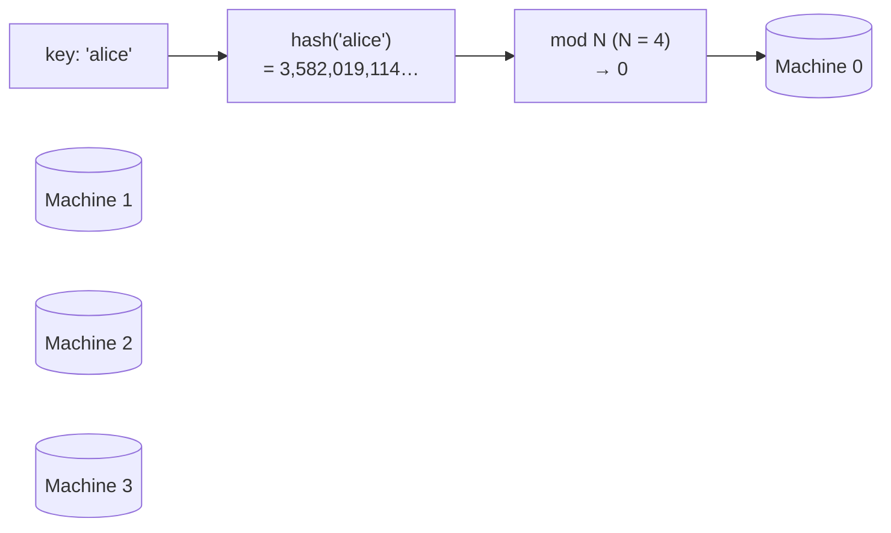
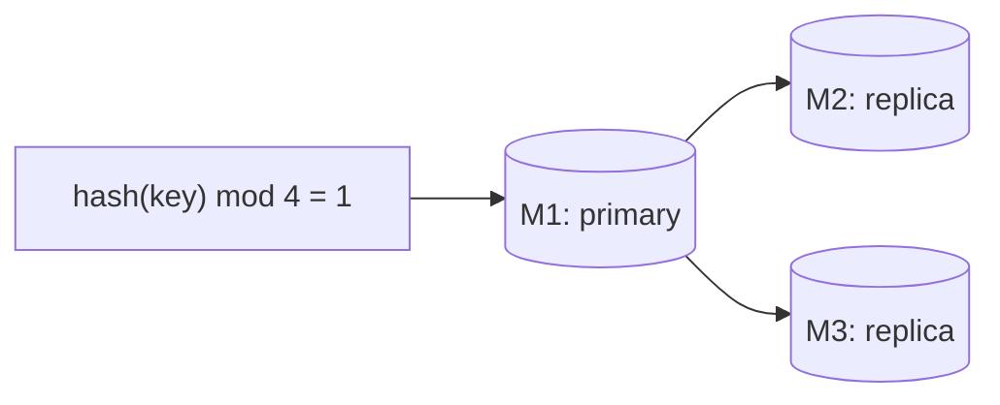
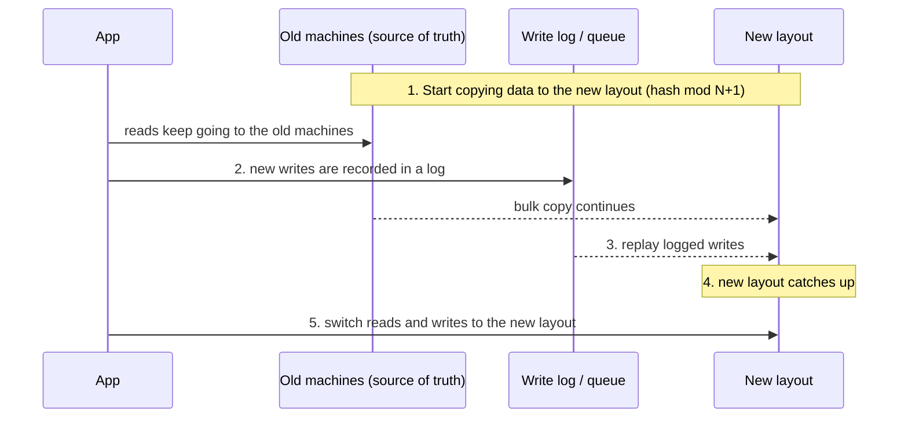

# Sharding - Using Partition Functions

> [!info] How this note is built
> - **🎓 Course:** the lecture page ("the simplest way of sharding is by using a Partitioning Function… how it works and its pros and cons") and the instructor's answers in the discussion. They show what the video covers: hashing, homogeneous data, replicas, and **remapping with a log**.
> - **🧠 Explanation:** my own explanation of how partition functions work, with worked numbers. The key-movement percentages were computed on 100,000 test keys. There's also a short list of reference [[#Sources]].
> - Related: [[Why Sharding is the Swiss Army Knife of System Design]], [[Distributed Caching Using Memcached]] (memcached's client does exactly this), [[CAP Theorem for Beginners]] (replicas and consistency)

## 7.1 The idea in one line

> [!quote] Partition function
> **A formula that takes a key and returns the machine that owns it.** No lookup table and no coordinator: anyone who knows the formula and the number of machines can compute where a key lives.
>
> `machine = hash(key) mod N`

- 🎓 It's **the simplest way to shard**.
- 🎓 A partition function is **similar to an index**: it tells you where to find a row.

---

## 7.2 How it works 🧠

**Write `alice`:**
1. The client or app server computes `hash("alice") mod 4 = 0`.
2. It sends the write straight to **machine 0**.

**Read `alice`:** compute the same thing, get 0, and read from machine 0. **The same key always lands on the same machine.**

### Why hash first? 🎓
The instructor gives two reasons:
1. **It turns any key into a number.** A string like `"abcd"` becomes an integer you can take `mod N` of.
2. **It spreads keys evenly.** If keys are 1-100, the hash **scatters them roughly at random** across machines, so neighboring keys don't pile up together.

🧠 **Without a hash**, using `user_id mod N` or range buckets, sequential IDs can cluster. Example: with a 1-per-day ID scheme, all of today's items land together.

🧠 **Hash function choice:**
- Use a **fast, uniform, stable** hash (MurmurHash, xxHash, CRC32, MD5).
- **Every client must use the same one.**
- Don't use language hashes that change per process, like Python's `hash()` on strings.

### A tiny worked example (computed with MD5, N = 4)

| Key | `hash mod 4` | Machine |
|---|---|---|
| alice | 0 | M0 |
| bob | 0 | M0 |
| carol | 0 | M0 |
| dave | 0 | M0 |
| erin | 3 | M3 |
| frank | 2 | M2 |

- Small samples look lumpy, and four of six keys landed on M0.
- Over **100,000 keys** the split was **24,902 / 25,162 / 24,770 / 25,166**, which is about 25% each. **Hashing evens out at scale.**

---

## 7.3 Pros and cons 🎓🧠

| ✅ Pros | ❌ Cons |
|---|---|
| **Simple:** one line of code | **Changing N moves most keys** (section 3) |
| **No lookup service** or directory, so no extra hop and no single point of failure | **Hot spots with non-homogeneous data** (section 4) |
| **Any client can compute the location** (like memcached clients) | **Range queries are expensive:** neighboring keys are scattered, so "all orders from May" asks every machine |
| **Even spread** when data is **homogeneous** 🎓 | You can't move one hot key to a quieter machine; the formula decides |
| Fast: O(1) to find the machine | Every client must agree on **N and the hash**, so config changes are risky |

> [!tip] When to use it 🎓
> - Great for **homogeneous** data, meaning keys **spread evenly across the hash space**.
> - Great when the **number of machines rarely changes**.

---

## 7.4 The big problem: changing N 🧠

Add one machine and `hash(key) mod N` becomes `hash(key) mod (N+1)`. **Almost every key's answer changes.**

These are measured on 100,000 keys:

| Resize | Keys that move |
|---|---|
| 3 → 4 | **75%** |
| 4 → 5 | **80%** |
| 10 → 11 | **91%** |
| 4 → 8 (doubling) | **50%** |

- **Rule:** going from N to N+1 moves about **N/(N+1)** of the keys. **The bigger the cluster, the worse it gets.**
- **Doubling is the least painful case.** Each key either **stays** on machine `k` or moves to `k + N`, and half move. Each old machine splits in two.

**Why it hurts:**
- **Database:** you have to copy most of the data between machines. Hours of work and lots of network traffic.
- **Cache:** most keys suddenly miss, and the DB gets flooded. Last.fm described this as having "effectively wiped the entire cache" ([[Distributed Caching Using Memcached]]).

**How people avoid it** (likely the next lectures):
- **Consistent hashing:** only about 1/N of keys move.
- **Many logical shards mapped to fewer machines:** move whole shards, never re-hash. Examples: Pinterest's 4,096 shards, Notion's 480.
- **Grow by doubling** if you must stick with mod N.

---

## 7.5 Homogeneous vs non-homogeneous data 🎓

**Homogeneous** 🎓 (the instructor's definition): the data is **mixed evenly across the hash space**, so each machine gets about the same load.

**Non-homogeneous:** some parts of the hash space are **much busier** than others, creating **hot spots**.

| Example | Type | Why (🎓 from the discussion) |
|---|---|---|
| **User profiles** created each day | Homogeneous | You choose how the keys are made, so they spread evenly |
| **Images keyed by date** | Non-homogeneous | Keys that include the date can land together, making one machine hot for "today's images" |
| **A celebrity posting lots of tweets, with the celebrity's ID inside the tweet ID** | Non-homogeneous | One user's huge activity concentrates on one machine |

> [!warning] Hashing can't fix a single hot key 🧠
> - A hash spreads **different** keys well.
> - If **one key** (or one user's keys) gets millions of requests, all of them still go to **one machine**.
> - **Fixes:**
>   - **Salt the key:** `celebrity:123#0…#9` spreads it over 10 machines; read all 10 and combine.
>   - **Cache** hot reads.
>   - Give heavy users special handling.
>   - Choose a partition key that isn't the busy dimension (e.g. hash on `tweet_id`, not `author_id`).

---

## 7.6 Replication with a partition function 🎓

- **Can partitions be replicated? Yes.** Each partition can have **several copies**.
- **Typical setup:** each row is **copied to 2 more nodes**, so 3 copies in total, for fault tolerance.
- **The primary machine is down?** For resilience, **write to 2 or more servers at once** (the replicas).
- **When is a write successful?**
  - Usually when **a majority of replicas** confirm it. If most fail, **return an error or retry**.
  - For **strong consistency**, use **synchronous replication**: success only when **all** replicas have the write. (See the quorum section in [[CAP Theorem for Beginners]].)

🧠 **A simple way to place replicas:** primary on `p = hash(key) mod N`, copies on `(p+1) mod N` and `(p+2) mod N`.

---

## 7.7 Remapping: adding machines without downtime 🎓

When N changes, data has to move. From the discussion, the video's approach is roughly:

🎓 **Why use a log instead of writing straight to the new machines?** A student asked this, and the instructor gave two reasons:
1. **You can't tell whether a row was already copied.** If you write row R to the new machine and the bulk copy later brings over the old R, **it overwrites the newer write**.
2. **If the copy fails halfway**, you'd have to work out which rows were written where and move them back.
3. Main point: **always keep one source of truth** (the old layout) to fall back on. Juggling several copies creates many edge cases.

🎓 **Other answers:**
- **Can you read data that's still in the log?** Ideally yes: **check the log for newer data** when reading.
- **Need consistent reads during remapping?** **Keep reading from the old machines** and only switch once the new ones are fully caught up.
- **Can the log be a cache or a queue?** Yes. "Log" is just a concept; a **queue with workers** replaying writes, or a cache, works too.

🧠 **What real systems add:**
- **Change data capture:** tail the DB's own write-ahead log instead of a separate log.
- **Double writes plus verification.** Notion used "dark reads" that compare old and new data before switching.
- **A short read-only or maintenance window** at the switch (Vitess: seconds; Notion: 5 minutes).

---

## 7.8 Scenarios to walk through 🧠

> [!example]- Scenario 1: Sharding user profiles across 4 DBs
> - **Partition key:** `user_id`, which is **homogeneous** (🎓 the profiles example).
> - `db = murmur(user_id) mod 4`, with each DB holding about 25% of users.
> - **Lookup:** "get profile 9812" → hash → DB 2 → one query, no directory.
> - **Replicas:** each DB has 2 replicas, and writes succeed on a majority.
> - **Weakness:** "list all users who signed up in May" must ask **all 4 DBs** and merge the results.

> [!example]- Scenario 2: Growing from 4 to 5 machines
> - **About 80%** of keys now belong to a different machine.
> - **As a cache:** the hit rate drops from about 90% to about 20% and the DB takes about 8× more reads. **Don't do this at peak.**
> - **As a DB:** copy about 80% of the data. Keep the old layout as the source of truth, log new writes, replay them, then switch.
> - **Better options:**
>   - **Double to 8** (only 50% moves, and each machine splits cleanly).
>   - Switch to consistent hashing.
>   - Pre-split into many logical shards.

> [!example]- Scenario 3: Photos keyed by upload date (non-homogeneous)
> - **Key:** `2026-09-28/photo123`, with the partition function applied to the **date part**.
> - Every photo uploaded today goes to one machine, so all today's writes and "latest photos" reads hit it. **Hot spot.**
> - **Fix:** partition on `hash(photo_id)`. If you need "photos by day", keep a separate index or time-bucketed table.

> [!example]- Scenario 4: The celebrity problem (🎓 the instructor's tweet example)
> - Tweet IDs contain the author's ID, and the partition function uses the author ID.
> - A celebrity posts constantly and has 100M followers reading, so **one machine melts**.
> - **Fixes:**
>   - Partition tweets by **`hash(tweet_id)`**.
>   - Cache the celebrity's timeline.
>   - Salt the celebrity's keys across machines.

> [!example]- Scenario 5: A machine is down during a write
> - `hash(key) mod 4 = 2`, but M2 is down.
> - **With replicas:** write to M3 and M0 as well. If a **majority (2 of 3)** confirm, it's a success. M2 catches up when it's back.
> - **No replicas:** the write fails, or you queue it for later.

> [!example]- Scenario 6: Memcached cluster (same idea, for a cache)
> - Memcached clients use a partition function to pick a server. The servers don't know about each other.
> - Losing a node with mod N changes N for everyone, so almost every key moves. That's why memcached clients switched to consistent hashing (ketama).

---

## 7.9 How it compares with the other options 🧠

| | Partition function (`hash mod N`) | Consistent hashing | Lookup table / directory |
|---|---|---|---|
| Find a key | Compute | Compute (search the ring) | Look it up (extra hop) |
| Add a machine | **Most keys move** | About **1/N** move | Move whatever you choose |
| Hot key | Can't move it | Can't move it (vnodes help load) | **Can move it** |
| Extra infrastructure | None | None | A reliable, cached directory |
| Best for | A fixed number of machines, homogeneous data | Caches and KV stores that grow and shrink | Big DBs needing flexible rebalancing |

---

## 7.10 Pitfalls to avoid in interviews

> [!warning] Common mistakes
> - Proposing `hash mod N` and not mentioning **what happens when N changes**.
> - Forgetting **replication**: a partition function alone means losing a machine loses its data.
> - Partitioning on a **time-based or celebrity-heavy key** (non-homogeneous).
> - Expecting **range queries** to be cheap on hashed data.
> - Writing straight to new machines during a move with **no source of truth** (🎓 the log discussion).
> - Clients disagreeing on N or on the hash function (a config drift bug).

## Video notes

- Partition function video:

## Sources

- 🎓 [Interview Camp – Sharding: Using Partition Functions](https://interview-academy.teachable.com/courses/101687/lectures/4014543)
- [Richard Jones (Last.fm) – libketama: why hash mod N breaks memcached](https://www.metabrew.com/article/libketama-consistent-hashing-algo-memcached-clients)
- [Wikipedia – Consistent hashing](https://en.wikipedia.org/wiki/Consistent_hashing)
- [Pinterest Engineering – Sharding Pinterest](https://medium.com/pinterest-engineering/sharding-pinterest-how-we-scaled-our-mysql-fleet-3f341e96ca6f)
- [Notion – Sharding Postgres at Notion](https://www.notion.com/blog/sharding-postgres-at-notion)
- [Vitess – Sharding](https://vitess.io/docs/archive/22.0/reference/features/sharding/)

---
