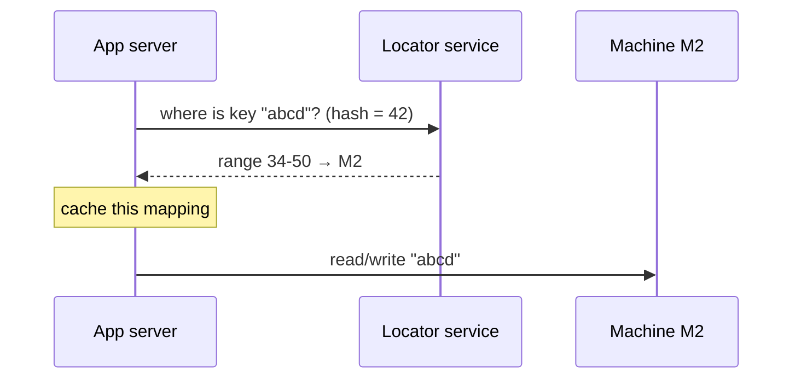

# Dynamic Sharding

> [!info] How this note is built
> - **🎓 Course:** the lecture page and the instructor's answers in the discussion (39 comments). They show the video uses a **locator service** that maps **key ranges → machines**, with a **backup locator**.
> - **🌐 Outside:** MongoDB, HBase and Bigtable docs plus the reading the course links. The attached Clustrix PDF wouldn't open, so I used the same author's article. See [[#Sources]].
> - **🧠 Explanation:** my own explanation and worked examples.
> - Related: [[Sharding - Using Partition Functions]] (the approach this improves on), [[Why Sharding is the Swiss Army Knife of System Design]]

## 8.1 What the lecture says 🎓

- **Dynamic sharding is an improvement over partition functions.**
- It has **more implementation details**, and you need to understand them to discuss it in interviews.

---

## 8.2 The core idea 🎓🧠

> [!quote] Dynamic sharding
> - Instead of a **fixed formula** (`hash(key) mod N`), keep a **table** that says **which key range lives on which machine**.
> - That table sits in a **locator service**, also called a metadata, config or directory service.
> - **Change the table and you change where data lives.** No formula has to change.

| | **Algorithmic / static** (partition function) | **Dynamic** (locator service) |
|---|---|---|
| Where is key X? | **Compute** `hash(X) mod N` | **Look up** X's range in the locator table |
| Adding a machine | Change N, and **most keys move** | **Split one range** and move **only that range** |
| Hot spot | Stuck: the formula decides | **Split or move the hot range** |
| Extra parts | None | A **locator service** (must be highly available) |
| Examples | Memcached clients, Redis Cluster (fixed slots), simple app sharding | **MongoDB, HBase, Bigtable** 🎓🌐 |

🎓 **Is this used in practice over consistent hashing?** "Yes… Many systems use this. For e.g., MongoDB, HBase."

🎓 **SQL or NoSQL?** It works for **any distributed database**. It's a general way to spread data across machines, not tied to one technology.

---

## 8.3 How the locator table works 🎓

### Step 1: turn keys into a number in a fixed key space
- 🎓 **Use `hash(key)`, with no `% N`.** The hash output **is** the key space. Taking `mod N` would bring back the old problem of changing N.
- 🎓 **Or assign keys randomly** within the key space, e.g. 0-10,000.
- 🎓 **How big should the key space be?** **Very large**, e.g. the full integer or long range.
  - A 4-byte int key gives a range of **[−2³¹, 2³¹−1]**.
  - Use a smaller space only if you know there are few possible keys.
  - If you can't define a range at all, fall back to static sharding (modulo).
- 🧠 **Or skip hashing and use the raw key** (e.g. `user_id` or `timestamp`) to keep **range scans** fast. That's what HBase and Bigtable do, at the risk of hot spots.

### Step 2: split the key space into ranges and assign them to machines

Example (like the table in the video):

| Key range | Machine |
|---|---|
| 0 - 33 | M1 |
| 34 - 50 | M2 |
| 51 - 75 | M3 |
| 76 - 100 | M4 |

- Ranges **don't have to be the same size**. Busy parts of the key space get **smaller** ranges.

### Step 3: read and write through the locator

- 🎓 **The locator belongs to the distributed database, not the load balancer.** The **app server** asks the locator where data lives.
- 🎓 **Could the load balancer be the locator?** "Possibly… if it had all the functionality," but **that's not its job**.
- 🎓 **Could a proxy sit in front?** A student suggested: client → **proxy/gateway** → proxy asks the locator → proxy calls the DB, so the **client doesn't need to know the backend layout**. The instructor: **"Yup, that's a good approach."**
  - 🌐 That's exactly **MongoDB's `mongos` router**.
- 🧠 **Caching the table:** clients or routers **cache** it so they don't ask the locator on every request. If a cached entry is wrong, the shard replies "not mine" and the client refreshes.

---

## 8.4 Adding machines and rebalancing 🎓🧠

**Adding a machine (M5) when M1 is too full:**

| Before | After |
|---|---|
| 0-33 → M1 | 0-16 → M1 |
| | **17-33 → M5** (new) |
| 34-50 → M2 | 34-50 → M2 |

- **Only keys 17-33 move.** M2, M3 and M4 aren't touched.
- 🎓 From a student: remapping is needed in both approaches, but **"in partition function, you might have to remap all the data. In locator service, you can add one more row… and it only requires remapping one or two machines."** The worst case can be the same, but the locator gives you **more control**.

🎓 **While a range is moving,** the locator can:
- **pause** requests for just those ranges, or
- keep serving them from **a copy that isn't being moved**.

This is where the locator's **flexibility** pays off. (The log-and-replay method from [[Sharding - Using Partition Functions]] still applies.)

🧠 **The steps to move a range:**
1. Copy range 17-33 from M1 to M5 while M1 keeps serving it.
2. Catch up on writes that happened during the copy (log, replay, or dual-write).
3. Briefly **pause writes** for 17-33.
4. **Update the locator** to 17-33 → M5.
5. Resume. Clients with an old cached map get redirected and refresh.
6. Delete 17-33 from M1.

🌐 **How MongoDB does it:**
- Data is split into **chunks**, each a range of shard-key values, **128 MB by default**.
- A background **balancer** migrates chunks when the gap between the biggest and smallest shard passes a threshold.
- A chunk that **can't be split**, because it's all **one shard-key value**, becomes a **"jumbo chunk"**. That's a hot-key problem.

🌐 **How HBase does it:**
- A **region** is a contiguous row-key range.
- It **splits automatically** when it grows past `hbase.hregion.max.filesize`, **10 GB by default**.
- The **HMaster** assigns regions to RegionServers.
- The **`hbase:meta`** table is the locator, and clients cache region locations.

---

## 8.5 Keeping the locator available 🎓

> [!warning] The locator is critical
> **If the locator is down, nobody knows where any data lives, so reads and writes both stop.** It's a single point of failure unless you make it redundant.

🎓 **The design from the video: a high-availability (HA) pair**
- **Primary locator** plus a **backup locator** holding a copy of the table.
- **If the primary fails**, the backup takes over in **read-only mode**.
  - "Read-only" means **no changes to the partition map**: no splitting or moving ranges. **Normal data reads and writes keep working.**
  - 🎓 **Why:** when the primary comes back, you **don't have to lock and re-sync** two different versions of the map.
  - 🎓 You *could* allow map changes on the backup and **sync when the primary returns**, but it's more complex.
- **If the backup also fails,** clients don't know where to read **or** write, so both stop.
- 🎓 **Both machines failing** is statistically much less likely. HA pairs cover **single-machine** failure. To cover both, add **another replica or backup in a separate data center**.

🌐 **What real systems do:**
- **MongoDB:** config servers run as a **3-member replica set** (CSRS). Clients go through several **`mongos`** routers, which cache the metadata.
- **Bigtable:** a **three-level lookup**. A Chubby file points to the **root tablet**, which lists the **METADATA tablets**, which list the **user tablets**.
  - Clients **cache** locations and **don't go through the master** to find data.
  - The paper puts a tablet at about **100-200 MB**. An empty cache costs **3 round trips**; a stale cache up to **6**.
- **ZooKeeper/etcd** are common choices for storing locator metadata **with consensus**.
- 🧠 **The locator is small** (a few thousand rows), so it's easy to **copy everywhere** and cache aggressively.

---

## 8.6 Pros and cons 🎓🧠

| ✅ Pros | ❌ Cons |
|---|---|
| **Adding machines moves only the affected ranges** | **One more service** to build, run and keep highly available |
| **Hot spots can be fixed:** split or move the busy range | **An extra lookup** (small with caching) |
| Ranges can differ in size to match uneven data | Caches can go **stale** and need redirect/refresh logic |
| **Range scans** stay efficient if keys aren't hashed | Unhashed, rising keys (timestamps) create a **hot spot on the last range**, even after many splits |
| Full control: pin a big customer to their own machine, move data for maintenance | Moving a range still needs careful copy → catch up → switch |

---

## 8.7 Distributed joins 🎓

- 🎓 **Can you run one big SQL join across shards?** It's hard, and **distributed JOINs** are a **big challenge** when you shard relational DBs.
- 🧠 **Ways around it:**
  - **Keep related data together**, e.g. a user's orders on the user's shard (an "entity group").
  - **Denormalize.**
  - **Join in the application.**
  - **Broadcast small tables** to every shard.
  - **Scatter-gather** as a last resort.

🎓 **ACID with lots of data?**
- Shard it (dynamic or any method).
- For strong consistency, **wait for all replicas before acknowledging**. Writes get slower; that's the price of strong ACID.

---

## 8.8 Scenarios to walk through 🧠

> [!example]- Scenario 1: URL shortener with a locator (🎓 Poonam's question)
> - **Key:** a 7-character short code, hashed to a 64-bit number.
> - **Key space:** 0 to 2⁶⁴−1, split into **64 ranges** over 8 machines (8 ranges each).
> - **Writing `aZ3k9Qx`:** hash it, find its range in the cached locator table (range 17 → M3), write to M3.
> - **Growth:** M3 fills up, so move ranges 17 and 18 to a new M9. Only 2 of 64 ranges move.
> - The code is **hashed**, so there are no hot ranges from sequential codes.

> [!example]- Scenario 2: Fixing a hot range
> - Range 34-50 on M2 gets **5×** the traffic of the others because it holds a viral creator's data.
> - **Split** it into 34-42 (stays on M2) and 43-50 (moves to the idle M4).
> - **With `hash mod N`** you couldn't do this; the formula decides and you can't give one range more machines.
> - **If one single key** is the problem (a MongoDB **jumbo chunk**), splitting doesn't help. You need a better key: add a suffix or refine the shard key.

> [!example]- Scenario 3: Time-series data (the classic range trap)
> - **Key:** raw `timestamp`, not hashed, so "last hour" queries are range scans.
> - **Problem:** every new write lands in **the last range**, and splitting just creates a new last range. The hot spot stays **at the end of the key range even after many splits**.
> - **Fixes:**
>   - Key on `(sensor_id, timestamp)` so writes spread across sensors.
>   - Or add a small **hash prefix or bucket** in front of the timestamp and query the buckets in parallel.

> [!example]- Scenario 4: The locator fails
> 1. The primary locator dies. Clients and routers **keep working from cached maps**.
> 2. The backup takes over in **read-only map mode**: data reads and writes are fine, but **no rebalancing**.
> 3. The primary comes back, **with no re-sync** because the map didn't change.
> 4. **If both die**, cached clients keep going for a while, but new clients and moved ranges fail. So keep a **third copy in another data center** (🎓), or use a 3-5 node consensus group (ZooKeeper, etcd, MongoDB config servers).

> [!example]- Scenario 5: A tenant that outgrows its shard
> - A SaaS app shards by `org_id` range, and one enterprise customer becomes 30% of all traffic.
> - Give that org **its own range and its own machine**, with one row in the locator table.
> - A partition function can't do that. **Custom placement is the locator's superpower.**

> [!example]- Scenario 6: A MongoDB sharded cluster
> - **App → `mongos` router** (the 🎓 proxy idea) → **config servers** (the locator, a 3-member replica set) → **shards** (each a 3-member replica set).
> - The collection is split into 128 MB chunks by shard key, and the balancer moves chunks when shards become uneven.
> - Pick **hashed** sharding for even writes, or **ranged** sharding for range queries (with hot-spot risk).

---

## 8.9 Pitfalls to avoid in interviews

> [!warning] Common mistakes
> - Proposing a locator without saying **how it stays available** (an HA pair, a replica set, consensus).
> - Forgetting that **clients cache** the map, and how stale caches get corrected.
> - Using `hash(key) % N` **and then** a locator. The hash should map into a **fixed, large key space**, with no `% N`.
> - Range-sharding on a **rising key** (timestamp, auto-increment) and calling it balanced.
> - Assuming splitting fixes a **single hot key**. It can't (jumbo chunks).
> - Confusing the locator with the **load balancer**. 🎓 They're different jobs.
> - Ignoring **cross-shard joins** for relational data.

## Video notes

- Dynamic sharding video:

## Sources

- 🎓 [Interview Camp – Dynamic Sharding](https://interview-academy.teachable.com/courses/101687/lectures/4019329) (plus the attached Clustrix article "The Differences Between Algorithmic and Dynamic Sharding")
- 🎓 [Jeeyoung Kim – How Sharding Works (linked in discussion)](https://medium.com/@jeeyoungk/how-sharding-works-b4dec46b3f6)
- [MongoDB – Sharded cluster components](https://www.mongodb.com/docs/manual/core/sharded-cluster-components/)
- [MongoDB – Data partitioning with chunks](https://www.mongodb.com/docs/manual/core/sharding-data-partitioning/)
- [Apache HBase Reference Guide – Regions](https://hbase.apache.org/book.html#regions.arch)
- [Bigtable paper notes (Chang et al., OSDI 2006)](https://mwhittaker.github.io/papers/html/chang2008bigtable.html)
- 🎓 [SingleStore (MemSQL) – Scaling distributed joins (linked by instructor)](https://www.memsql.com/blog/scaling-distributed-joins/)

---
