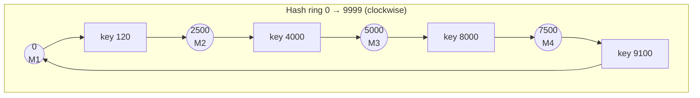

# Sharding - Consistent Hashing

> [!info] How this note is built
> - **🎓 Course:** the lecture page ("**minimize the movement of data when adding a new node**") and the discussion (45 comments). The discussion shows the video covers **Model 1** (one spot per machine) and **Model 2** (many spots per machine), the ring as a **sorted array with binary search**, adding an "orange" machine, **doubling machines**, and replication to the **next 3 nodes**.
> - **🌐 Outside:** papers and docs under [[#Sources]].
> - **🧠 Explanation:** my own explanation, plus a **simulation** of 200,000 keys on 10 servers.
> - Related: [[Sharding - Using Partition Functions]] (the problem this solves), [[Dynamic Sharding]] (the other fix), [[Distributed Caching Using Memcached]] (ketama)

## 9.1 What the lecture says 🎓

> [!quote]
> **With consistent hashing, you can minimize the movement of data when adding a new node** to a distributed database.

> [!tip] Interview advice from the instructor 🎓
> - **Start with normal sharding first**, then move to consistent hashing if it's needed.
> - Normal sharding is **more common** and **more flexible**: you can adapt it to the question.
> - Opening with consistent hashing "is usually a **dead giveaway** that you've studied it and are just repeating what you've studied."

🎓 **Why is it called "consistent"?** It's **not** CAP consistency. From the original paper: "a consistent hash function is one which **changes minimally as the range of the function changes**."

---

## 9.2 The problem it solves 🧠

- With a partition function `hash(key) mod N`, **adding one machine moves about N/(N+1) of all keys**: 80% for 4→5, 91% for 10→11. See [[Sharding - Using Partition Functions]].
- **Consistent hashing moves only about 1/(N+1)**, just the keys the new machine takes over.

| 10 → 11 servers (200k keys, my simulation) | Keys moved |
|---|---|
| `hash mod N` | **about 91%** |
| Consistent hashing | **about 8%** (ideal is 1/11 ≈ 9.1%) |

---

## 9.3 How the ring works 🎓🧠

1. **Choose a big hash space** and think of it as a **circle** (a ring). 🎓 The instructor uses `hash(key) % 10000`; real systems use 0 to 2³²−1 or more.
2. **Put each machine on the ring** by hashing its name or ID, e.g. `hash("M1") → 0`.
3. **Put each key on the ring** with the same hash.
4. **A key belongs to the first machine clockwise from it.** Past the top, wrap around to the start.



- key 120 → next machine clockwise is **M2** (at 2500).
- key 4000 → **M3** (at 5000).
- key 9100 → wraps past 9999 → **M1** (at 0).

### In code, the ring is just a sorted array 🎓

The instructor's example:

```
[   0 -> Machine 1,
  253 -> Machine 2,
 6893 -> Machine 3,
 9474 -> Machine 2,
10383 -> Machine 1, ... ]
```

- **Lookup key 8000:** binary search for the **first position greater than 8000**, which is **9474 → Machine 2**.
- **Lookup cost: O(log M)**, where M is the number of spots on the ring.
- **Machine 2 appears twice.** A machine can hold **several spots** (Model 2, below).

```python
# 🧠 minimal version
import bisect
positions = [0, 253, 6893, 9474, 10383]      # sorted
owners    = ["M1", "M2", "M3", "M2", "M1"]
def machine_for(key):
    p = hash_fn(key) % RING_SIZE
    i = bisect.bisect_right(positions, p) % len(positions)   # wrap around
    return owners[i]
```

---

## 9.4 Adding and removing a machine 🎓🧠

**Adding M5 at position 6000** (between M3 at 5000 and M4 at 7500):
- Keys from **5001 to 6000** used to belong to M4. They **now belong to M5**.
- **Only M4 gives up keys.** M1, M2 and M3 don't change.
- 🎓 **What gets copied:** only that key range (e.g. keys 1938-3948) moves to the new machine; nothing else is copied.
- 🎓 **Who moves the data:** the consistent hashing software. When a machine joins, it broadcasts "**machine X added at position Y**", and the machine that owns that range starts moving its keys.
- 🎓 **Is there downtime?** A student asked. The same methods from earlier lectures apply: keep serving from the old owner or a replica, **log new writes and replay them**, then switch.

**Removing M3** (a failure or a planned removal):
- M3's keys go to **the next machine clockwise**, M5 or M4.
- Nothing else moves.

---

## 9.5 Model 1 vs Model 2 (virtual nodes) 🎓

| | **Model 1: one spot per machine** | **Model 2: many spots per machine** ("virtual nodes") |
|---|---|---|
| Spots | 1 per machine | Many per machine (🎓 the video uses 3; real systems use 100-256) |
| Balance | **Uneven:** random positions leave some machines with big arcs | **Even:** many small arcs average out |
| Adding 1 machine | Takes load from **only 1 neighbor** | Takes a little load from **many machines** |
| To relieve **every** machine | 🎓 You'd have to **double the machines**, adding as many as you already have | Add one; it takes a slice from everyone |
| Machine fails | **All** its load lands on **one** neighbor, which can overload it too | Its load **spreads across many** machines |
| Used in practice | Rarely | 🎓 **"Any industrial system will have Model 2"** |

> [!warning] Spots ≠ copies 🎓
> - "Each machine takes 3 spots" does **not** mean the data is copied 3 times.
> - The machine is responsible for **3 smaller parts of the ring** instead of one big part.
> - **The key space is divided, not the data.**

🎓 **Where should a new machine go?**
- Ideally where it makes **all arcs about equal**.
- In practice **random placement works about as well** when there are many spots, and it's simpler.

### Simulation: how virtual nodes even things out 🧠
10 servers, 200,000 keys. Ideal share is **10.0%** each.

| Spots per server | Busiest server | Least busy | Std dev | Keys moved when adding an 11th |
|---|---|---|---|---|
| **1** (Model 1) | **25.2%** | **0.1%** | 8.4 | 8.1% |
| 10 | 14.7% | 6.7% | 2.5 | 6.9% |
| 100 | 12.3% | 6.5% | 1.5 | 8.6% |
| 200 | **10.8%** | **8.6%** | 0.7 | 8.3% |

- With **one spot each**, one server got **25%** of keys and another got **0.1%**.
- With **200 spots**, every server was within about ±1.4 points of the ideal 10%.
- 🌐 That's why systems use about **100-256 spots per node** (ketama: 100-200; Cassandra's old default: 256 tokens).
- 🌐 **Weighted machines:** give a bigger machine **more spots**.

---

## 9.6 Who runs the hashing? No locator needed 🎓

- **Consistent hashing vs dynamic sharding:** the main difference is that **there's no locator or master**. "That leads to different designs."
- **Every machine on the ring (or every client) has a copy of the ring** and the hashing software. It's a **masterless** system.
- A request can go to **any** machine. The load balancer picks one **round robin, randomly, or by which is free**, and that machine **forwards it to the owner**.
- Or the **client library** holds the ring and goes straight to the owner. That's how memcached clients work.

🧠 **A student's sharper point:**
- Both approaches keep a **map from ranges to machines**. In consistent hashing, the map (the ring) is **copied to every node** instead of living in one locator service.
- So you could say consistent hashing is "a **decentralized** version of dynamic sharding" with a **hash-based** way of placing machines.

---

## 9.7 Replication and failures 🎓

**Replication on the ring:**
- Store each key on the **owner plus the next nodes clockwise**. With a **replication factor of 3**, every key lives on **3 servers**.
- If one goes down, the other two can still serve it. 🎓 A student noted this is how **Cassandra** works.
- 🧠 With virtual nodes, skip spots that belong to a machine you've already used, so the 3 copies are on **3 different physical machines**. Dynamo calls this the "preference list".

**Detecting failures: gossip** 🎓
1. Each node **checks on about 3 other nodes** and expects acknowledgments.
2. If one stops responding, the node marks it down and **spreads that news** to the others.
3. **Reads and writes go to the replicas** of the failed machine.
4. When it **comes back**, it **gets missed updates from its replicas**, announces it's active, and starts serving again.
5. If it's **gone for good** (less common), it's removed from the ring or an admin adds a replacement.

**Consistency:** combine with quorums, **R + W > N** (🎓 from the discussion). See [[CAP Theorem for Beginners]].

**Geography** 🎓 — two options:
1. **One ring spanning regions**, with parts of the ring on servers in different regions.
2. **One ring per region**, each holding its region's data, with an upstream router choosing the ring.

---

## 9.8 Downsides and alternatives 🎓🌐

🎓 The instructor pointed to Damian Gryski's "Consistent Hashing: Algorithmic Tradeoffs" for the downsides:

| Algorithm | Idea | Pros | Cons |
|---|---|---|---|
| **Ring hash** (this lecture) | Sorted ring plus virtual nodes | Handles any add or remove | Still uneven: **about 10% std dev at 100 vnodes**, about 3.2% at 1,000. **Memory** for many vnodes; O(log n) lookup |
| **Jump hash** (Google, 2014) | A few lines of math map a key to a bucket 0…n−1 | **Almost perfect balance**, no memory | Buckets are numbered, so you **can't remove an arbitrary node**. Bad for caches where any node can crash. |
| **Rendezvous / HRW** (1996) | For each key, score every node with `hash(key, node)` and pick the highest | Simple, even, any add or remove | **O(n) per lookup** |
| **Maglev** (Google LB) | A precomputed lookup table | **O(1)** lookups, even | Rebuilding the table is slow, and a few extra keys move |
| **Bounded loads** (Google, 2017) | Consistent hashing, but **skip a node that's over its load limit** | Stops hot nodes | More complex. Used in HAProxy and at Vimeo. |

**Other limits:**
- It **doesn't fix a single hot key**; that key still lands on one node.
- **No range scans**, since keys are hashed.
- **Membership has to converge.** Nodes with different views of the ring send keys to different places for a while.

🌐 **Who uses it:**
- Amazon Dynamo, Cassandra, Riak, Discord
- Memcached clients (ketama), Akamai (the original 1997 use)
- Envoy/NGINX load balancers (`ring_hash`, `hash … consistent`)
- **Redis Cluster uses 16,384 fixed hash slots instead**, a different way to get the same result.

🎓 **Related paper:** **Chord** (MIT, 2001) builds a peer-to-peer lookup service on a consistent hashing ring.

---

## 9.9 Scenarios to walk through 🧠

> [!example]- Scenario 1: A key lookup (the instructor's array)
> Ring: `[0→M1, 253→M2, 6893→M3, 9474→M2, 10383→M1]`
> - key hash **8000** → first position > 8000 is **9474** → **M2**
> - key hash **100** → **253** → **M2**
> - key hash **7000** → **9474** → **M2**
> - key hash **10500** → nothing is greater → **wrap** to **0** → **M1**

> [!example]- Scenario 2: Growing a cache cluster from 10 to 11 nodes
> - **With `hash mod N`:** about 91% of keys move, the hit rate collapses and the DB gets flooded.
> - **With a ring and 200 vnodes:** about 8-9% of keys move to the new node, and the other 91% still hit.
> - This is exactly why **memcached clients switched to ketama** ([[Distributed Caching Using Memcached]]).

> [!example]- Scenario 3: A node fails, Model 1 vs Model 2
> - **Model 1:** M3 dies and **all** its keys go to M4. M4 now has double load, may fall over, and **cascades** to M1…
> - **Model 2 (200 vnodes):** M3's 200 small arcs go to **many different** next nodes, so each survivor takes about +1/9 more. No cascade.
> - **With replication factor 3:** the keys are already on 2 other machines, so reads keep working. Gossip spreads "M3 is down" and a replacement **copies from replicas**.

> [!example]- Scenario 4: Mixed hardware
> - 8 old servers (32 GB) and 2 new ones (128 GB).
> - Give the old servers **100 vnodes** and the new ones **400**. The new servers get about 4× the keys, matching their memory.

> [!example]- Scenario 5: Designing a distributed key-value store (interview flow)
> 1. 🎓 **Start simple:** "shard by `hash(key) mod N`."
> 2. **Interviewer:** "What happens when you add a server?" → most keys move.
> 3. **Improve:** use a **ring with virtual nodes**, so adding a node moves about 1/N of keys.
> 4. **Add replication:** store on the next 3 distinct nodes clockwise, with **R + W > N** for consistency.
> 5. **Failures:** gossip to detect them, replicas take over, the returning node catches up.
> 6. **Mention the limits:** hot keys (salt them), no range scans, and membership must converge.

> [!example]- Scenario 6: Hot key on a ring
> - A viral video's metadata key gets 1M reads per second, and all of them go to its one owner.
> - Consistent hashing **can't** help: it spreads *keys*, not the load on one key.
> - **Fixes:** a local cache on the app servers, key copies (`vid:42#1..8`), or **bounded-load** hashing for request routing.

---

## 9.10 Pitfalls to avoid in interviews

> [!warning] Common mistakes
> - Opening with consistent hashing. 🎓 **Start with basic sharding**, then improve.
> - Drawing one spot per machine (Model 1) without **virtual nodes**.
> - Saying spots mean copies. 🎓 **Spots split the key space; replication is separate.**
> - Confusing "consistent" hashing with CAP consistency.
> - Claiming it fixes **hot keys** or supports **range queries**.
> - Forgetting how nodes **agree on the ring** (gossip or a config service).
> - Saying Redis Cluster uses consistent hashing. It uses **fixed hash slots**.

## Video notes

- Consistent hashing video (Model 1, Model 2, orange machine):

## Sources

- 🎓 [Interview Camp – Sharding: Consistent Hashing](https://interview-academy.teachable.com/courses/101687/lectures/4014547)
- 🎓 [Karger et al. 1997 – Consistent Hashing and Random Trees (paper linked by instructor)](https://www.cs.princeton.edu/courses/archive/fall09/cos518/papers/chash.pdf)
- 🎓 [Damian Gryski – Consistent Hashing: Algorithmic Tradeoffs](https://dgryski.medium.com/consistent-hashing-algorithmic-tradeoffs-ef6b8e2fcae8)
- 🎓 [DataStax – Gossip protocol (linked by instructor)](https://docs.datastax.com/en/ddac/doc/datastax_enterprise/dbArch/archGossipAbout.html)
- 🎓 [Stoica et al. – Chord (linked in discussion)](https://pdos.csail.mit.edu/papers/chord:sigcomm01/chord_sigcomm.pdf)
- [Wikipedia – Consistent hashing](https://en.wikipedia.org/wiki/Consistent_hashing)
- [Google Research – Consistent hashing with bounded loads](https://research.google/blog/consistent-hashing-with-bounded-loads/)
- [Vimeo Engineering – Improving load balancing with a new consistent-hashing algorithm](https://medium.com/vimeo-engineering-blog/improving-load-balancing-with-a-new-consistent-hashing-algorithm-9f1bd75709ed)
- [Richard Jones (Last.fm) – libketama](https://www.metabrew.com/article/libketama-consistent-hashing-algo-memcached-clients)
- [Werner Vogels – Amazon's Dynamo](https://www.allthingsdistributed.com/2007/10/amazons_dynamo.html)
- [Cassandra – Dynamo architecture](https://cassandra.apache.org/doc/latest/cassandra/architecture/dynamo.html)

---
