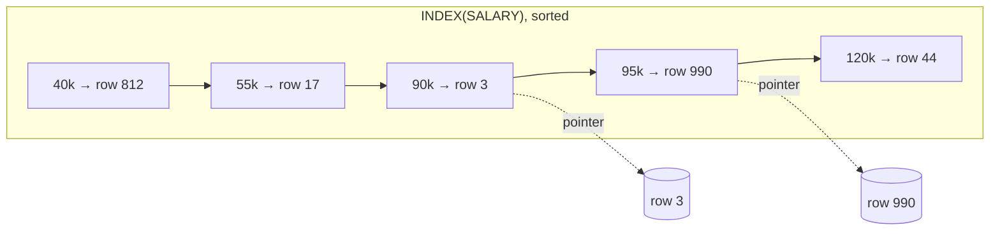

# Databases - Intro to Indexing and NoSQL

> [!info] How this note is built
> - **🎓 Course:** the lecture page and the instructor's answers in the discussion.
>   - **Video 1** covers indexing, using an index on **SALARY** that is **sorted** so you can **binary search** it. It also covers **RAM vs disk**.
>   - **Video 2** covers **NoSQL types** and how to use them in interviews.
> - **🌐 Outside:** MySQL/PostgreSQL docs, Use The Index, Luke, and others. See [[#Sources]].
> - **🧠 Explanation:** my own explanation and worked numbers.
> - Related: [[CAP Theorem for Beginners]] (ACID vs BASE), [[Why Sharding is the Swiss Army Knife of System Design]]

## 10.1 What the lecture says 🎓

- This section **introduces database concepts**.
- **Video 1: what indexing is.** You'll use it later when **designing schemas** for systems.
- **Video 2: NoSQL databases**, how to use them in interviews, and the **types of databases you should know**.

---

## Part 1: Indexing

### 10.2 What an index is 🎓🧠

> [!quote] Index
> A **separate, sorted data structure** that points to rows, so the database can **find rows without scanning the whole table**. It's like the index at the back of a book: look up "salary" and jump to the page.

**The course's example, rebuilt** 🎓

`EMPLOYEES(id, name, dept, salary)` with 1,000,000 rows, and the query `WHERE salary BETWEEN 90000 AND 100000`:

| Without an index | With `INDEX(SALARY)` |
|---|---|
| **Full table scan:** read all 1,000,000 rows and check each salary | The index is **sorted by salary** 🎓, so **binary search** to 90,000, then **walk forward** until 100,000 |
| About 1,000,000 checks, mostly from disk | About **20 steps** (log₂ 1M) to find the start, then only the matching rows |

- 🎓 An index built for **range queries** is **sorted**, which is why binary search works.
- 🎓 **Indexes exist in both SQL and NoSQL databases.** Examples: MongoDB secondary indexes, Cassandra secondary indexes, DynamoDB global secondary indexes (GSIs).
- 🎓 An index is **similar to a partition function**: both tell you **where a row lives** ([[Sharding - Using Partition Functions]]).

### 10.3 RAM vs disk 🎓

- A database is **software on a machine**. It keeps data on **disk** and uses the machine's **RAM** for important things, like a **cache** of hot pages and **indexes**.
- **Why index in RAM:** the lookup happens **in memory first**. Only the few rows you need come from disk.
- **The difference from Redis/Memcached:** there, **RAM is the main storage**. A traditional DB uses a **smaller** amount of RAM, only for essentials. (That's also why **in-memory databases** exist.)
- 🎓 **"Doesn't everything go through RAM anyway?"** Yes. The point is **where the lookup starts**: RAM, versus disk and then RAM.
- 🌐 **Rough latencies:** memory about **100 ns**, SSD random read about **150 µs**, disk seek about **10 ms**. That's roughly 1,000× to 100,000× slower than RAM.

### 10.4 How real indexes are built 🌐🧠

| Structure | How it works | Good for | Used by |
|---|---|---|---|
| **B-tree / B+tree** (the default) | A balanced tree of **sorted** keys where each node has hundreds of children, so it's only **3-4 levels deep** even for billions of rows | `=`, `<`, `>`, `BETWEEN`, `ORDER BY`, `LIKE 'abc%'` | MySQL InnoDB, PostgreSQL (default), most SQL DBs, MongoDB |
| **Hash index** | `hash(key) → location` | **Only `=`**, no ranges | PostgreSQL `HASH`, in-memory KV stores |
| **LSM tree** | Writes go to memory, then get flushed to **sorted files** on disk that are merged in the background | **Very heavy writes** | Cassandra, RocksDB, LevelDB, HBase, ScyllaDB |
| **Inverted index** | word → list of documents that contain it | **Full-text search**, arrays, JSON | Elasticsearch, PostgreSQL GIN |
| **Spatial** (R-tree, quadtree, geohash) | Indexes 2D space | "Drivers **near me**" | PostGIS (GiST), MongoDB 2dsphere, Redis GEO |
| **BRIN** | A summary per block range | Huge tables stored in natural order (time-series) | PostgreSQL |

🧠 **B-tree vs LSM, the common interview contrast:**
- **B-trees** update pages **in place**: fast reads, slower random writes.
- **LSM trees** **append** writes and merge later: very fast writes, reads may check several files.

### 10.5 Types of index to know 🌐

- **Primary / clustered index:** the table **is stored in** this index's order.
  - In MySQL InnoDB, the **PRIMARY KEY is the clustered index**, and the rows live inside it.
  - With no primary key, InnoDB uses the first UNIQUE NOT NULL index, or else a hidden generated one.
- **Secondary index:** any other index.
  - In InnoDB, each secondary index entry **stores the primary key**, and a lookup then goes through the clustered index.
  - **Keep primary keys short**, because every secondary index repeats them.
- **Composite index** `(a, b, c)`: sorted by `a`, then `b`, then `c`, **like a phone book (last name, first name)**.
  - **Leftmost prefix rule:** it helps queries on `a`, `a+b`, and `a+b+c`, **but not on `b` alone**.
- **Covering index:** holds **every column the query needs**, so the DB never reads the table rows.
- **Unique index:** also **enforces** that no two rows share the value (e.g. email).

### 10.6 The cost of indexes 🧠

> [!warning] Indexes aren't free
> - **Slower writes:** every INSERT, UPDATE or DELETE must also update **every index**.
> - **More storage and RAM:** indexes can be as big as the table.
> - **Can go unused:** an index on a column with few distinct values (e.g. `gender`), or a function in the WHERE clause (`WHERE LOWER(email)=…`), can make the DB ignore it.
> - **Rule:** index the columns in your **most common WHERE, JOIN and ORDER BY clauses**, and no more.

### 10.7 Indexing in interviews 🧠
- When you write out tables, **name the index** each key query needs:
  - "`tweets(user_id, created_at DESC)` for a user's timeline"
  - "`users(email)` UNIQUE for login"
- **Sharding is still separate.** An index speeds up lookups *within* a machine; sharding spreads data *across* machines. You usually need both.

---

## Part 2: NoSQL

### 10.8 Why NoSQL exists 🧠🌐
- Relational DBs were built for **one machine**, with **joins and ACID transactions**. Those are hard to keep once data is **spread across many machines**.
- NoSQL databases **give up** some of that (joins, flexible queries, sometimes strong consistency) in exchange for **easy horizontal scaling**, **high availability**, **flexible schemas** and **high write throughput**.
- They're usually **BASE** / eventually consistent by default, but often configurable ([[CAP Theorem for Beginners]]).

### 10.9 Types of databases you should know 🎓🌐

| Type | Data model | Great for | Weak at | Examples |
|---|---|---|---|---|
| **Relational (SQL)** | Tables, rows, fixed schema, **joins**, ACID | Money, orders, inventory, anything relational | Scaling writes horizontally (needs sharding) | PostgreSQL, MySQL, Oracle, SQL Server |
| **Key-value** | `key → value` (the DB doesn't look inside the value) | Sessions, caches, carts, feature flags, very fast lookups | Queries on anything but the key | Redis, Memcached, DynamoDB, Riak |
| **Document** | `key → JSON document` (nested; can query **inside** it) | User profiles, product catalogs, flexible or changing fields | Joins across documents | MongoDB, Couchbase, Firestore |
| **Wide-column** | Row key → **column families** → many columns, sorted by key | **Huge write volume**, time-series, messages, feeds | Ad-hoc queries; you design around access patterns | Cassandra, HBase, Bigtable, ScyllaDB |
| **Graph** | Nodes + edges | Friends-of-friends, recommendations, fraud rings | Bulk analytics, simple lookups | Neo4j, Amazon Neptune |
| **Search** | Inverted index | Full-text search, filters, autocomplete | Being the main source of truth | Elasticsearch, OpenSearch, Solr |
| **Time-series** | (series, timestamp) → value | Metrics, IoT, monitoring | General queries | InfluxDB, TimescaleDB, Prometheus |
| **Object / blob store** | `key → file` | Images, videos, backups | Small, frequently updated records | Amazon S3, GCS |

> [!note] Is Cassandra key-value or wide-column? 🎓
> Cassandra has **column families**, so it's a **wide-column** store. But **wide-column stores are key-value stores underneath**; only the data model is shown as columns.

### 10.10 SQL or NoSQL in interviews 🎓

- 🎓 **Either is fine.** "In an interview, it is perfectly fine to use NoSQL systems as a way to scale and implement databases."
- 🎓 **SQL scales too.** For example, **MySQL Cluster provides automatic sharding**. "You can use either MySQL or NoSQL, whatever your preference is."
- 🎓 **About the Quora CTO saying "stick with MySQL":** that was **one company's opinion in 2012**. Many companies use NoSQL and many don't. Neither is perfect for everyone.
- 🌐 **Big companies do run sharded MySQL/Postgres** at huge scale: Instagram, Pinterest, Notion, Figma ([[Why Sharding is the Swiss Army Knife of System Design]]).

> [!tip] How to choose 🧠
> 1. **Need joins, transactions or strong consistency** (money, orders, bookings)? → **SQL**.
> 2. **Simple lookups by ID at huge scale** (sessions, carts, URL shortener)? → **Key-value**.
> 3. **Flexible, nested records read as a whole** (profiles, catalogs)? → **Document**.
> 4. **Massive writes, reads by a known key and time** (chat messages, feeds, events, IoT)? → **Wide-column**.
> 5. **Relationship-heavy queries** (friends of friends)? → **Graph**.
> 6. **Text search**? → **Search engine**, next to the main DB.
> 7. **Files or media**? → **Object store**, with the URL in the DB.
>
> **Say why in one sentence**, e.g. "Cassandra for messages, because the traffic is write-heavy, we always read by `(chat_id, time)`, and we need to scale out easily."

### 10.11 Polyglot persistence 🧠
Real systems **mix** databases, each for what it does best. From the course's Uber design ([[Approach for System Design Interviews + Uber-Lyft Design]]):
- **Profiles** → distributed DB (SQL or NoSQL)
- **Driver locations and trip state** → **in-memory DB** (Redis)
- **Photos** → object store + CDN
- **Search** → Elasticsearch
- **Analytics** → data warehouse via Hadoop/Spark

---

## 10.12 Scenarios to walk through 🧠

> [!example]- Scenario 1: Slow "top earners" query
> - `SELECT name FROM employees WHERE salary > 150000 ORDER BY salary DESC LIMIT 10` takes 4 s.
> - **Why:** there's no index on salary, so the DB **scans and sorts all rows**.
> - **Fix:** `CREATE INDEX idx_salary ON employees(salary)`. The B-tree is sorted, so the DB jumps to 150k and reads 10 entries in order. It now takes milliseconds.
> - **Better still:** `(salary, name)` is a **covering** index, so the table is never touched.

> [!example]- Scenario 2: Composite index order
> - The index is `(last_name, first_name)`.
> - `WHERE last_name='Kim'` ✅ uses the index.
> - `WHERE last_name='Kim' AND first_name='Jin'` ✅ uses the index.
> - `WHERE first_name='Jin'` ❌ can't use it. It's a phone book: you can't look people up by first name.
> - **Fix:** add a separate `(first_name)` index, or reorder the columns if that's the more common query.

> [!example]- Scenario 3: Too many indexes on a write-heavy table
> - An events table gets 50k inserts per second and has 9 indexes. Inserts are slow and the disk is full.
> - **Each insert updates 10 structures** (the table plus 9 indexes).
> - **Fix:**
>   - Drop the indexes no one uses.
>   - Move analytics queries to a warehouse.
>   - Or use an LSM-based store (Cassandra) keyed by `(event_type, time)`.

> [!example]- Scenario 4: Pick databases for Twitter
> - **Users and follow graph:** sharded MySQL, or a graph DB for recommendations.
> - **Tweets:** wide-column (Cassandra), keyed by `(user_id, tweet_time)`, with lots of writes.
> - **Timelines:** Redis lists (in memory) for fast reads.
> - **Search:** Elasticsearch.
> - **Media:** S3 + CDN.
> - Each choice comes with a **one-line why**.

> [!example]- Scenario 5: E-commerce checkout
> - Orders, payments and inventory need **atomic, consistent** updates: take one off stock and create the order **together**. → **SQL with transactions** (sharded by `customer_id` if needed).
> - The product catalog has varied attributes (shirts have sizes, TVs have resolution). → A **document store** fits.
> - The cart is keyed by user, temporary, and needs to be fast. → **Key-value** (Redis/DynamoDB).

---

## 10.13 Pitfalls to avoid in interviews

> [!warning] Common mistakes
> - "NoSQL because it scales," with no access pattern or reason.
> - "SQL can't scale." It can: sharding, MySQL Cluster, Vitess, Instagram and Pinterest.
> - Indexing **every** column, or none.
> - Forgetting the **leftmost prefix rule** for composite indexes.
> - Using a **hash index** for range queries.
> - Treating the **search index** or **cache** as the source of truth.
> - Storing images or videos **in the DB** instead of an object store.
> - Mixing up **indexing** (fast lookups within a machine) with **sharding** (spreading data across machines).

## Video notes

- Indexing video (SALARY example, RAM vs disk):
- NoSQL video:

## Sources

- 🎓 [Interview Camp – Databases: Intro to Indexing and NoSQL](https://interview-academy.teachable.com/courses/101687/lectures/4094138)
- 🎓 [MySQL – How MySQL uses memory (linked by instructor)](https://dev.mysql.com/doc/refman/8.0/en/memory-use.html)
- [MySQL – Clustered and secondary indexes (InnoDB)](https://dev.mysql.com/doc/refman/8.0/en/innodb-index-types.html)
- [PostgreSQL – Index types](https://www.postgresql.org/docs/current/indexes-types.html)
- [Use The Index, Luke – Concatenated keys (leftmost prefix)](https://use-the-index-luke.com/sql/where-clause/the-equals-operator/concatenated-keys)
- [System Design Primer – SQL vs NoSQL, latency numbers](https://github.com/donnemartin/system-design-primer)
- [Instagram Engineering – Sharding & IDs](https://instagram-engineering.com/sharding-ids-at-instagram-1cf5a71e5a5c)
- [Pinterest Engineering – Sharding Pinterest (MySQL)](https://medium.com/pinterest-engineering/sharding-pinterest-how-we-scaled-our-mysql-fleet-3f341e96ca6f)

---
