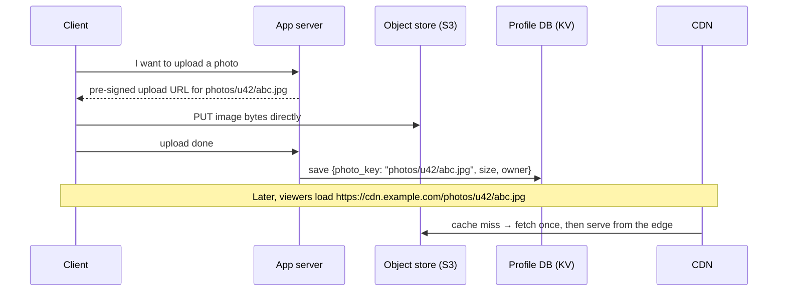

# Key-Value Stores incl. Object Stores, In Memory DBs

> [!info] How this note is built
> - **🎓 Course:** the lecture page and the instructor's answers in the discussion.
>   - **Video 1:** introduction to key-value stores.
>   - **Video 2:** special types of key-value store: **object stores, in-memory DBs, distributed caches**.
> - **🌐 Outside:** AWS, Redis and Dynamo docs. See [[#Sources]].
> - **🧠 Explanation:** my own explanation and worked scenarios.
> - Related: [[Databases - Intro to Indexing and NoSQL]], [[Sharding - Consistent Hashing]], [[Distributed Caching Using Memcached]], [[Approach for System Design Interviews + Uber-Lyft Design]]

## 11.1 What the lecture says 🎓

- You've likely used or heard of key-value stores like **Amazon S3**.
- **Most NoSQL databases are key-value stores underneath** (e.g. Cassandra's columns sit on top of key-value storage).
- **For a system like Facebook**, use them to store **user profiles and images**.

---

## 11.2 What a key-value store is 🧠

> [!quote] Key-value store
> A giant **distributed hash map**: `put(key, value)`, `get(key)`, `delete(key)`.
> - The store usually treats the value as **opaque bytes**: a string, JSON, an image, anything.
> - You find data **only by its key**.

| ✅ Strengths | ❌ Weaknesses |
|---|---|
| **Very fast O(1) lookups** by key | **No queries on values** ("all users in Texas") without extra indexes |
| **Simple to shard**: hash the key (consistent hashing) | **No joins**, and usually no multi-key transactions |
| **Scales out** almost without limit | You must **design keys around access patterns** up front |
| Flexible values, no fixed schema | Updating part of a big value means rewriting it (unless it's a document store) |

🎓 **Are key-value stores automatically scalable?** No. **Scalability comes from the sharding strategy.** That's true of any data structure once the data doesn't fit on one machine. So in interviews, say **how** it's sharded and replicated.

### How a distributed key-value store works inside 🌐
Amazon's **Dynamo** paper (2007) is the classic design, and it combines everything from the sharding lectures:

| Problem | Dynamo's answer | Course link |
|---|---|---|
| Which node owns a key? | **Consistent hashing** with virtual nodes | [[Sharding - Consistent Hashing]] |
| Don't lose data | **Replicate** to the next N nodes on the ring (N=3 is common) | Replication to the next 3 nodes |
| Consistency vs availability | **Quorums** R + W > N, e.g. (3, 2, 2) | [[CAP Theorem for Beginners]] |
| Conflicting versions | **Vector clocks**; the app merges them | BASE, eventual consistency |
| A node is briefly down | **Hinted handoff**: another node holds its writes until it returns | Failure handling |
| Replicas drift apart | **Merkle-tree** anti-entropy repair | Soft state |
| Who's alive? | **Gossip** protocol | Gossip from the consistent hashing lecture |

🌐 **Key-value stores to know:**
- **DynamoDB:** managed, partition key hashed to a partition.
- **Redis / Valkey:** in memory.
- **Memcached:** a cache.
- **Riak.**
- **etcd / ZooKeeper:** small, **strongly consistent** config data.
- **RocksDB / LevelDB:** embedded, on one machine.

### DynamoDB, as a concrete example 🌐
- **Partition key:** hashed to pick the partition (physical storage), like a partition function.
- **Partition key + sort key:** items with the same partition key are **stored together, sorted** by the sort key. That allows **range queries within a partition**.
  - Example: `Artist` + `SongTitle`.
  - A chat app: `chat_id` + `timestamp`.
- **Secondary indexes:** a **GSI** (different partition key, up to 20 per table) or an **LSI** (same partition key, different sort key, up to 5).
- **Limits:**
  - Items up to **400 KB**.
  - Each partition handles about **3,000 reads and 1,000 writes per second**, so a **hot partition key** is still a problem.

---

## 11.3 Special type 1: object stores 🎓🌐

> [!quote] Object store
> - A key-value store for **large files ("objects")**: images, videos, backups, logs.
> - **Key** = a path-like name: `photos/user42/profile.jpg`.
> - **Value** = the file bytes, plus metadata.

**Amazon S3** (🎓 the course's example) 🌐:

| Property | Value |
|---|---|
| Organization | **Buckets** hold objects. "Folders" are just **prefixes** in the key; it's a **flat** key space. |
| Durability | Designed for **99.999999999% (11 nines)**, stored across **at least 3 availability zones** |
| Consistency | **Strong read-after-write** for PUT, overwrite, DELETE and LIST |
| Throughput | About **3,500 writes and 5,500 reads per second per prefix**, with no limit on the number of prefixes |
| Latency | About **100-200 ms** to first byte. Fine for media, **too slow for small, hot records**. |
| Object size | **5 GB** per single PUT; **multipart upload** for larger files (5 MB to 50 TB) |

**Why not store images in the database?** 🧠
- Blobs **bloat the DB**: backups, replication and the DB's memory cache all pay for them.
- DB storage and IOPS cost **far more** than S3.
- S3 plus a **CDN** serves images to users **close to them**.

**The standard pattern** 🧠

- The **DB stores only the key/URL and metadata**; the bytes stay in S3.
- With a **pre-signed URL**, the client uploads **straight to S3**, so large files never pass through the app servers.

---

## 11.4 Special type 2: in-memory databases 🎓🌐

> [!quote] In-memory DB
> - A key-value store (often with data structures) that keeps **everything in RAM** for **microsecond-level speed**.
> - Unlike a cache, it **also saves data to disk**, so it's a real database.
> - Example: **Redis** with persistence turned on.

🌐 **Redis persistence options:**

| Mode | How | Data you can lose on a crash |
|---|---|---|
| **None** | Pure cache | Everything |
| **RDB snapshots** | Periodic point-in-time dump, e.g. `save 60 1000` | **Minutes** |
| **AOF** (append-only log) with `appendfsync everysec` (the default) | Logs every write and replays it on restart | **About 1 second** |
| AOF with `always` | Syncs to disk on every write | About none, but slow |
| **RDB + AOF** | Recommended for durability | About 1 s, plus fast restarts and backups |

🌐 **Beyond get/set, Redis has data structures:**
- **lists** (queues, timelines)
- **sets**
- **sorted sets** (leaderboards, rankings)
- **hashes** (objects)
- **counters** (`INCR`), **TTLs**
- **geo** (`GEOADD` / `GEOSEARCH`, for "drivers near me")
- **pub/sub**, **streams**

🧠 **Use it for** data that needs **in-memory speed** and **must survive a restart**:
- Session stores
- Leaderboards
- Rate limiters
- Real-time counters
- Ride or trip **state** 🎓 (the Uber design)

---

## 11.5 Special type 3: distributed cache 🎓

A key-value store that exists **only to speed up common lookups**. Examples: **Memcached**, and Redis in cache mode. See [[Distributed Caching Using Memcached]].
- **Usually not saved to disk.** A real **database is the source of truth**.
- Losing it only makes things **slower**, not **wrong**.

### Cache vs in-memory DB 🎓

| | **Distributed cache** | **In-memory DB** |
|---|---|---|
| Purpose | 🎓 **Speed up common reads** that would otherwise hit the DB | 🎓 **In-memory speed *and* persistence** for the data itself |
| Saved to disk? | Usually **no** | **Yes** |
| Source of truth? | **No**: the DB is | **Yes** (for that data) |
| If it's wiped | Slower, then refills from the DB | You rely on its **own** persistence and replicas |
| Example data (🎓 a student's framing, approved) | **Most popular Twitter profiles** | **Frequent reads and writes**, like **driver locations** |
| Examples | Memcached, Redis as a cache | Redis with AOF/RDB, and managed options (e.g. MemoryDB) |

🎓 **Redis can be either.** You choose the level of persistence, and it's **often used purely as a cache**.

> [!question]- Driver location in Uber: cache or in-memory DB? 🎓
> - **The earlier Uber lecture** put driver locations and trip states in an **in-memory DB** ([[Approach for System Design Interviews + Uber-Lyft Design]]).
> - **Here, a student argued for Memcached:** a location is **overwritten every few seconds**, and **old locations are worthless**, so there's little reason to save them. The instructor: "that's a good thought process."
> - 🧠 **How to reconcile the two:**
>   - **Driver location:** short-lived and regenerated constantly, so a **cache is fine**. If it's lost, the next ping in about 4 s restores it.
>   - **Trip state** (REQUESTING → WAITING → RIDING): must **not** be lost mid-ride, so use an **in-memory DB with persistence**, or a durable DB.
>   - **In an interview, say which data you'd lose and why that's OK.**

---

## 11.6 Choosing between them 🧠

| Data | Store | Why |
|---|---|---|
| **User profiles** 🎓 (Facebook) | Key-value / document DB (DynamoDB, Cassandra, MongoDB), keyed by `user_id` | Read by ID, huge scale, easy to shard |
| **Images and videos** 🎓 (Facebook) | **Object store** (S3) + **CDN** | Big blobs, cheap and durable, served near users |
| Sessions | In-memory DB (Redis with persistence) or DynamoDB | Fast, keyed by session ID, should survive restarts |
| Popular profiles and feeds | **Distributed cache** in front of the DB | Speeds up common reads, fine to lose |
| Leaderboard | Redis sorted set | Ranked reads in memory |
| Live driver location | Cache or in-memory DB (see above) | Overwritten constantly |
| Config and leader election | etcd / ZooKeeper | Small, **strongly consistent** |
| Orders and payments | **Not** a plain key-value store; SQL with transactions | Needs multi-row ACID |

---

## 11.7 Scenarios to walk through 🧠

> [!example]- Scenario 1: Facebook profiles and photos (🎓 the course's example)
> 1. **Profiles:** a key-value store, `user:{id} → {name, bio, photo_key, …}`. Sharded by consistent hashing on `user_id`, **replicated 3×**, quorum reads and writes.
> 2. **Photos:** the client uploads to **S3** with a pre-signed URL. The profile stores only `photo_key`, and photos are served through a **CDN**.
> 3. **Hot profiles** (celebrities): **Memcached/Redis cache** in front, using cache-aside.
> 4. **Why not SQL for profiles?** You can (Facebook itself used sharded MySQL). A key-value store is simpler because profiles are **always read by ID** and never joined in the hot path.

> [!example]- Scenario 2: URL shortener
> - `short_code → long_url` is a **pure key-value lookup**: DynamoDB or Cassandra keyed by `short_code`.
> - **Reads outnumber writes about 100:1**, so put a **Redis cache** in front for popular links.
> - No joins and no queries on values, so a key-value store fits perfectly.

> [!example]- Scenario 3: Chat messages in a key-value store with sort keys
> - DynamoDB with **partition key = `chat_id`** and **sort key = `timestamp`**.
> - "Last 50 messages" is a single-partition **range query**, sorted by the sort key.
> - **Watch out:** a huge group chat makes its partition **hot** (about 1,000 writes per second per partition). Split it: `chat_id#bucket`.

> [!example]- Scenario 4: Redis crash with different persistence settings
> - **No persistence:** everything is gone. Fine for a **cache**, a disaster for **sessions or trip state**.
> - **RDB every 5 minutes:** up to about 5 minutes of writes lost.
> - **AOF `everysec`:** about 1 second of writes lost.
> - **Add a replica with automatic failover:** a replica takes over almost immediately (though async replication can still drop the last few writes).

> [!example]- Scenario 5: Video platform storage
> - **Raw uploads** → S3 `raw/…`.
> - **Transcoded versions** (480p, 720p, 1080p) → S3 `videos/{id}/{res}/…`, created by **workers** from a job queue ([[Anatomy of a Scalable Web Application]]).
> - **Video metadata** (title, owner, views) → key-value/document DB. **View counters** → Redis `INCR`, flushed to the DB periodically.
> - **Delivery** → CDN.

---

## 11.8 Pitfalls to avoid in interviews

> [!warning] Common mistakes
> - Saying "key-value stores scale" without saying **how they're sharded and replicated**. 🎓
> - Storing **images or videos in the DB** instead of an object store plus CDN.
> - Using S3 for **small, hot, frequently updated** records (100-200 ms, per-request cost).
> - Treating a **cache** as the source of truth for data you can't lose.
> - Forgetting that **Redis persistence is a setting**: none, RDB, AOF, or both.
> - Using a plain key-value store for **multi-row transactions** (payments, orders).
> - Ignoring **hot keys or hot partitions**. Hashing doesn't fix a single busy key.

## Video notes

- Intro to key-value stores:
- Object stores, in-memory DB, distributed cache:

## Sources

- 🎓 [Interview Camp – Key-Value Stores incl. Object Stores, In Memory DBs](https://interview-academy.teachable.com/courses/101687/lectures/4094142)
- [Werner Vogels – Amazon's Dynamo](https://www.allthingsdistributed.com/2007/10/amazons_dynamo.html)
- [AWS – DynamoDB core components](https://docs.aws.amazon.com/amazondynamodb/latest/developerguide/HowItWorks.CoreComponents.html)
- [AWS – DynamoDB partition key design](https://docs.aws.amazon.com/amazondynamodb/latest/developerguide/bp-partition-key-design.html)
- [AWS – S3 uploading objects (size limits)](https://docs.aws.amazon.com/AmazonS3/latest/userguide/upload-objects.html)
- [AWS – S3 data durability](https://docs.aws.amazon.com/AmazonS3/latest/userguide/DataDurability.html)
- [AWS – S3 strong consistency](https://aws.amazon.com/s3/consistency/)
- [AWS – S3 performance guidelines](https://docs.aws.amazon.com/AmazonS3/latest/userguide/optimizing-performance.html)
- [Redis – Persistence](https://redis.io/docs/latest/operate/oss_and_stack/management/persistence/)
- [AWS ElastiCache – Choosing an engine (Memcached vs Redis/Valkey)](https://docs.aws.amazon.com/AmazonElastiCache/latest/dg/SelectEngine.html)

---
