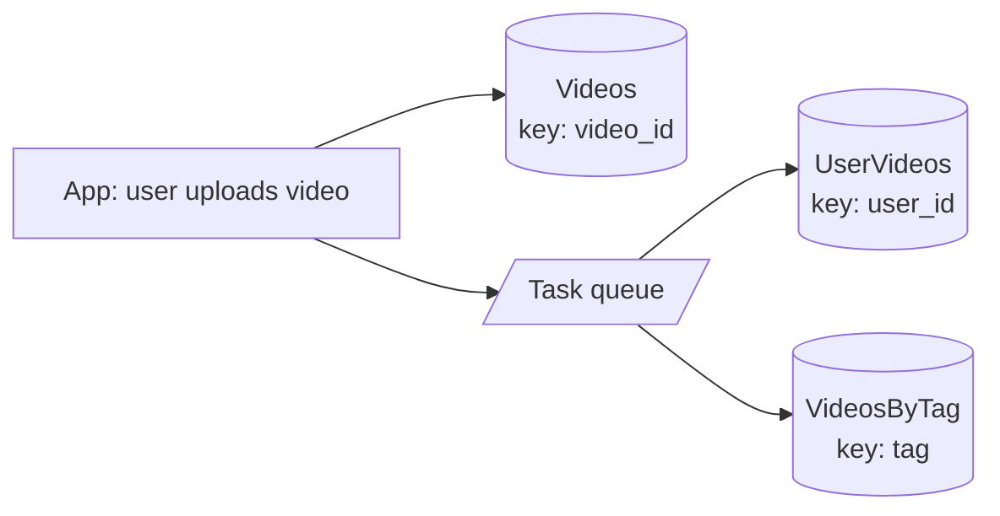

# Wide Column Stores - HBase, Cassandra

> [!info] How this note is built
> - **🎓 Course:** the lecture text and the instructor's answers in the discussion (35 comments). Its 3 videos are:
>   1. **Intro**: a *Users* table with a list of videos, compared with SQL.
>   2. **Storing Google's web-crawl data**: the Bigtable "Webtable" example.
>   3. **Using index tables** to speed up queries, written through a **task queue**.
> - **🧠 Explanation:** my own explanation, based on the Bigtable paper (which the instructor links), Cassandra/HBase design, and worked data models.
> - Web lookups hit a session limit while I wrote this, so a few numbers are from memory and marked *(verify)*.
> - Related: [[Key-Value Stores incl. Object Stores, In Memory DBs]], [[Databases - Intro to Indexing and NoSQL]], [[Dynamic Sharding]] (HBase/Bigtable), [[Sharding - Consistent Hashing]] (Cassandra)

## 12.1 What the lecture says 🎓

- **Wide-column stores are key-value stores underneath**, but the **value is expressed as columns**. That makes it easy to express **database models**.
- The course **prefers them** because they give **a lot of functionality out of the box**.
- **If you're not comfortable with the data model, it's OK to use a plain key-value store (like DynamoDB)** in your designs.
- 🎓 Use them in **any question that needs a distributed database**.

---

## 12.2 The data model 🎓🧠

> [!quote] A wide-column store is a map of maps
> ```
> row_key → { column_family → { column_qualifier → { timestamp → value } } }
> ```
> - **Bigtable paper:** "a sparse, distributed, persistent, multidimensional **sorted map**" indexed by **(row key, column key, timestamp)**.
> - Every value is **bytes**.

| Term | Meaning | Example |
|---|---|---|
| **Row key** | The primary key. Rows are **sorted by it** and **sharded by it**. | `user123`, or `com.cnn.www` |
| **Column family** | A group of related columns, **declared up front** and stored together | `profile:`, `videos:` |
| **Column qualifier** | A column name **inside a family**. Can be **created on the fly**, and there can be **millions** per row. | `videos:vid1`, `videos:vid2` |
| **Cell** | row + column → value | `videos:vid1 → "My trip"` |
| **Timestamp / version** | A cell can keep **several versions** | the page content at t3, t5, t6 |

**Why "wide":**
- Each row can have **a different set of columns**. Missing columns take **no space** (the table is **sparse**).
- A row can grow **very wide**, with thousands or millions of columns.

### The course's Users example (video 1), rebuilt 🎓🧠

**SQL-style thinking:** a `users` table plus a `videos` table joined on `user_id`. Several students noted you'd normally use **two tables** in SQL.

**Wide-column style: one row holds the user and their video list**

| row key | `profile:name` | `profile:email` | `videos:vid1` | `videos:vid2` | `videos:vid7` |
|---|---|---|---|---|---|
| user123 | Jin | jin@x.com | {title, thumbnail, link} | {title, thumbnail, link} | — |
| user456 | Ana | ana@y.com | — | — | {title, thumbnail, link} |

- 🎓 `videos:*` is really a **list of video IDs or links**, so the profile page can show them. You need that list somewhere.
- 🎓 You can store a **preview** (title and thumbnail) in each video column. Add a **link** to make it clickable.
- **One read of `user123` returns the profile *and* the video previews.** No join needed.

🎓 **A 4th dimension, like List<List<Videos>>?** The model has fixed levels (row → family → column → version). For deeper nesting, **encode it in the column name or the value** (e.g. JSON), or use **another table**.

---

## 12.3 Google's web-crawl example (video 2): Bigtable's "Webtable" 🎓🧠

The Bigtable paper's own example, which the instructor linked:

| row key (reversed URL) | `contents:` | `anchor:cnnsi.com` | `anchor:my.look.ca` |
|---|---|---|---|
| **com.cnn.www** | `<html>…` @t6, `<html>…` @t5, `<html>…` @t3 | "CNN" @t9 | "CNN.com" @t8 |

- **Row key = reversed URL** (`com.cnn.www`, not `www.cnn.com`). Rows are **sorted by key**, so **all pages from the same domain sit next to each other**. Crawling or analyzing one site becomes a fast **range scan**.
- **`contents:` family:** the page HTML, with **several versions by crawl time**. Old versions are cleaned up by rule, e.g. "keep the last 3" or "keep the last 7 days".
- **`anchor:` family:** **one column per site that links to this page**. The column name is the linking site; the value is the link text. That could be **millions of columns** for a popular page, which is exactly why "wide" matters.
- **Reads and writes to one row are atomic**, so updating a page's contents and anchors together is safe.

---

## 12.4 How it's stored and scaled 🧠

- **Sorted by row key and split into ranges:** Bigtable calls them **tablets**, HBase **regions**. A **master** assigns ranges to servers ([[Dynamic Sharding]]).
- **Cassandra** instead **hashes the partition key onto a ring**, with no master ([[Sharding - Consistent Hashing]]).
- **Writes use an LSM tree:** append to a **commit log**, then an in-memory **memtable**, then flush to sorted, immutable **SSTables** on disk, merged by **compaction**. The result is **very fast writes**.
- **Stored by column family:** 🎓 values of a family sit **next to each other**, so they're easy to **compress** and fast to read when you only need that family. (The instructor confirmed a student's point on this.)

### HBase vs Cassandra 🧠

| | **HBase** (modeled on Bigtable) | **Cassandra** (Bigtable data model + Dynamo distribution) |
|---|---|---|
| Architecture | **Master** (HMaster) + RegionServers, stored on **HDFS**, coordinated by ZooKeeper | **Masterless** ring; every node is equal |
| Sharding | **Range** regions by row key → good **scans** | **Hash** of the partition key → even spread; scans only **within** a partition |
| CAP leaning | **CP**: one server owns each region; strongly consistent row reads/writes | **AP** by default; **tunable** (R + W > N for stronger reads) |
| Query language | Java API / scans | **CQL** (SQL-like, but **no joins**) |
| Sweet spot | Hadoop ecosystem, analytics, big scans | Huge write volume, multi-datacenter, always writable |
| Also in this family | Google Cloud Bigtable, ScyllaDB (Cassandra-compatible) | |

🎓 A student's summary, which fits the table: Bigtable/HBase favor **consistency** (single master, one server per tablet). Dynamo/Cassandra favor **availability** (masterless, always writable, conflicts resolved on read), but can be tuned to be more consistent.

### Cassandra's version of the model 🧠
```sql
CREATE TABLE videos_by_user (
  user_id    uuid,          -- partition key: which node(s)
  created_at timestamp,     -- clustering column: sort order inside the partition
  video_id   uuid,
  title      text,
  thumbnail  text,
  PRIMARY KEY ((user_id), created_at, video_id)
) WITH CLUSTERING ORDER BY (created_at DESC);
```
- **Partition key** (`user_id`): all of one user's videos live **together on the same replicas**.
- **Clustering columns** (`created_at`): **sorted within the partition**, so "latest 20 videos" is one fast sequential read.
- This is the **same idea as the wide row**: one partition = one wide row, and each video = a "column".

---

## 12.5 Index tables (video 3) 🎓🧠

Wide-column stores are fast **only for lookups by row key**. For **any other query, build another table** keyed by what you query on, i.e. **your own index**.

**Example: Users and Videos**
- `Videos` table, keyed by `video_id`, with an `owner_user_id` column 🎓
- To list a user's videos, either:
  - a **column in Users** holding the video list, or
  - a **separate `UserVideos` table**: key = `user_id`, column = video list 🎓
- Other index tables as needed: `VideosByTag` (key = tag), `VideosByDay` (key = date bucket)



- 🎓 **Write the main table, then offload the index-table writes to a task queue** so the user doesn't wait.
- 🎓 **If a task fails:** **retry**. If it keeps failing, **notify the user and/or mark the row incomplete**.
- 🎓 **Need strong consistency across the tables?** Write them all before responding and **accept the slower writes**. That's the price of consistency.
- 🎓 **Keeping copies in sync** (a video's title shown in Users, or in UserVideos, when the video changes): it depends on your design. Store **IDs** in the index and look up details from `Videos`, **or** store copies and **update them via the queue**.

🧠 **The general rule: "one table per query"**
- Wide-column stores have **no joins**, so you **denormalize**: design tables **around the queries you'll run**, even if data is copied.
- **Cost:** more writes and more storage, and copies are **eventually consistent**.
- **Benefit:** every read is a **single fast lookup or range scan**.

---

## 12.6 Limits: rows can't grow forever 🎓

- **Rows and partitions have size limits.** Google Cloud Bigtable limits a row to **256 MB**. Cassandra partitions should stay much smaller; a common guideline is **about 100 MB** *(verify)*.
- 🎓 **Past that point, you might as well use an object store.**
- 🎓 **Time-series over years (5-10 years of posts)?** **Archive old data** to another DB. For example, when a row nears **200 MB**, move data older than 2 years elsewhere. It's rarely queried.
- 🧠 **Better up front: bucket by time** so no partition grows without limit, e.g. `(user_id, month)` or `(sensor_id, day)`. Discord does this with `(channel_id, time_bucket)` ([[Why Sharding is the Swiss Army Knife of System Design]]).

---

## 12.7 When to use a wide-column store 🎓🧠

🎓 A student asked when to use a wide-column store instead of a plain key-value store like DynamoDB.

| Use a wide-column store when… | Use a plain key-value store when… |
|---|---|
| You need **many columns** per row, read **selectively** | You always read/write the **whole value** |
| **Sorted, range-scan** access within a key (latest N items, time ranges) | Pure lookups by ID |
| **Huge write volume** (LSM, append-only) | Moderate traffic, simple needs |
| **Versioned cells** (history) | No history needed |
| You want **"functionality out of the box"** 🎓: column families, TTLs, versions, secondary structures | You'd rather keep the model simple 🎓 |

🧠 **Typical uses:**
- messages and chat
- activity feeds and timelines
- time-series and IoT metrics
- event logs
- user activity history
- web crawl data 🎓
- product view counts

🧠 **Poor fits:**
- **ad-hoc queries** or reporting (use a warehouse)
- **multi-row ACID transactions** (payments)
- **small datasets** (overkill)
- **heavy relationships** (use a graph DB)

> [!note] Spanner and ACID at scale 🎓
> - Dynamo's paper said ACID stores "tend to have poor availability". Google's **Spanner** later showed distributed ACID at scale, though with its own limits.
> - 🎓 **Interviewers won't expect Spanner details.**

> [!note] ACID's C vs CAP's C (discussion follow-up) 🎓
> - Students pointed out again that the two C's are defined differently.
> - The instructor: from an interview perspective **the difference doesn't matter much**. ACID applies consistency to database transactions, which can touch many items, so it's a **stronger** guarantee.
> - See the warning in [[CAP Theorem for Beginners]].

---

## 12.8 Scenarios to walk through 🧠

> [!example]- Scenario 1: A YouTube-style user profile page
> - `Users` row `user123`: `profile:{name, avatar}` plus `videos:{vid → title/thumbnail/link}`. **One read** renders the page.
> - `Videos` row `vid1`: `meta:{title, owner_user_id, duration}`, `stats:{views, likes}`. The file itself is in S3 behind a CDN.
> - **Upload flow:**
>   1. Write `Videos`.
>   2. **Queue** the updates to `Users.videos:` and `VideosByTag`.
>   3. On failure, retry, then mark the upload incomplete.

> [!example]- Scenario 2: Chat messages in Cassandra
> - Table `messages_by_chat`: `PRIMARY KEY ((chat_id, month), sent_at, msg_id)`, `ORDER BY sent_at DESC`.
> - **Last 50 messages:** one partition, a sorted read.
> - **Month bucketing** keeps partitions from growing forever (🎓 the row-size limit).
> - **Search messages by word?** Not here. Send them to **Elasticsearch** via the queue.

> [!example]- Scenario 3: Web crawler storage (the course's Google example)
> - **Row key** = reversed URL (`com.example.www/about`), so a domain's pages are **contiguous**.
> - `contents:` keeps the last 3 crawled versions. `anchor:<source_site>` holds the link text from each linking site.
> - "Re-crawl every page of example.com" becomes **one range scan** over the `com.example.` prefix.

> [!example]- Scenario 4: IoT sensor readings
> - About 1M sensors sending a reading every 10 s, which is very write-heavy, so a wide-column store's **LSM writes** fit.
> - **Key:** `(sensor_id, day)`, **clustered by** `timestamp`, with a **TTL of 90 days** so old data expires automatically.
> - **Dashboards:** "sensor X, last hour" is a single-partition range scan. **Fleet-wide analytics** go to Spark or a warehouse, not Cassandra.

> [!example]- Scenario 5: A row that got too big
> - A celebrity's `followers:` family reaches 50M columns, and reads and compaction get slow.
> - **Fixes:**
>   - Split the key: `(user_id, bucket 0..N)`.
>   - Move cold history to an **archive DB** 🎓.
>   - Store big lists in an **object store** 🎓 when they're rarely read.

---

## 12.9 Pitfalls to avoid in interviews

> [!warning] Common mistakes
> - Designing tables like SQL (normalized, expecting joins). **Design around queries** instead.
> - Querying on a **non-key column** without an **index table**.
> - Letting a row or partition **grow without limit**. Bucket by time, or archive 🎓.
> - Updating index tables **synchronously** when eventual consistency is fine. Use a **task queue** 🎓.
> - Forgetting **failure handling** for queued index writes: retry, then mark incomplete 🎓.
> - Calling Cassandra "strongly consistent" without mentioning quorum settings.
> - Using it for **ad-hoc analytics** or **multi-row transactions**.
> - 🎓 Don't force it. **A plain key-value store is fine** if you're more comfortable with that.

## Video notes

- Intro (Users/videos model):
- Google web-crawl example:
- Indexes in wide-column stores:

## Sources

- 🎓 [Interview Camp – Wide Column Stores (HBase, Cassandra)](https://interview-academy.teachable.com/courses/101687/lectures/4094144)
- 🎓 [Chang et al. – Bigtable: A Distributed Storage System for Structured Data (OSDI 2006), linked by instructor](https://research.google.com/archive/bigtable-osdi06.pdf)
- 🎓 [Google Cloud Bigtable – Quotas and limits (row size), linked in discussion](https://docs.cloud.google.com/bigtable/quotas)
- 🎓 [Khurana – Introduction to HBase schema design (;login:, linked in discussion)](http://0b4af6cdc2f0c5998459-c0245c5c937c5dedcca3f1764ecc9b2f.r43.cf2.rackcdn.com/9353-login1210_khurana.pdf)
- 🎓 [Martin Kleppmann – Please stop calling databases CP or AP (linked in discussion)](https://martin.kleppmann.com/2015/05/11/please-stop-calling-databases-cp-or-ap.html)
- 🎓 [YugabyteDB – A primer on ACID transactions (linked in discussion)](https://blog.yugabyte.com/a-primer-on-acid-transactions/)
- [Apache Cassandra – Data modeling](https://cassandra.apache.org/doc/latest/cassandra/developing/data-modeling/intro.html)
- [Apache HBase Reference Guide – Regions](https://hbase.apache.org/book.html#regions.arch)
- [Discord – How Discord stores trillions of messages](https://discord.com/blog/how-discord-stores-trillions-of-messages)

---
