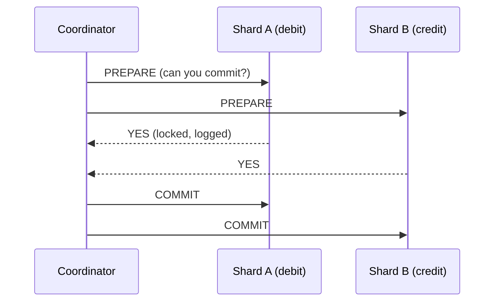

# Transaction Processing

> [!info] How this note is built
> - **🎓 Course:** the lecture page and discussion (see [[#13.1 What the lecture says 🎓|What the lecture says]]), plus earlier lectures that point here:
>   - booking plane tickets with a transactional DB
>   - locking the row as soon as a purchase starts
> - **🧠 Explanation:** my own explanation of isolation, locking, 2PC, sagas and idempotency.

## 13.1 What the lecture says 🎓

**Video 1:** what a **transaction** is, why it matters in interviews, and **the most popular technique for transactions across databases: two-phase commit (2PC)**. See section 4.

**Video 2:** **which database to use for transactions**, and how to use it in your designs.

**Optional reading:** an article on **transaction isolation levels**, i.e. the different concurrency cases during a transaction. See section 2.

**From the discussion** 🎓
- **Which database for transactions (payments, etc.)?** Typically a **relational DB**.
- **Why not NoSQL in consistent mode?**
  - NoSQL *can* be consistent, but **isn't designed for this**. Cassandra in consistent mode must **wait for all writes to propagate**, which is slower than a relational DB.
  - Relational DBs also have SQL features, and **very little software does transactions over NoSQL**.
- **Don't speak in absolutes:**
  - ❌ "NoSQL is not consistent."
  - ✅ "**Most** NoSQL databases prioritize availability over consistency."
- **Do Cassandra/DynamoDB support locking?** They likely have extra features to lock individual rows for consistent writes. 🧠 Examples: Cassandra lightweight transactions (`IF` conditions), DynamoDB conditional writes and `TransactWriteItems`.
- **Sharding relational DBs** is **not usually built in**. It's harder, but many companies build their own (Instagram, Pinterest, Notion).
- **Do transactions block reads?** Blocking can apply to **writes only**, with queued writes processed in order. **If reads must be consistent, block reads too.**
- **What if the rollback itself fails?** **Retry a few times; if it still fails, raise an error for manual intervention.**
- **2PC: what if C fails to commit in phase 2 after A and B committed?** 🎓 The instructor linked a Stack Overflow thread on this.
  - 🧠 In 2PC, **"YES" in phase 1 is a binding promise**. C has already logged the change durably, so it can't refuse.
  - After a crash, C **recovers from its log and finishes the commit**, and the coordinator **keeps retrying COMMIT** until C confirms.
  - A and B are **never rolled back**. That's exactly why a participant that has said "prepared" must wait for the coordinator's decision, which makes 2PC **blocking**.
- **Example of what locks are for (Oracle docs):** a data lock stops several customers from **buying the last copy of a book** at once.

## 13.2 Why transactions exist 🧠

> [!quote] Transaction
> A group of reads and writes that the database treats as **one unit**: **all of it happens, or none of it does**, and other users never see it half-done.

**The classic problem 🎓:** 1 seat left on a flight, and two users click "Book" at the same moment.
- **Without transactions:**
  1. Both read `seats_left = 1`.
  2. Both write `seats_left = 0`.
  3. Both get a confirmation. **The flight is overbooked.**
- **With transactions and locking:** the first to lock the seat row wins, and the second sees `0` and gets "sold out".

---

## 13.3 ACID recap 🧠
See [[CAP Theorem for Beginners]] for the course's definitions.

| | Guarantee | How DBs do it |
|---|---|---|
| **Atomicity** | All or nothing | An **undo log** / rollback. The **write-ahead log (WAL)** records the change before applying it. |
| **Consistency** | The data follows its rules (constraints, balance ≥ 0, FKs) | Constraints + the app's own logic |
| **Isolation** | Transactions running at the same time don't interfere | **Locks** and/or **MVCC** (multi-version concurrency control, section 3) |
| **Durability** | Once committed, it survives a crash | The **WAL is saved to disk** before "commit OK" is returned; replicas |

---

## 13.4 What goes wrong without isolation 🧠

| Anomaly | What happens | Example |
|---|---|---|
| **Dirty read** | You read another transaction's **uncommitted** change, which then gets rolled back | You see $500, but that deposit was cancelled |
| **Non-repeatable read** | You read the same row twice in one transaction and get **different values** | The price was $300, then $350 in the same checkout |
| **Phantom read** | You rerun a query and **new rows appear** | "Count free seats" changes mid-transaction |
| **Lost update** | Two read-modify-write transactions run at once and **one write overwrites the other** | Two +1 likes, but the count only goes up by 1 |
| **Write skew** | Two transactions each check a condition, then write **different rows**, and together they **break the rule** | Two on-call doctors both go off-call because each saw "someone else is on call" |

### Isolation levels (weakest → strongest)

| Level | Stops | Still allows | Default in |
|---|---|---|---|
| **Read uncommitted** | — | Everything | Rarely used |
| **Read committed** | Dirty reads | Non-repeatable reads, phantoms, lost updates, write skew | **PostgreSQL**, Oracle, SQL Server |
| **Repeatable read / snapshot** | + non-repeatable reads (and phantoms in snapshot implementations) | Write skew; lost updates in some DBs | **MySQL InnoDB** |
| **Serializable** | Everything: acts as if transactions ran **one at a time** | — (slower, more aborts and retries) | Opt-in |

> [!warning] Interview trap
> - **"ACID" doesn't mean serializable by default.** Most databases default to **read committed** or **repeatable read**.
> - For money or inventory, either **raise the isolation level** or **lock explicitly**.

---

## 13.5 How databases give you isolation 🧠

### Pessimistic locking ("lock first, then work") 🎓
```sql
BEGIN;
SELECT seats_left FROM flights WHERE id = 42 FOR UPDATE;  -- row lock; others wait
-- if seats_left > 0:
UPDATE flights SET seats_left = seats_left - 1 WHERE id = 42;
INSERT INTO bookings (flight_id, user_id) VALUES (42, 'A');
COMMIT;                                                  -- lock released
```
- 🎓 This is the course's rule: **"lock that entry as soon as A requests a purchase. Whoever locks the entry first gets the purchase."**
- **Pros:** simple and safe under **high contention** (lots of people fighting over the same rows).
- **Cons:** others **wait**, **deadlocks** are possible, and locks held for a long time kill throughput.
- **Two-phase locking (2PL):** take locks as you go, and **release them only at commit**. This gives serializability.

> [!note] Deadlocks
> - T1 locks A and waits for B; T2 locks B and waits for A. Neither can continue.
> - DBs **detect** this and **abort one** transaction; the app retries.
> - **Prevent it** by always locking rows **in the same order** (e.g. by ID).

### Optimistic concurrency ("work, then check nobody changed it")
```sql
SELECT seats_left, version FROM flights WHERE id = 42;   -- e.g. 1, v7
UPDATE flights SET seats_left = 0, version = 8
 WHERE id = 42 AND version = 7;                          -- 0 rows updated → someone beat you → retry
```
- **Pros:** no waiting; great when **conflicts are rare**.
- **Cons:** under heavy contention, many **retries**.
- The same idea as memcached's `gets`/`cas` ([[Distributed Caching Using Memcached]]).

### Atomic conditional update (often the simplest fix)
```sql
UPDATE flights SET seats_left = seats_left - 1
 WHERE id = 42 AND seats_left > 0;   -- 1 row = you got a seat, 0 rows = sold out
```
- **A single statement is atomic**, so there's no separate read and no race.

### MVCC (multi-version concurrency control)
- The DB keeps **several versions** of each row. **Readers see a snapshot** and **don't block writers**, and writers don't block readers.
- Used by PostgreSQL, MySQL InnoDB and Oracle.
- Similar to memcached's multi-versioned objects in [[Distributed Caching Using Memcached]].

| Choose | When |
|---|---|
| **Atomic conditional update** | A single-row counter or state change (seats, stock, balance) |
| **Pessimistic lock** | Multi-step logic on **hot** rows with frequent conflicts |
| **Optimistic (version)** | Conflicts are rare (editing a profile or document) |
| **Serializable isolation** | Complex rules across many rows (write skew risk) where correctness beats speed |

---

## 13.6 Transactions across machines 🧠

On one database node, transactions are "easy". After **sharding** ([[Why Sharding is the Swiss Army Knife of System Design]]) or splitting into **microservices**, one action can touch **several machines**.

### Two-phase commit (2PC)

- **Phase 1 (prepare):** everyone locks and promises they *can* commit. **Phase 2 (commit):** the coordinator tells everyone to commit, or everyone to abort.
- ✅ **Atomic across nodes** (strong consistency).
- ❌ **Slow:** extra round trips, and locks are held throughout.
- ❌ **Blocking:** if the **coordinator dies after "prepare"**, participants sit **stuck holding locks**.
- Used inside distributed SQL (Spanner, CockroachDB), usually on top of **consensus** (Paxos/Raft) to avoid the blocking problem.

### Saga (the microservices alternative)
- A chain of **local transactions**, each with a **compensating action** that undoes it if a later step fails:
  1. **Order service:** create order (undo: cancel order)
  2. **Payment service:** charge card (undo: refund)
  3. **Inventory service:** reserve item (undo: release)
  4. If step 3 fails, **run the undos for 2, then 1**.
- ✅ No global locks, so services stay independent and available.
- ❌ **Only eventually consistent.** Other users can see in-between states. Undos must be written carefully.
- **Orchestrated** (a central coordinator drives the steps) or **choreographed** (services react to each other's events via a queue).

### Other patterns you'll need
- **Transactional outbox:** write the DB change **and** an "event to publish" row in the **same local transaction**. A worker publishes the outbox to the queue. The DB and the queue can't disagree.
- **Idempotency keys:** the client sends a unique `request_id`; the server stores it with the result. **A retry with the same key returns the saved result instead of charging twice.** Essential for payments and for **at-least-once** job queues ([[Anatomy of a Scalable Web Application]]).
- **Keep the transaction on one shard:** choose shard keys so each transaction touches **one shard**, e.g. an order and its line items share `customer_id`. That avoids 2PC entirely.

---

## 13.7 Reservations: holding inventory without long locks 🧠

In ticketing and flight booking, the user takes **minutes** to pay. **Don't hold a DB lock that long.**

1. **Reserve (short transaction):** `UPDATE seats SET status='HELD', held_by=A, hold_until=now()+10min WHERE id=12C AND status='FREE'`
2. **Pay** (external, slow): no DB locks are held.
3. **Confirm (short transaction):** `UPDATE seats SET status='SOLD' WHERE id=12C AND held_by=A AND hold_until > now()`
4. **Expire:** a background job (or a TTL) releases holds that are past `hold_until`, so the seat is **FREE** again.

🎓 This connects to the earlier discussion question about **counting in a distributed cache**:
- The cache can serve a fast **"seats left ≈ N"** display and act as a **gate** that turns away most requests when sold out.
- The **DB transaction stays the source of truth** for the actual booking.

---

## 13.8 Scenarios to walk through 🧠

> [!example]- Scenario 1: Flight booking (🎓 the course's running example)
> - **Single DB:** an atomic `UPDATE … WHERE seats_left > 0`, or `SELECT … FOR UPDATE`, then insert the booking **in one transaction**.
> - **Replicas:** **reads for search** can come from replicas (slightly stale is fine). **Booking goes to the primary**. Otherwise you get the replica-lag double booking from [[Load Balancers and App Servers]].
> - **Sharded:** shard by `flight_id`, so one flight's seats and bookings sit on one shard and the transaction stays local.

> [!example]- Scenario 2: Bank transfer, $100 from A to B
> - **Same DB:** `BEGIN; UPDATE acct SET bal = bal - 100 WHERE id = A AND bal >= 100; UPDATE acct SET bal = bal + 100 WHERE id = B; COMMIT;` If the first update hits 0 rows, **roll back**.
> - **Lock accounts in ID order** to avoid deadlocks with a transfer in the opposite direction.
> - **A and B on different shards:** use 2PC, **or** a **ledger + saga**:
>   1. Write a debit entry on A.
>   2. Publish an event (outbox).
>   3. Write a credit entry on B.
>   4. A retry with the same **idempotency key** is a no-op.

> [!example]- Scenario 3: Concert ticket flash sale (100k users, 5k seats)
> - Don't send 100k requests into row locks on one table.
> - **Gate first:** a Redis counter `DECR tickets` (atomic). If the result is < 0, reply "sold out" immediately.
> - Survivors go through a **queue** to workers that do the **DB reservation transaction** (a hold with a 10-min expiry).
> - Payment confirms the hold. Expired holds put the seats back and `INCR` the gate.

> [!example]- Scenario 4: The user double-clicks "Pay"
> - Without protection, two requests mean **two charges**.
> - The client sends `Idempotency-Key: 7f3a…`. The server stores `(key → result)` in the **same transaction** as the charge.
> - The second request finds the key and **returns the first result**. One charge.

> [!example]- Scenario 5: Order checkout across microservices (saga)
> 1. Order service creates `order PENDING`.
> 2. Payment service charges the card.
> 3. Inventory service reserves the item and it's **out of stock**.
> 4. **Compensate:** refund the payment, mark the order `CANCELLED`, and notify the user.
> - Between steps, the order is visibly **PENDING**. That's eventual consistency, and acceptable when you tell the user.

> [!example]- Scenario 6: Lost update on a like counter
> - The app reads `likes=10`, adds 1 and writes 11, while another request does the same. The result is 11, not 12.
> - **Fix:** `UPDATE posts SET likes = likes + 1 WHERE id = X` (atomic in the DB), or Redis `INCR`.
> - At huge scale, use **sharded counters** added together periodically. Exactness isn't critical there ([[CAP Theorem for Beginners]]).

---

## 13.9 Pitfalls to avoid in interviews

> [!warning] Common mistakes
> - "Read, check, then write" in separate steps with no lock or condition. That's a **race**.
> - Assuming the default isolation level is **serializable**.
> - Holding DB locks **while waiting on a user or an external API** (payments). Use **holds with expiry**.
> - Reading from an **async replica** before a decision that must be correct.
> - Proposing **2PC** across microservices without its downsides (blocking, latency). Sagas are usually preferred there.
> - Forgetting **idempotency** when there are retries or at-least-once queues.
> - Using a cache counter as the **source of truth** for money or inventory.
> - Ignoring **deadlocks**. Lock in a consistent order and retry aborted transactions.

## Video notes

- Video 1 (transactions and two-phase commit):
- Video 2 (which DB to use for transactions):

## Sources

- 🎓 [Interview Camp – Transaction Processing](https://interview-academy.teachable.com/courses/101687/lectures/5773043)
- 🎓 [Stack Overflow – How do two-phase commits prevent last-second failure? (linked by instructor)](https://stackoverflow.com/questions/171876/how-do-two-phase-commits-prevent-last-second-failure)
- 🎓 [Oracle – DML locks (linked in discussion)](https://docs.oracle.com/cd/E18283_01/server.112/e17118/ap_locks001.htm)
- [PostgreSQL – Transaction isolation](https://www.postgresql.org/docs/current/transaction-iso.html)
- [MySQL – InnoDB transaction isolation levels](https://dev.mysql.com/doc/refman/8.0/en/innodb-transaction-isolation-levels.html)
- [Martin Kleppmann – Designing Data-Intensive Applications, Ch. 7 (Transactions) and Ch. 9 (2PC)](https://dataintensive.net/)
- [microservices.io – Saga pattern](https://microservices.io/patterns/data/saga.html)
- [microservices.io – Transactional outbox](https://microservices.io/patterns/data/transactional-outbox.html)
- [Stripe – Designing robust and predictable APIs with idempotency](https://stripe.com/blog/idempotency)

---
