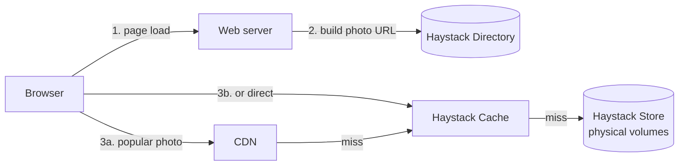

# Facebook Haystack (Optional Paper)

> [!info] How this note is built
> - **🎓 Course:** the lecture page and discussion. The course recommends reading **only the first 5 pages** of the paper.
> - **📄 Paper:** "Finding a Needle in Haystack: Facebook's Photo Storage" (Beaver et al., **OSDI 2010**), summarized from its first 5 pages.
> - **🧠 Explanation:** my own explanation, plus links back to earlier notes.
> - Related: [[Key-Value Stores incl. Object Stores, In Memory DBs]] (Haystack is an object store), [[Anatomy of a Scalable Web Application]] (CDN), [[Distributed Caching Using Memcached]], [[Dynamic Sharding]] (the Directory is a locator)

## 14.1 What the lecture says 🎓

- The paper describes **Facebook's photo storage** and gives **a good idea of how these systems are designed in real life**.
- **Read the first 5 pages.** 🎓 The first few pages of most papers are the useful part; after that they get too detailed.
- 🎓 **Don't chase cutting-edge techniques.** Interviews aren't knowledge tests, and they expect **classic, fundamental techniques**. Read Haystack to see **fundamentals applied**, not to memorize Haystack.

**What students took from it** 🎓
- At Facebook's scale, **even one extra line of metadata** per photo lookup can cost **millions of dollars**.
- Separating the **CDN (hot images)** from Facebook's own **Haystack Cache (which works like an in-house CDN)** is a useful idea.

---

## 14.2 The scale 📄

| Number (2010) | Value |
|---|---|
| Photos stored | **260+ billion** images, **20+ petabytes** |
| Uploads | About **1 billion photos per week** (about **60 TB**) |
| Reads at peak | **1+ million images per second** |
| Sizes per upload | **4 sizes** generated and stored for each photo |

🧠 **Access pattern:** written **once**, read **often**, **never modified**, **rarely deleted**. That's a textbook **object store** workload.

---

## 14.3 The problem: file metadata was the bottleneck 📄

**The old design:** each photo was **its own file** on **NFS** network-attached storage (NAS).


- With **thousands of files per directory**, one photo read took **more than 10 disk operations**.
- Even after tuning, it still needed **about 3 disk operations per photo**:
  1. directory metadata
  2. the inode (the file's metadata)
  3. the actual data
- The **metadata** wouldn't fit in memory, so **most disk work went to finding the file rather than reading it**.

🧠 **Why caching didn't fix it:**
- The **CDN** serves **popular** photos well.
- Facebook also has a huge **"long tail"**: requests for **less popular, often older** photos. Each is rare, but together they're a lot of traffic, and they **miss the CDN** and go to storage.
- So storage itself had to be fast for random reads. More caching couldn't solve it.

---

## 14.4 Design goals 📄

1. **High throughput, low latency:** **at most one disk operation per read**, by keeping **all metadata in memory**.
2. **Fault tolerance:** **replicate** photos across machines and **geographic locations**.
3. **Cost-effective:** each usable TB costs **about 28% less** and handles **about 4× more reads per second** than the NAS setup.
4. **Simple:** easy to build and run, so they could ship it quickly.

---

## 14.5 The key idea: pack many photos into one huge file 📄🧠

> [!quote] Needles in a haystack
> - Instead of one file per photo, the **Store** keeps a few **very large files ("physical volumes")**, each holding **many photos**.
> - Each photo inside is a **"needle"**.
> - The server keeps an **in-memory map**: photo → (**offset in the file**, size).
> - A read is **one seek and one read**, with no filesystem metadata lookup.

**Needle layout** (inside the big volume file):

| Header | | | | | | Data | Footer |
|---|---|---|---|---|---|---|---|
| magic number | **cookie** | **64-bit key** | 32-bit alternate key | flags | size | **photo bytes** | checksum |

- **Key:** the photo ID. **Alternate key:** which of the **4 sizes**.
- **Cookie:** a random value that's **part of the URL**, so people **can't guess URLs** to photos they shouldn't see.
- **Flags:** e.g. **deleted**. 🧠 Deletes just set a flag; the space is reclaimed later by **compaction**.
- **In-memory index per Store machine:** `(key, alternate key) → (flags, size, offset)`. It's small enough to fit in RAM, so **reads never touch disk for metadata**.

🧠 **Why it works:** the costly part was **filesystem metadata per file**. Haystack keeps **its own tiny metadata in RAM** and uses the filesystem only for a few huge files. This is the same "the lookup starts in RAM" idea as indexes in [[Databases - Intro to Indexing and NoSQL]].

---

## 14.6 Architecture: Directory, Cache, Store 📄



| Component | Job | Connects to |
|---|---|---|
| **Directory** | Maps **logical volume → physical volumes**, tracks which volumes are **write-enabled**, **builds photo URLs**, and decides **CDN vs Cache** for each request | Like the **locator service** in [[Dynamic Sharding]] |
| **Cache** | Facebook's **internal cache** in front of the Store. The students' "in-house CDN". | [[Distributed Caching Using Memcached]] |
| **Store** | Machines holding **physical volumes** (huge files of needles), with the in-memory index | [[Key-Value Stores incl. Object Stores, In Memory DBs]] |

### Logical vs physical volumes 📄
- Several **physical volumes** on **different machines** are grouped into one **logical volume**.
- A photo written to a logical volume is written to **every** physical volume in it, which gives **replication**. That's the "copies on 3 machines" idea from [[Sharding - Using Partition Functions]].

### Photo URL 📄
```
http://<CDN>/<Cache>/<Machine id>/<Logical volume, Photo>
```
- The URL **encodes the whole route**.
- Each layer **strips its part** and, on a miss, **forwards the rest** to the next layer: CDN → Cache → Store machine.

### Upload flow 📄
1. The web server asks the **Directory** for a **write-enabled logical volume**.
2. It assigns a photo ID and writes the photo (all 4 sizes) **to every physical volume** in that logical volume.
3. The Store machines **append** the needle and **update their in-memory index**.

### Read flow 📄
1. The browser gets the URL (built by the Directory).
2. **CDN**: hit, done. Miss → **Cache**: hit, done. Miss → **Store**.
3. The Store looks up the photo in its **in-memory index**, then does **one disk read** at the offset.

---

## 14.7 Lessons for interviews 🧠

> [!tip] Fundamentals Haystack uses
> - **Metadata overhead matters at scale.** Know where your disk operations go.
> - **Keep indexes in memory** so a read is one disk operation.
> - **Append-only, immutable writes.** Deletes are flags, and compaction cleans up later.
> - **Tiered caching:** CDN for hot content, an internal cache, then storage. And the **long tail still needs fast storage**.
> - **A directory/locator** maps logical to physical, making **replication and placement** flexible.
> - **Replicate across machines and regions** for fault tolerance.
> - **Unguessable URLs** (a cookie in the URL) for access control on cheap static serving.
> - **Design for the access pattern:** write-once, read-many, never modified.

**How to use it in an interview answer:**
- "For photos I'd use an **object store** (S3, or a Haystack-style blob store) behind a **CDN**, with metadata in the DB."
- "I'd pack blobs into large files with an in-memory index, like Facebook's Haystack, because one file per photo makes **filesystem metadata** the bottleneck."
- Mention it only if the interviewer goes deep on storage. 🎓 **Fundamentals first.**

---

## 14.8 Scenarios to walk through 🧠

> [!example]- Scenario 1: Why not one file per photo?
> - Billions of files means the directory and inode metadata **doesn't fit in RAM**.
> - Each read costs **about 3 disk operations** (directory, inode, data) instead of 1. At 1M reads per second, that's **3× the disks**.
> - Haystack: **one disk operation per read**, so far fewer disks for the same traffic. That's where the **~28% cheaper, ~4× more reads per TB** comes from.

> [!example]- Scenario 2: An old photo from 2009 is viewed
> - It isn't popular, so the **CDN misses** (the long tail).
> - The **Haystack Cache** probably misses too.
> - The **Store** machine finds it in its **in-memory index**, then does **1 disk read** at the offset. Still fast.

> [!example]- Scenario 3: A Store machine dies
> - The photo's **logical volume** has copies on **other physical machines**.
> - The **Directory** sends reads to a healthy copy. Later, the data is re-copied to a replacement machine.

> [!example]- Scenario 4: A user deletes a photo
> - The Store **sets the deleted flag** on the needle and in the in-memory index, so reads now return "not found".
> - The space is freed later by **compaction**, which rewrites the volume without deleted needles.
> - 🧠 CDN copies may live until they expire, which is a common consideration for deletes.

> [!example]- Scenario 5: Designing Instagram's photo storage (interview)
> 1. **Upload:** app → API → **object store** (S3 or a Haystack-style store), with **several sizes** made by workers from a queue.
> 2. **Metadata** (photo_id, owner, caption, object key) → a sharded DB.
> 3. **Serving:** **CDN** in front, **unguessable URLs** or signed URLs.
> 4. **Deep dive, if asked:** why "one file per photo" breaks at billions of files (Haystack's lesson), an in-memory index, and append-only volumes.

---

## 14.9 Pitfalls to avoid in interviews

> [!warning] Common mistakes
> - Assuming a CDN solves everything. The **long tail** still reaches storage.
> - Storing billions of small files on a regular filesystem **without thinking about metadata cost**.
> - Storing photos **in the database**.
> - Forgetting that **several sizes** of each image are stored.
> - 🎓 Leading with Haystack details. **Fundamentals first**; bring it up only if asked to go deep.

## My notes (first 5 pages)

-

## Sources

- 🎓 [Interview Camp – Optional Paper: Facebook Haystack](https://interview-academy.teachable.com/courses/101687/lectures/4108974)
- 📄 [Beaver et al. – Finding a Needle in Haystack: Facebook's Photo Storage (OSDI 2010)](https://www.usenix.org/legacy/event/osdi10/tech/full_papers/Beaver.pdf)

---
