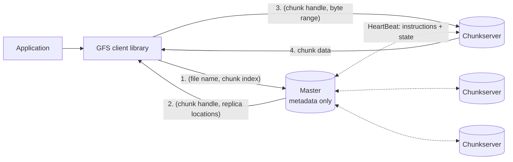
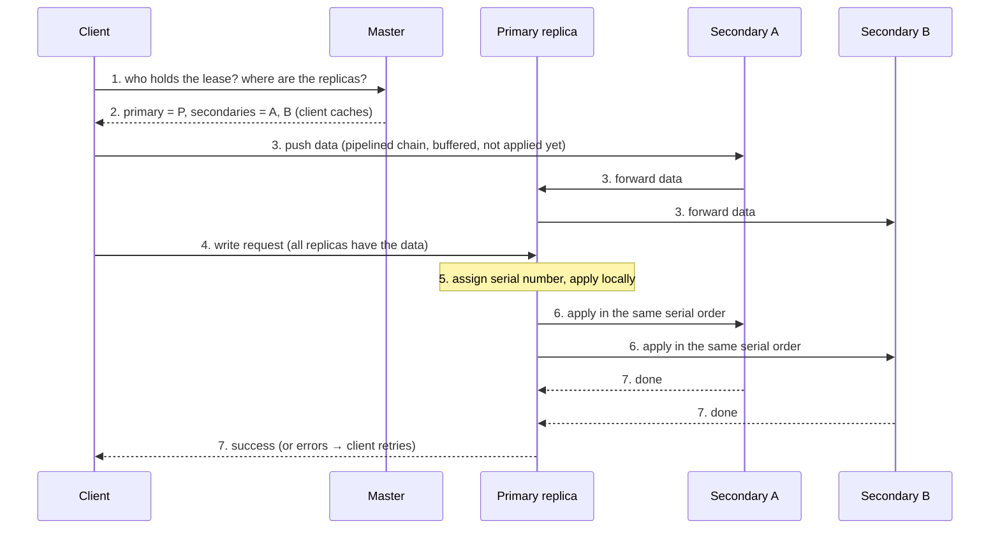

# Distributed File System Design (GFS)

> [!info] How this note is built
> - **🎓 Course:** the lecture page and the instructor's answers in the discussion (24 comments).
> - **📄 Paper:** a deep dive into the course's PDF, "The Google File System" (Ghemawat, Gobioff, Leung, **SOSP 2003**). I read the whole paper, with all key concepts and numbers pulled out.
> - **🧠 Explanation:** my own explanation, the HDFS mapping, and interview framing.
> - 🎓 **The course's advice:** the **first half** of the paper (design, architecture, reads/writes) is what matters. The **second half is complicated and irrelevant for general interviews**. Its key ideas are summarized here anyway, clearly marked.
> - Related: [[Facebook Haystack (Optional Paper)]], [[Dynamic Sharding]] (the master works like a locator), [[Sharding - Using Partition Functions]] (replicas), [[Transaction Processing]] (the write ordering), [[Anatomy of a Scalable Web Application]] (Hadoop/MapReduce)

## 15.1 What the lecture says 🎓

- **The first half of the paper** gives a good idea of **how to design a distributed file system**. **Skip the second half.**
- The videos give an **overview of the system**.
- 🎓 **Can you name GFS/HDFS in an interview?** Yes, but say "**an architecture similar to how HDFS does it**", so your design is **inspired by** it rather than looking **memorized**.
- 🎓 **Using the course framework (FUSHD) here:** for **internal systems** like this, focus on **Features**; you can mostly skip Use Cases and What to Store.

---

## Part A: The first half (core design) 📄

### 15.2 Why GFS was built differently: its assumptions

| Assumption | What it means for the design |
|---|---|
| **Component failures are the norm, not the exception** | Hundreds to thousands of cheap machines: disks, memory, network and power fail, plus bugs and human error. The system must **constantly monitor, detect, tolerate and recover**. |
| **Files are huge** | **Multi-GB files are common.** Expect a few million files, **typically 100 MB+**. Small files work but aren't optimized. |
| **Reads** | Mostly **large streaming reads** (hundreds of KB to **1 MB+**), plus some **small random reads** (a few KB). |
| **Writes** | Mostly **large sequential appends**. Files are **rarely modified** after being written, and **random writes are practically non-existent**. |
| **Many writers appending to one file** | **Hundreds of producers** (one per machine) append to the same file at once, e.g. producer-consumer queues and merge results. |
| **Bandwidth over latency** | **High sustained throughput** matters more than fast individual requests (bulk data processing). |

🧠 **Why this matters in interviews:**
- Every design choice below follows from these assumptions.
- **Start any DFS design by stating the workload** (file sizes, read/write pattern, failure rate), just as GFS does. That's the **Features** step 🎓.

### 15.3 Interface
- Familiar operations: **create, delete, open, close, read, write** (not full POSIX).
- Two special operations:
  - **Snapshot:** a cheap copy of a file or directory tree.
  - **Record append:** **many clients append to the same file at once**, and **each client's append is atomic**. No extra locking needed.

### 15.4 Architecture: one master, many chunkservers, clients

| Component | Role |
|---|---|
| **Master** (one) | Holds **all metadata**: the **namespace** (files and directories), **access control**, the **file → chunks mapping**, and the **chunk → replica locations**. Also runs **chunk leases**, **garbage collection**, and **moving chunks between servers**. Talks to chunkservers through **HeartBeat** messages. |
| **Chunkservers** (many) | Store **chunks as plain Linux files** on local disk. |
| **Clients** | A library linked into the application. Asks the master for **metadata**, then reads and writes data **directly with chunkservers**. |

- **Files are split into fixed-size chunks of 64 MB.**
- Each chunk has an **immutable, globally unique 64-bit chunk handle**, assigned by the master when the chunk is created.
- **Each chunk is replicated on 3 chunkservers** by default (configurable).
- **The key principle: the master handles metadata only, and data never flows through the master.** That keeps the single master from becoming a bottleneck.

**No caching of file data** 📄
- **Clients don't cache file data:** apps stream through huge files, or their working sets are too big to cache. Skipping it also **avoids cache-coherence problems**.
- **Chunkservers don't need a cache:** chunks are local files, so the **Linux page cache** already keeps hot data in memory.
- **Clients *do* cache metadata** (where the chunks are).

### 15.5 How a read works 📄

1. The client turns **(file name, byte offset)** into a **chunk index**: `offset ÷ 64 MB`.
   - 🎓 The instructor's toy example: with a chunk size of 10 bytes, **byte 45 is in chunk #5**. The client computes this itself because the **chunk size is fixed**.
2. The client asks the master: "(file, chunk index)?"
3. The master replies with the **chunk handle and replica locations**. The client **caches** this.
4. The client reads from **one replica**, usually the **closest**.
5. **Later reads of that chunk skip the master** until the cache expires or the file is reopened.
6. 📄 A client often asks for **several chunks in one request**, and the master includes locations for the **chunks that follow**, which avoids future lookups.

🎓 **Opening a whole 100 MB PDF from a cloud drive?** The client just reads **all the chunks** that cover the file (here, 2 chunks), possibly in parallel. Reading chunk by chunk is the same mechanism.

### 15.6 Why 64 MB chunks? 📄

| ✅ Benefits of big chunks | ❌ Costs |
|---|---|
| **Fewer trips to the master**: one lookup covers 64 MB of reading or writing | **Hot spots**: a small file of **one chunk** read by **many clients at once** overloads its 3 chunkservers |
| **Less network overhead**: long-lived TCP connections to one chunkserver | Wasted space for small files (reduced by **lazy space allocation**; the Linux file only grows as needed) |
| **Less metadata on the master**: all of it fits in RAM | |

- 📄 **A real hot spot:** an **executable** was stored as a single-chunk file and **launched on hundreds of machines at once**.
- **Fixes:** a **higher replication factor** for such files, **staggered** start times, and letting clients read from **other clients**.

### 15.7 Metadata on the master 📄

| Metadata | Kept in memory? | Saved to disk? |
|---|---|---|
| **Namespace** (file and directory names) | ✅ | ✅ via the **operation log** |
| **File → chunk handles mapping** | ✅ | ✅ via the **operation log** |
| **Chunk → replica locations** | ✅ | ❌ **Not saved.** The master **asks the chunkservers** at startup and when a chunkserver joins. |

- **All metadata is kept in memory**, so the master's operations are fast and it can easily **scan the whole state** in the background (garbage collection, re-replication, rebalancing).
- **Less than 64 bytes of metadata per 64 MB chunk.** Per file, the namespace takes under 64 bytes too, thanks to **prefix compression**.
- **Why not save chunk locations?** The **chunkserver has the final say** on what it holds: disks fail, servers get renamed, and so on. Asking them avoids **keeping the master and chunkservers in sync**, which would be very hard with frequent failures.

**Operation log** 📄
- The **only persistent record** of metadata, and it defines the **order** of operations over time.
- **The client gets a reply only after the log record is flushed to disk, both locally and on remote replicas.** It's the same write-ahead-log idea as databases ([[Transaction Processing]]).
- **Checkpoints:** when the log grows, the master saves a **checkpoint** (a compact **B-tree-like** form that can be loaded straight into memory).
- **Recovery** = load the latest checkpoint, then replay only the log after it. That makes it **fast**.

### 15.8 Consistency model 📄

**Namespace changes** (like creating a file) are **atomic**, because only the master handles them, using namespace locks.

**What a file region looks like after a data change:**

| Term | Meaning |
|---|---|
| **Consistent** | Every client sees the **same data** whichever replica it reads |
| **Defined** | Consistent **and** clients see **exactly what a single change wrote** |
| **Undefined but consistent** | Everyone sees the same data, but it's a **mix of pieces** from several concurrent writes |
| **Inconsistent** | Different clients may see **different data** (after a **failed** change) |

| | Write (at an offset you choose) | Record append (GFS chooses the offset) |
|---|---|---|
| One writer, success | **Defined** | **Defined**, with some **inconsistent** gaps in between |
| Concurrent writers, success | **Consistent but undefined** | **Defined**, with some **inconsistent** gaps in between |
| Failure | **Inconsistent** | **Inconsistent** |

- **Record append is "at least once, atomically":** the record is written **at least once** as one unit, at an **offset GFS picks**. The file may contain **padding** or **duplicate** records.
- **How apps cope with the relaxed consistency:**
  - **Prefer appends to overwrites.**
  - **Checkpoint** (readers only read up to the last checkpoint, which is known to be defined).
  - **Self-validating records** (checksums to skip padding or garbage).
  - **Self-identifying records** (unique IDs to drop duplicates).
- 🧠 This is the same **at-least-once plus idempotency** pattern as job queues ([[Anatomy of a Scalable Web Application]]).

---

## Part B: The second half (optional per the course) 📄

> [!note] 🎓 The course says to skip this half for general interviews. These are the key ideas, handy if the interviewer goes deep.

### 15.9 Writes: leases and change ordering

- The master grants a **chunk lease** to **one replica, the primary**.
- **The primary decides the order of all changes** to that chunk, and the others follow it.
- **Lease timeout is 60 s**, extended through **HeartBeat** messages. The master can revoke it.

**The 7-step write:**

- 🎓 **Does the primary wait for all replicas before replying?** "That depends on the design. In this system, I believe it does wait." 📄 Yes: the primary replies after the secondaries do. If any fail, the client gets an **error and retries**, and the region may be **inconsistent** until then.
- 🎓 **How does the first chunkserver know where to forward data?** **The GFS client software tells it**, because it knows which machines to write to.
- 🎓 **Can you read a chunk while it's being written?** Probably not, since you could get **half-written data**.
- 🎓 **A chunkserver stops responding mid-write?** **Retry**, and if retries fail, **assign a new chunkserver** for that write.
- 🎓 **One replica is out of disk space?** The **safer** option: **fail the write** and put the chunk on another server. The alternative: count it as success (the other replicas wrote it) and **move the last replica asynchronously**.
- 🎓 **Two clients writing the same file** (in HDFS): **the second waits**. The first holds a **write lock**. 🧠 GFS instead lets many clients append at once through **record append**.

### 15.10 Separating data flow from control flow
- **Control** goes client → primary → secondaries.
- **Data** is **pushed along a chain** of chunkservers, **pipelined**. Each server forwards to the **closest** server that doesn't have it yet (distance is estimated from IP addresses).
- Ideal transfer time for B bytes to R replicas: **B/T + R·L** (T = throughput, L = per-hop latency).
- With 100 Mbps links, **1 MB reaches all replicas in about 80 ms**.
- 🧠 **Why:** each machine's **full outgoing bandwidth** is used, and nothing waits on one slow sender.

### 15.11 Record append
- The client sends **only the data**, and GFS picks the offset.
- If the record **won't fit** in the current chunk, the primary **pads the chunk to 64 MB**, tells the secondaries to do the same, and the client **retries on the next chunk**.
- **A record can be at most ¼ of the chunk size** (16 MB), to limit wasted padding.
- A failed append is **retried**, which is where **duplicates** come from.

### 15.12 Snapshot (copy-on-write)
1. The master **revokes outstanding leases** on the chunks involved.
2. It logs the operation and **copies only the metadata**. The new file **points to the same chunks**.
3. On the **first write** to a shared chunk C, the master notices it's shared (reference count > 1). It creates **C′**, and each chunkserver **copies C to C′ locally**: disk is about 3× faster than the 100 Mbps network.

### 15.13 Master operations
- **Namespace locking:**
  - Full pathnames map to metadata. Each path has a **read-write lock**.
  - Operating on `/d1/d2/leaf` takes **read locks** on `/d1` and `/d1/d2`, and a **read or write lock** on the full path.
  - This allows **concurrent changes in the same directory** (e.g. creating many files at once).
  - Locks are taken in a **consistent order** (by tree level, then alphabetically) to **avoid deadlock**.
- **Replica placement:** spread replicas **across machines *and* racks**, so a whole rack can fail and reads can use several racks' bandwidth. The cost: writes cross racks.
- **Creating chunks:**
  1. Prefer servers with **below-average disk use**.
  2. **Limit recent creations per server**, since new chunks attract heavy writes soon after.
  3. Spread across racks.
- **Re-replication priority:**
  - Chunks **furthest below their replication goal** go first (1 copy left beats 2 left).
  - **Live files** before recently deleted ones.
  - Chunks **blocking a client** get a boost.
- **Rebalancing:** move replicas regularly to even out disk use and load, and **fill new servers gradually**.
- **Garbage collection (lazy deletion):**
  - Delete = **rename to a hidden name with a timestamp**. It can still be **undeleted**.
  - Hidden files older than **3 days** (configurable) are removed during regular namespace scans.
  - **Orphaned chunks** are found during scans. Via HeartBeats, the master tells chunkservers which chunks to delete.
  - **Why lazy:**
    - Simple and reliable when failures are common (lost delete messages, partly created chunks).
    - Done in the background, in batches.
    - A **safety net** against accidental deletes.
  - **Downside:** space isn't freed immediately. Deleting a file twice speeds this up.
- **Stale replica detection:**
  - Each chunk has a **version number**, **increased every time the master grants a new lease**.
  - A replica that was **down** during a change keeps the **old version** and is treated as **stale**: ignored, then garbage-collected.

### 15.14 Fault tolerance
- **Fast recovery:** the master and chunkservers **restart in seconds**, however they stopped. They're routinely shut down just by **killing the process**.
- **Chunk replication:** 3 copies across racks by default. The master **copies again** whenever a server disappears or corruption is found.
- **Master replication:**
  - The **operation log and checkpoints are replicated**.
  - A change **counts only after it's saved locally and on all master replicas**.
  - If the master machine dies, monitoring starts a new master elsewhere. Clients use a **DNS name**, so they don't need to change.
- **Shadow masters:** **read-only** copies that lag by **fractions of a second**. They keep reads working while the primary master is down.
- **Data integrity (checksums):**
  - Each chunk is split into **64 KB blocks**, each with a **32-bit checksum**, kept in memory and logged.
  - **Checked on every read.** A mismatch returns an error, the client reads **another replica**, and the master **copies a good replica** and deletes the bad one.
  - Chunkservers also **scan idle chunks** in the background to catch corruption in rarely read data.
- **Diagnostics:** detailed, **asynchronous RPC logs** used for debugging and load testing.

### 15.15 Measurements (2003)
| | Value |
|---|---|
| Largest clusters | **1,000+ storage nodes, 300+ TB**, hundreds of clients |
| Cluster A / B | **342 / 227 chunkservers**, 72 / 180 TB available (55 / 155 TB used), about 735k / 737k files, **master metadata only 48 / 60 MB** |
| Master load | **200-500 operations per second**, so not a bottleneck |
| Micro-benchmark (16 clients, 100 Mbps) | Reads **94 MB/s** total, writes **35 MB/s**, record append **4.8 MB/s** to one file |
| Recovery | Killing one chunkserver (**15,000 chunks, 600 GB**) was fully re-replicated in **23.2 minutes** (about 440 MB/s). After 2 servers died, the **266 chunks down to one replica** were restored to 2× **within 2 minutes**. |
| Lesson | Disk and Linux bugs caused **silent data corruption**, which is why the checksums exist |

---

## 15.16 Part C: Mapping to HDFS and interviews 🧠

| GFS | HDFS (Hadoop, open-source version) |
|---|---|
| Master | **NameNode** |
| Chunkserver | **DataNode** |
| Chunk (64 MB) | **Block** (128 MB default in modern Hadoop) |
| Operation log + checkpoint | **EditLog + FsImage** |
| Shadow master | **Standby NameNode** (HA) |
| Replication 3, rack-aware | Replication 3, **rack awareness** |
| Record append (many writers) | **One writer per file** (a write lease). 🎓 A second writer waits for the lock. |

🧠 **After GFS:** Google replaced it with **Colossus**, which spreads metadata across many machines (stored in Bigtable) to remove the **single-master limit** on the number of files.

### Interview flow: "Design a distributed file system" 🎓🧠
1. **Features and assumptions** 🎓: huge files, append-heavy, streaming reads, cheap machines that fail, throughput over latency.
2. **Split files into big fixed chunks** (64-128 MB) and **replicate each 3× across racks**.
3. **Metadata service** (master/NameNode): namespace, file → chunks, and **chunk locations reported by servers**. Keep it **in memory** with an **operation log and checkpoints**.
4. **Data goes directly between clients and chunkservers**, never through the master. Clients **cache** metadata.
5. **Writes:** a primary replica with a **lease** orders changes. Data flows along a pipeline, and the client retries on failure.
6. **Failures:** heartbeats, re-replication by priority, **checksums**, **version numbers** for stale replicas, and **shadow masters**.
7. **Scaling limits:** the master's memory caps the number of files. Mention **federation / sharded metadata** (Colossus, HDFS Federation).

---

## 15.17 Scenarios to walk through 🧠

> [!example]- Scenario 1: Read byte 200,000,000 of a file
> - Chunk index = 200,000,000 ÷ 67,108,864 (64 MB) → **chunk #2** (0-based), at offset about 65.8 MB into it.
> - Ask the master once for chunk #2's handle and replicas, and cache them.
> - Read from the **closest** replica. The next reads in that chunk **don't touch the master**.

> [!example]- Scenario 2: 500 machines append logs to one file
> - Each uses **record append**. GFS picks the offsets, and each record lands **atomically at least once**.
> - A failed append is **retried**, so there may be **duplicates**, which readers drop by **record ID**.
> - A record that doesn't fit makes the primary **pad the chunk** and move on to a new one.

> [!example]- Scenario 3: A chunkserver dies (🎓 Jason's question)
> - The master notices **missing HeartBeats**. Every chunk on that server is now **under-replicated**.
> - It **re-replicates** in priority order (fewest copies left first), copying **from the surviving replicas** to new servers across racks.
> - 📄 Real numbers: 600 GB restored in about **23 min**. Chunks down to one copy are fixed **within 2 minutes**.
> - 🎓 **That's why replicas exist:** the other two copies are what you restore **from**.

> [!example]- Scenario 4: A replica misses a write while it's down
> - The master grants a new lease and bumps chunk X's version from 7 to 8. Chunkserver C is down, so it's still at version 7.
> - C comes back and reports "X v7". The master sees v8 elsewhere, so C's copy is **stale**. It's **ignored** and later **garbage-collected**, and a fresh copy is made.

> [!example]- Scenario 5: Silent disk corruption
> - A read covers blocks with a **checksum mismatch**. The chunkserver returns an error and tells the master.
> - The client reads **another replica**. The master **copies a good replica** to a new server and deletes the corrupt one.

> [!example]- Scenario 6: The master crashes
> - The operation log and checkpoints are **already replicated**.
> - Monitoring starts a new master, which **loads the checkpoint, replays the log**, and **asks the chunkservers** for chunk locations. Clients find it through the **DNS name**.
> - Meanwhile, **shadow masters** keep serving **reads** (slightly behind).

> [!example]- Scenario 7: An accidental `rm` of a big dataset
> - The file is just **renamed to a hidden name with a timestamp**. **Undelete** works for **3 days**.
> - After that, the metadata is removed, and chunkservers delete the orphaned chunks through HeartBeat replies.

---

## 15.18 Pitfalls to avoid in interviews

> [!warning] Common mistakes
> - Sending **file data through the master**. The master handles **metadata only**.
> - Small chunks (like 4 KB disk blocks). **Master memory blows up** and clients query it constantly.
> - Saving chunk locations on the master and trying to keep them in sync. **Let chunkservers report them.**
> - Forgetting **rack-aware** replica placement.
> - Promising **strong consistency** for concurrent appends. GFS gives **at-least-once, atomic** appends; apps remove duplicates.
> - No plan for **stale replicas** (version numbers) or **corruption** (checksums).
> - Ignoring that the **single master** limits how many files the system can hold.
> - 🎓 Copying GFS word for word. Say "**similar to how HDFS does it**" and adapt it to the question.

## Video notes

- DFS overview videos:

## Sources

- 🎓 [Interview Camp – Distributed File System Design](https://interview-academy.teachable.com/courses/101687/lectures/3967119)
- 📄 [Ghemawat, Gobioff, Leung – The Google File System (SOSP 2003)](https://static.googleusercontent.com/media/research.google.com/en//archive/gfs-sosp2003.pdf)
- 🎓 [Hadoopsphere – Data de-duplication tactics with HDFS (linked by instructor)](http://www.hadoopsphere.com/2013/02/data-de-duplication-tactics-with-hdfs.html)

---
