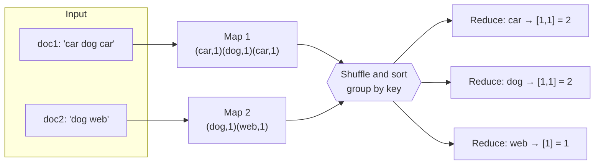
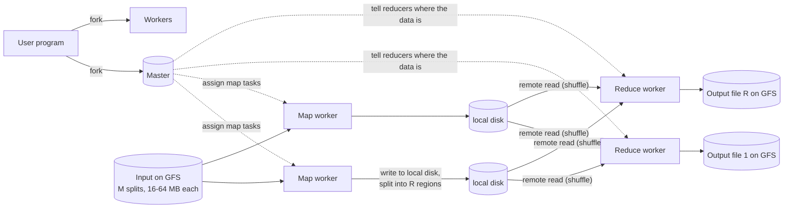

# Distributed Processing using MapReduce

> [!info] How this note is built
> - **🎓 Course:** the lecture page and the instructor's answers in the discussion. The course calls this paper **"a must read for every interview candidate… read it cover to cover."**
> - **📄 Paper:** "MapReduce: Simplified Data Processing on Large Clusters" (Dean & Ghemawat, **OSDI 2004**), read in full with the key concepts and numbers pulled out.
> - **🧠 Explanation:** my own explanation, worked examples, and interview framing.
> - Related: [[Distributed File System Design (GFS)]] (MapReduce reads and writes GFS), [[Why Sharding is the Swiss Army Knife of System Design]] (MapReduce shards the work), [[Sharding - Using Partition Functions]] (`hash(key) mod R`), [[Anatomy of a Scalable Web Application]] (the data processing box)

## 16.1 What the lecture says 🎓

- **A must-read.** It contains **a lot of knowledge about distributed systems**. Read the paper **and** watch the videos.
- **The 4 videos:**
  1. **High-level intro:** how you would **spread data processing** across machines.
  2. **How the system handles machine failures.**
  3. **The MapReduce programming model.** It "probably **won't be asked in an interview** (unless you are going for a **Data Engineering** role)", but it **helps you understand the architecture**.
  4. **The end-to-end architecture** of the whole MapReduce process.

**The big picture** 🎓
- A student noticed that **GFS, dynamic sharding and MapReduce all share one pattern**: work is spread across **many cheap machines/workers**, and a **master keeps track** of it.
- The instructor: **"Yes, that is correct! This design is very helpful for scaling lots of things."**

---

## 16.2 Why MapReduce exists 📄

- Google had **many simple computations over huge data**: crawled documents, request logs, inverted indexes, web graphs, and so on.
- The logic was simple, but spreading it over **hundreds or thousands of machines** meant writing complicated code for **splitting work, spreading data and handling failures**. That code **buried the simple logic**.
- **The insight**, borrowed from functional programming:
  - most jobs **apply a map to each record**, producing intermediate key/value pairs,
  - then **apply a reduce to all values that share a key**.
- **The library handles all the hard parts**: splitting the data, scheduling, failures and communication between machines. The programmer writes just **two functions**.

---

## 16.3 The programming model 📄

```
map    (k1, v1)        → list(k2, v2)
reduce (k2, list(v2))  → list(v2)
```

**Word count** (the classic example):
```
map(String doc_name, String contents):
    for each word w in contents:
        EmitIntermediate(w, "1")

reduce(String word, Iterator counts):
    result = 0
    for each v in counts: result += ParseInt(v)
    Emit(AsString(result))
```



🎓 In the video's word-count example, the `1` in `car:1` is **a count of one occurrence**, not a document ID.

### Examples from the paper 📄

| Job | Map emits | Reduce does |
|---|---|---|
| **Distributed grep** | the line, if it matches the pattern | nothing (identity: just output it) |
| **URL access frequency** | `(URL, 1)` from request logs | adds up the counts per URL |
| **Reverse web-link graph** | `(target, source)` for each link | lists all sources linking to each target |
| **Term vector per host** | `(hostname, term vector)` per document | adds the vectors and drops rare terms |
| **Inverted index** | `(word, document ID)` | sorts the doc IDs → `(word, list of doc IDs)` |
| **Distributed sort** | `(key, record)` | nothing (identity). The sorting comes from the framework's **partitioning and ordering**. |

🎓 **Can a database be the input?** **Yes**, databases can also feed MapReduce. Input readers are pluggable (see section 6).

---

## 16.4 How it runs, end to end 📄



**The 7 steps:**
1. **Split:** the library splits the input into **M pieces of 16-64 MB** and starts many copies of the program on the cluster.
2. **Master and workers:** one copy is the **master**; the rest are **workers**. The master hands out **M map tasks** and **R reduce tasks** to idle workers.
3. **Map:** a map worker **reads its input split**, parses key/value pairs, runs the user's **map**, and **buffers the output in memory**.
4. **Save locally and partition:** the buffered pairs are regularly **written to the worker's local disk**, **split into R regions** by the partitioning function. **The worker reports their locations to the master.**
5. **Shuffle and sort:** the master tells the reduce workers where the data is. Each reducer **pulls its region from every map worker's disk** (remote reads), then **sorts by key** so identical keys are grouped (an external sort if it doesn't fit in memory).
6. **Reduce:** for each unique key, call the user's **reduce** with the key and all its values, and **append the result to that reducer's output file**.
7. **Done:** when every task finishes, the master **wakes up the user program**. The result is **R output files**, often fed straight into **another MapReduce** job.

**What the master tracks** 📄
- For each task: its **state** (idle / in-progress / completed) and **which worker** has it.
- For each **completed map task**: the **location and size of its R output regions**.
- It makes **O(M + R) scheduling decisions** and keeps **O(M × R) state** in memory, though at about 1 byte per map/reduce pair.

🎓 **Do you need 8,000 machines for 8,000 reduce buckets?** No. **The same machines run both map and reduce tasks**, even at the same time. The number of buckets and the number of machines are separate.

---

## 16.5 Handling failures 📄🎓

**Worker failure**
- The master **pings every worker regularly**. No reply means the worker is **marked failed**.
- **Its in-progress map and reduce tasks** go back to **idle** and are rescheduled.
- **Its completed map tasks are also re-run**, because their output lives on the **dead machine's local disk** and can't be reached.
- **Its completed reduce tasks are *not* re-run**, because their output is already on **GFS** (global, replicated).
- When a map task is re-run elsewhere, **every reducer is told** to read that task's data from the new worker.
- 📄 **Proof it works:** in one job, network maintenance knocked out groups of **80 machines at a time**, and the job **still finished**, just slower.

🎓 **Keeping workers from being overloaded:**
- Map and reduce run **at the same time on all workers**, and some take over failed workers' tasks.
- **The master constantly monitors the workers**. The initial assignment isn't enough, because **you can't know which map tasks will take longer**.

**Master failure**
- It could write **checkpoints** and restart from the last one.
- In practice **there's only one master**, so failure is unlikely, and **the job is simply aborted** and the client retries.

**Correctness despite failures**
- If map and reduce are **deterministic**, the distributed result equals **what one failure-free machine would produce**.
- **How:**
  - Each task writes to **private temporary files**.
  - **Map:** on completion it tells the master the file names, and **the master ignores duplicate completions**.
  - **Reduce:** on completion it **atomically renames** its temp file to the final name. If a task ran twice, the rename guarantees **one** final file.
- 🧠 Same **"at least once + idempotent/atomic commit"** idea as job queues and GFS record append.

---

## 16.6 Performance tricks 📄

### Locality: move the computation, not the data
- Input is on **GFS** in **64 MB blocks, usually 3 copies** on different machines ([[Distributed File System Design (GFS)]]).
- The master **schedules each map task on a machine that already holds a copy of its input**, or failing that, **near one** (e.g. the **same network switch / rack**).
- Result: **most input is read locally** and uses **no network bandwidth**, which was the scarce resource.
- 🎓 **What does "close" mean?**
  - The datacenter knows which machines are near each other, e.g. **same row / same rack**, so the master picks a nearby worker.
  - Across **datacenters**, prefer the **same location**.

### Task granularity
- Make **M and R much larger than the number of machines**. That gives better **load balancing** (fast machines take more tasks) and **faster recovery** (a failed worker's many small tasks spread across everyone).
- **Typical:** **M = 200,000, R = 5,000, on 2,000 workers.**
- **R** is usually set by users because it equals the number of output files. **M** is chosen so each task is **16-64 MB** of input.

### Backup tasks (stragglers)
- **Stragglers:** a few machines finish their last tasks very slowly (bad disk, CPU contention, a bug). They hold up the whole job.
- **Fix:** near the end, **launch backup copies of the remaining in-progress tasks**. **Whichever copy finishes first wins.**
- Costs **only a few percent** more resources.
- **Sort took 44% longer without backup tasks.**
- 🧠 This is today's **"speculative execution"** (Hadoop, Spark) and "hedged requests".

---

## 16.7 Refinements 📄

| Refinement | What it does |
|---|---|
| **Partitioning function** | Default **`hash(key) mod R`** (like [[Sharding - Using Partition Functions]]). Custom, e.g. **`hash(Hostname(url)) mod R`**, puts all URLs from one host in the **same output file**. |
| **Ordering guarantee** | Within a partition, keys are processed in **sorted order**, so output is **sorted per file** (fast lookups by key, easy global sort). |
| **Combiner** | A **mini-reduce on the map worker** before sending data. Word count sends one `(the, 5000)` instead of 5,000 `(the, 1)`, **cutting network traffic**. It only works when the reduce is **associative and commutative**. |
| **Input/output types** | Pluggable readers and writers: text lines, key/value files, **databases**, in-memory data. |
| **Side effects** | Tasks that write extra files must keep them **atomic and idempotent** themselves. |
| **Skipping bad records** | If one record **crashes the map every time**, the master sees repeated failures on it and **skips it**. Useful when a few bad records don't matter. |
| **Local execution** | Run the whole job on **one machine** for debugging (gdb, unit tests). |
| **Status pages** | A built-in **HTTP status server**: tasks done, bytes processed, failed workers. |
| **Counters** | Named counters (e.g. words seen, German documents seen), gathered by the master, with **duplicates from re-run tasks removed**. |

---

## 16.8 Real numbers from the paper 📄

**Cluster (2004):** about **1,800 machines**, each with 2× 2 GHz Xeon, **4 GB RAM**, 2× 160 GB IDE disks, and **gigabit Ethernet**.

| Benchmark | Setup | Result |
|---|---|---|
| **Grep** | Scan **10¹⁰ 100-byte records (~1 TB)** for a rare pattern, M = 15,000, R = 1 | Peak **30 GB/s**, about **150 s** total (including about 1 minute of startup) |
| **Sort** | Sort **10¹⁰ 100-byte records (~1 TB)**, M = 15,000, R = 4,000 | **891 s** |
| Sort, **no backup tasks** | | **1,283 s**, **44% slower** (stragglers) |
| Sort, **200 workers killed** mid-job | | **933 s**, only **5% slower** (failures handled well) |

**Use at Google (August 2004):**

| Metric | Value |
|---|---|
| Jobs | **29,423** |
| Average job time | **634 s** |
| Machine-days used | **79,186** |
| Input read | **3,288 TB** |
| Intermediate data | **758 TB** |
| Output written | **193 TB** |
| Average workers per job | **157** |
| Distinct MapReduce programs (Sept 2004) | about **900** (from 0 in early 2003) |

**Rewriting Google's search indexing** with MapReduce shrank one phase from **about 3,800 to about 700 lines of C++**, and made it simpler to run and scale.

---

## 16.9 Where MapReduce fits today 🧠

| | MapReduce (Google 2004, Hadoop) | **Spark** | **Stream processing** (Flink, Kafka Streams, Spark Streaming) |
|---|---|---|---|
| Model | Map → shuffle → reduce, one stage per job | A graph of many steps, **kept in memory** | Continuous, event by event |
| Intermediate data | **Written to disk** between stages | **Kept in memory** when possible | State in memory, with checkpoints |
| Best for | Huge one-pass batch jobs | Iterative jobs (machine learning), multi-step pipelines, SQL | Real-time metrics, alerts |
| Latency | Minutes to hours | Seconds to minutes | Milliseconds to seconds |

- **Hadoop** = the open-source **MapReduce + HDFS** (HDFS is the open-source GFS).
- 🎓 In the course's **scalable web app diagram**, the **"Data Processing System (Hadoop/MapReduce, Spark)"** box reads from the DB, computes **metrics**, and writes results back ([[Anatomy of a Scalable Web Application]]).
- 🧠 **Interview use:**
  - "Nightly batch job to compute trending topics / recommendations / analytics": **MapReduce/Spark** over logs in HDFS/S3.
  - "Real-time counts": a **streaming** system.

---

## 16.10 Scenarios to walk through 🧠

> [!example]- Scenario 1: Count page views per URL from 10 TB of logs
> - **Map:** parse each log line → `(url, 1)`. **Combiner:** add up locally → `(url, 3,812)`.
> - **Partition:** `hash(url) mod R`, so each URL's counts go to **one** reducer.
> - **Reduce:** add the counts → `(url, total)`.
> - **With M ≈ 10 TB ÷ 64 MB ≈ 160,000 map tasks:** each runs **where its log block lives** (locality).

> [!example]- Scenario 2: Build a search inverted index
> - **Map:** for each document → `(word, doc_id)` for every word.
> - **Reduce:** for each word → sort the doc IDs → `(word, [doc3, doc9, …])`.
> - The output files are **sorted by word**, ready for lookups.

> [!example]- Scenario 3: A worker dies halfway through the job
> - The master's ping times out.
> - **Its in-progress tasks** get re-scheduled.
> - **Its completed map tasks** are **re-run**: their output was on its dead local disk. Reducers are told the new locations.
> - **Its completed reduce tasks are kept**, since their output is already on GFS.
> - **Duplicate completions** are ignored, and the atomic rename leaves one final file per reducer.

> [!example]- Scenario 4: One slow machine (straggler)
> - 3,999 of 4,000 reduce tasks are done, and one sits on a machine with a failing disk.
> - The master launches a **backup copy** on a healthy machine, and whichever finishes first wins.
> - 📄 Without this, sort took **44% longer**.

> [!example]- Scenario 5: Group URLs by website
> - The default `hash(url) mod R` scatters `site.com/a` and `site.com/b` across files.
> - A **custom partitioner** `hash(hostname(url)) mod R` keeps **each site in one output file**.

> [!example]- Scenario 6: A corrupt record crashes the mapper
> - The map crashes on record #8,812,301, retries, and crashes again.
> - The worker reports the record number to the master, which marks it bad. The next attempt **skips it** and the job finishes.

> [!example]- Scenario 7: Distributed sort of 1 TB
> - **Map:** `(key, record)`. **Partition:** by **key range** (sampled split points), so partition 1 < partition 2 < … < partition R.
> - Each reducer's file is **sorted**, and joining the R files end to end gives a **fully sorted** result.
> - 📄 1 TB in **891 s** on about 1,800 machines (2004).

---

## 16.11 Pitfalls to avoid in interviews

> [!warning] Common mistakes
> - Sending all input over the network. **Move the computation to the data** (locality).
> - Forgetting the **shuffle** is the expensive step. Use a **combiner** to shrink it.
> - Using a combiner with non-associative operations (e.g. **average**: send (sum, count) instead).
> - Assuming reduce keys are spread evenly. A **hot key** (e.g. "the") makes one reducer a straggler. Salt the key or pre-aggregate.
> - Forgetting that **completed map output is lost with the worker** (it's on local disk) while reduce output is safe (it's on GFS).
> - Map/reduce functions with **non-idempotent side effects**, which break when tasks are re-run.
> - Using MapReduce for **real-time** needs. Use streaming.
> - 🎓 Going deep into the programming model in a general interview. It's mostly asked for **data engineering** roles.

## Video notes

- Video 1 (intro to distributed data processing):
- Video 2 (handling machine failures):
- Video 3 (programming model):
- Video 4 (end-to-end architecture):

## Sources

- 🎓 [Interview Camp – Distributed Processing using MapReduce](https://interview-academy.teachable.com/courses/101687/lectures/3967110)
- 📄 [Dean & Ghemawat – MapReduce: Simplified Data Processing on Large Clusters (OSDI 2004)](https://static.googleusercontent.com/media/research.google.com/en//archive/mapreduce-osdi04.pdf)

---
