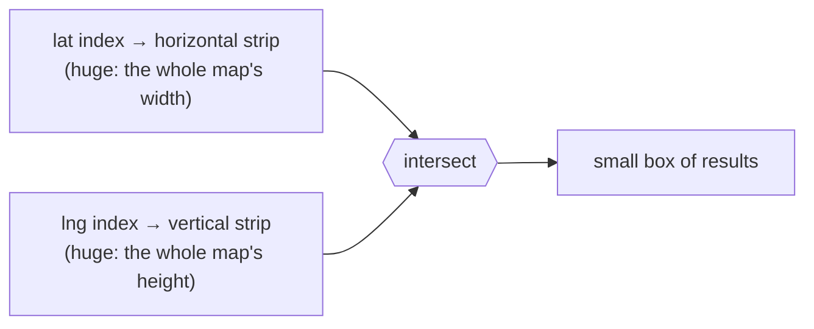

# Spatial Indexing - Nearest Neighbors Search

> [!info] How this note is built
> - **🎓 Course:** the lecture page and the instructor's answers in the discussion (28 comments). It has **4 videos**:
>   1. nearest neighbors with a **regular 1D index** (SQL / binary search tree)
>   2. **R-tree** intro
>   3. **R-tree range queries**
>   4. **R-tree insertion**
> - **🧠 Explanation:** my own explanation, worked examples, and the other common approaches (geohash, quadtree, S2/H3, Redis GEO).
> - Related: [[Approach for System Design Interviews + Uber-Lyft Design]] (the Matching System uses a spatial index), [[Databases - Intro to Indexing and NoSQL]] (B-trees, 1D indexes), [[Key-Value Stores incl. Object Stores, In Memory DBs]] (in-memory DB), [[Why Sharding is the Swiss Army Knife of System Design]]

## 17.1 What the lecture says 🎓

- For **Uber/Lyft or Yelp**, **location** is central. **Finding the k nearest neighbors (kNN) to a user** is a common use case.
- **Two ways to build it:**
  1. A **one-dimensional index**, like the one you'd use with a SQL database.
  2. A **spatial index using R-trees**. It's a new data structure, but "**if you know the basics, you will find it much easier to ace this system**."

> [!tip] Instructor advice 🎓
> - **Any one approach is good enough** (R-tree, quadtree, and so on). These topics are "quite complicated for interviews anyway."
> - **Grokking is not a standard template** for system design interviews.
> - **The Anatomy Diagram is your cheat sheet** ([[Anatomy of a Scalable Web Application]]).
> - Unlike algorithms, you don't need to cram system design the week before. Topics you read a couple of weeks earlier stay with you.

---

## 17.2 The problem 🧠

- **Input:** a user's location (lat, lng) and **k**, or a radius.
- **Output:** the **k closest** points (drivers, restaurants), or **all points within a radius**.
- **Why it's hard:**
  - Normal indexes sort on **one value**, but location has **two dimensions**.
  - "Close in 2D" doesn't mean "close in a sorted list" on either coordinate alone.

**Two query types**
- **Range query:** everything inside a **box** (or circle). 🎓 The R-tree videos use **box queries**.
- **kNN query:** the k closest points. Usually done as **a range query that grows** until at least k points are found.

---

## 17.3 Approach 1: a regular 1D index (SQL / BST) 🎓

**Idea:**
- Store points in a table `places(id, lat, lng, …)` and **index `lat` and `lng`** separately (B-tree or binary search tree).
- To search around (x, y) with radius d:

```sql
SELECT id, lat, lng FROM places
WHERE lat BETWEEN :y - d AND :y + d
  AND lng BETWEEN :x - d AND :x + d;
```

**How the database actually runs it** 🧠
1. Use the **lat index** to find **every place in the horizontal strip** `[y−d, y+d]`, which covers the **whole width of the map**.
2. Use the **lng index** to find **every place in the vertical strip** `[x−d, x+d]`, which covers the **whole height of the map**.
3. **Intersect** the two sets, since only points in **both** strips are in the box.



**The problem**
- Each strip can hold a **huge number of points**, but the final box is small. You read **far more rows than you return**.
- 🎓 You *can* put a composite or clustered index on (X, Y), but you'd **still have to run the queries and combine the results yourself**.
  - 🧠 A composite `(lat, lng)` index only narrows `lng` **within each exact `lat` value**. For a range on `lat`, it still scans the whole latitude strip.
- ✅ Simple, works in any SQL DB, fine for **small datasets** or a first answer.
- ❌ Slow at scale, because it **doesn't understand 2D closeness**.
- 🎓 (The video's size math: **1,000,000 KB = 1 GB**, not 1 TB. The instructor confirmed that correction.)

---

## 17.4 Approach 2: R-trees 🎓🧠

### The idea
- An **R-tree** is a **balanced tree of rectangles**. The "R" stands for rectangle.
- Each node holds up to **M children** (the max branching factor, e.g. 3 in the video).
- Each child is stored with its **minimum bounding rectangle (MBR)**: the **smallest box that contains everything below it**.
- **Leaves** hold the actual points (or small shapes).

```
                 [ Root ]
          ┌─────────┼─────────┐
         [A]       [B]       [C]        ← boxes around groups of boxes
       ┌──┼──┐   ┌──┼──┐   ┌──┼──┐
      p1 p2 p3  p4 p5 p6  p7 p8 p9      ← points (drivers, restaurants)
```

- 🎓 It's **like a B-tree** (the instructor agreed): balanced, with a **max number of children per node**, and nodes **split when full**. The difference is that keys are **rectangles**, not numbers.
- 🎓 A student noted **quadtrees** are similar but **split space into 4** fixed parts (section 5).

### Range query (video 3) 🎓
- 🎓 **Box X is the user's query.** "Restaurants within 1 mile of point Y" means **X is a square extending 1 mile around Y**.
- **Algorithm:**
  1. Start at the root.
  2. For each child box, **does it intersect X?** No: **skip that whole subtree**. Yes: go into it.
  3. At the leaves, return the points that are **inside X**.

```python
def search(node, X, results):
    for child in node.children:
        if intersects(child.mbr, X):          # prune everything else
            if node.is_leaf:
                if contains(X, child.point): results.append(child.point)
            else:
                search(child, X, results)
```

- **Why it's fast:** whole regions that don't touch X are **skipped in one check**.
- 🎓 **"Aren't you just looping over all the children?"** Only **up to M children per node** (e.g. 3). The tree prunes everything else, so the work is about **O(log n + number of results)** for small queries.

### Insertion (video 4) 🎓🧠
1. **Choose a leaf:** from the root, go down into the child whose box would **grow the least** to include the new point (ties: pick the smaller box).
2. **Add** the point to that leaf.
3. **If the leaf now has more than M entries, split** it into two nodes, grouping points that are close together so the new boxes stay **small with little overlap**.
4. **Go back up the tree:** **expand parent boxes** to fit, and **push splits upward**. If the root splits, the tree gets one level taller, like a B-tree.

**Moving points (Uber drivers)** 🎓
- **"Does the R-tree get rebuilt every few seconds?"** "Rebuilt, no. Individual points updated, yes."
- 🧠 Update = **delete the old point and insert the new one**, or just **adjust the leaf if the point stays inside its box**.

---

## 17.5 From range query to kNN 🎓

- **"What if there's nothing in my box?"** The instructor: **keep widening the box** (1 mile → 5 → 10…) until you find drivers.
- **Is it exact?** 🎓 A student pointed out that a box isn't a circle. A point **just outside the box's edge** can be **closer** than the k-th point in a **corner** of the box.
  - The instructor: **"this algorithm might not give you the exact nearest neighbors since it works with bounding boxes. For accurate NN, we would need a circle around the point. In practice though, it doesn't make much of a difference."**
  - Another student: for Yelp, showing **corner points** fits a **rectangular screen** anyway. For Uber it's already an estimate, since cars move and you only need **one driver to accept**.
- 🧠 **To get exact kNN:**
  1. Query a box that returns **more than k** points.
  2. Compute the **real distance** for each and keep the **k closest**.
  3. Then check that the box's **half-width ≥ the k-th distance**. If not, widen once more.
  - Or use **best-first search** on the R-tree: a priority queue ordered by distance to each box.

---

## 17.6 Other approaches worth knowing 🧠

🎓 **Any one approach is enough** in an interview, but these come up often:

| Approach | How it works | Pros | Cons | Used by |
|---|---|---|---|---|
| **1D index on lat and lng** 🎓 | Two B-tree range scans, then intersect | Any SQL DB | Scans huge strips | Small apps |
| **R-tree** 🎓 | A tree of bounding rectangles | Fast range queries; handles **shapes** (polygons) too | More complex; boxes can overlap | **PostGIS** (GiST), SQLite R*Tree, Oracle Spatial |
| **Quadtree** | Split each square into **4** until each holds ≤ N points | Simple; adapts to dense areas (cities split more) | Can get unbalanced; uneven load | Yelp-style designs (Grokking), game engines |
| **Geohash** | Turn (lat, lng) into a **string**; **shared prefix = nearby** | Works with **any 1D index / key-value store** (prefix range); easy to shard | Edge effects: close points can have different prefixes, so **check the 8 neighbor cells** | **Redis GEO**, Elasticsearch, DynamoDB geo libraries |
| **S2 / H3 cells** | Cover Earth with a hierarchy of cells (S2: squares on a cube; **H3: hexagons, from Uber**) | Even cell sizes; hexagons have **equal distance to all neighbors** | More to learn | Google (S2), **Uber (H3)** for pricing and dispatch |

**Geohash, explained** 🧠
- Split the world in half on longitude (0 or 1), then latitude, and repeat, **interleaving the bits**. Write them in base-32, e.g. `9q8yy…` (San Francisco).
- **More characters = a smaller cell:**

| Geohash length | Cell size (approx.) |
|---|---|
| 5 | about 4.9 km × 4.9 km |
| 6 | about 1.2 km × 0.6 km |
| 7 | about 153 m × 153 m |

- **Nearby search:** compute the user's geohash at the right precision, then fetch that cell **plus its 8 neighbors** (a prefix query on a normal index). Finally filter by real distance.
- 🧠 **Why interviewers like it:** it turns a 2D problem into a **1D key**, so the **sharding, caching and key-value tools from earlier lectures just work**.

**Redis GEO** 🧠
- `GEOADD drivers <lng> <lat> driver42` and `GEOSEARCH drivers FROMLONLAT <lng> <lat> BYRADIUS 2 km ASC COUNT 10`.
- It uses a **sorted set with geohash-based scores**, all **in memory**. That's a good fit for **frequently updated driver locations** 🎓 (the course's in-memory DB for Uber).

---

## 17.7 At scale 🎓🧠

- 🎓 **A dataset too big for one machine** (e.g. 1 TB in an in-memory DB): use a **cluster of machines**, **sharded** like any database ([[Why Sharding is the Swiss Army Knife of System Design]]).
- 🧠 **Shard by geography:** by city/region, or by **geohash prefix / S2 or H3 cell ranges**. A nearby query then usually hits **one shard**, or a few at borders.
- 🧠 **Hot spots:** Manhattan has far more drivers than rural areas. Use **smaller cells or more shards for dense areas** (quadtrees adapt to this naturally).
- 🎓 **"In-memory DB" means any database stored in memory** (e.g. Redis). The SQL vs NoSQL label doesn't really apply here.

---

## 17.8 Scenarios to walk through 🧠

> [!example]- Scenario 1: Uber, find the nearest drivers (🎓 the Matching System)
> 1. Drivers **send their location every few seconds**. App servers update the **in-memory spatial index** (an R-tree, or Redis GEO) with a **point update, not a rebuild** 🎓.
> 2. A rider requests a ride. Run a **range query** with a 1 km box around the rider.
> 3. **No available drivers? Widen** to 3 km, then 5 km 🎓.
> 4. Sort the candidates by real distance or ETA, then send requests one at a time until someone accepts (see [[Approach for System Design Interviews + Uber-Lyft Design]]).
> 5. **Scale:** one index per city/region shard.

> [!example]- Scenario 2: Yelp, restaurants within 1 mile
> - Restaurants **rarely move**, so the index can be **built once and cached**. A read-heavy spatial index works well: PostGIS R-tree, a geohash column with a B-tree, or Elasticsearch geo.
> - **Query:** box X = 1 mile around the user 🎓. Walk the R-tree, pruning boxes that don't touch X, then filter by exact distance and rank by rating.
> - Showing results in the **rectangular map view** makes the box query natural 🎓.

> [!example]- Scenario 3: R-tree range query by hand
> - The root has boxes **A** (downtown), **B** (the airport) and **C** (the suburbs). The query box X is downtown.
> - X intersects **A only**, so skip B and C entirely. Inside A, check its ≤ M children, and return points inside X.
> - **If X overlaps A and B**, search both subtrees and combine the results 🎓.

> [!example]- Scenario 4: Inserting a new restaurant
> - Pick the child box that **grows the least**: the point is already inside A, so A grows by 0. Go down into A.
> - The leaf now has 4 entries but M = 3, so **split** it into two leaves of close points.
> - The parent **gains a child** and its box **expands**. If the parent overflows, **split upward**.

> [!example]- Scenario 5: Geohash in a plain key-value store (no spatial DB)
> - Store `geohash6 → set of driver IDs` in Redis or DynamoDB.
> - **Query:** the user's geohash6 **plus its 8 neighbors** gives 9 key lookups. Merge them and filter by distance.
> - **A driver moves:** remove them from the old cell's set and add them to the new one when the geohash changes.

> [!example]- Scenario 6: Why the 1D index struggles
> - 10M restaurants in the US. A **1-mile** box around a user in Chicago.
> - The **lat strip** (1 mile tall, as wide as the whole country) holds about 30k restaurants. The **lng strip** is about the same.
> - The **intersection** might be **200**. You read about 60k index entries to return 200.
> - An R-tree or geohash reads roughly **just the neighborhood**.

---

## 17.9 Pitfalls to avoid in interviews

> [!warning] Common mistakes
> - Saying "just index lat and lng" without explaining the **strip-intersection cost**.
> - Treating box results as **exact kNN**. Mention the box vs circle difference, then **filter by real distance** 🎓.
> - Returning nothing when the box is empty. **Widen the box** 🎓.
> - **Rebuilding** the index for moving drivers. **Update individual points** 🎓.
> - Forgetting geohash **edge effects**. Always check the **neighbor cells**.
> - Ignoring **dense-area hot spots** when sharding by region.
> - 🎓 Trying to cover every approach. **Pick one and explain it well.**

## Video notes

- 1D index (SQL/BST):
- R-trees intro:
- R-trees range querying:
- R-trees inserting a point:

## Sources

- 🎓 [Interview Camp – Spatial Indexing: Nearest Neighbors Search](https://interview-academy.teachable.com/courses/101687/lectures/4174698)
- [Guttman – R-Trees: A Dynamic Index Structure for Spatial Searching (SIGMOD 1984)](https://dl.acm.org/doi/10.1145/602259.602266)
- [PostgreSQL – Index types (GiST for spatial data)](https://www.postgresql.org/docs/current/indexes-types.html)
- [Redis – GEOSEARCH](https://redis.io/docs/latest/commands/geosearch/)
- [Wikipedia – Geohash](https://en.wikipedia.org/wiki/Geohash)
- [Uber Engineering – H3: Uber's Hexagonal Hierarchical Spatial Index](https://www.uber.com/blog/h3/)

---
