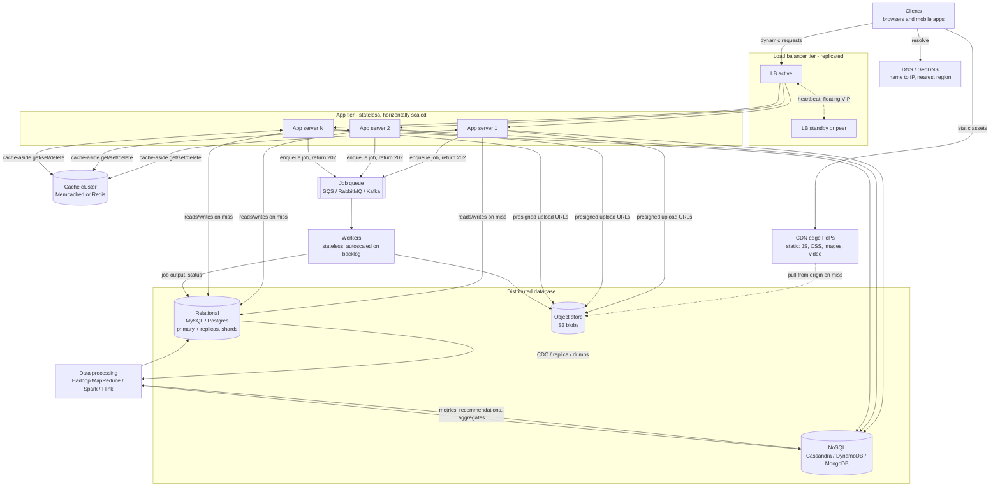

# Scalable web application anatomy

A scalable web application is a pipeline of specialized tiers, each of which removes one bottleneck and one single point of failure (SPOF) from the one-box design. **Clients get static bytes from a CDN at the edge. Dynamic requests go to a replicated load balancer, which spreads them over identical, stateless app servers. Those servers read through a Memcached/Redis cache to a distributed data tier: relational DB, NoSQL, and an object store for blobs. Slow work goes onto a job queue for workers. A batch or stream system (Hadoop MapReduce, Spark, Flink) turns the stored data into metrics and results that it writes back for the app to serve.** Every box exists for a reason you can state in one sentence. The CDN cuts latency and origin load. The LB enables horizontal scaling and failover. Statelessness lets any server take any request. The cache absorbs reads. Replicas scale reads, while sharding is the only thing that scales writes. Queues decouple latency from work, and the offline pipeline keeps analytics off the transactional database. The design grows in a standard order (separate the DB, add an LB, replicate, cache, CDN, go stateless, multi-DC, queues, shard), and each step moves the SPOF somewhere new ([ByteByteGo](https://bytebytego.com/courses/system-design-interview/scale-from-zero-to-millions-of-users)). In an interview, knowing what each box costs matters as much as knowing what it does: stale caches, replication lag, duplicate job delivery, hot shards, and a load balancer that is itself a SPOF are the traps interviewers probe.

> [!note] Scope and provenance
> The component layout follows the "Diagram for a Scalable Web Backend" on the Interview Camp lecture page and its discussion thread (the videos themselves were not watched). Every mechanism, number and tradeoff below is cited to primary docs (AWS, Redis, Kafka/Confluent, Cloudflare, Envoy, NGINX), papers (Facebook memcache at NSDI 2013, Amazon Dynamo) and standard interview references (System Design Primer, ByteByteGo, DDIA). Numbers are tagged **documented** (vendor limit or default), **measured** (a reported result), or **rule of thumb** (heuristic; don't quote as fact).

## 18.1 The whole diagram fits in one request path and two async paths

The diagram has one synchronous path and two asynchronous ones. The **synchronous path** runs client → (CDN for static) → LB → app server → cache → DB, and it must stay fast because a user is waiting. The **job path** runs app → queue → workers → DB. It moves work the user doesn't need right away (emails, thumbnails, transcodes, feed fan-out) out of the request ([system-design-primer](https://github.com/donnemartin/system-design-primer)). The **analytics path** runs DB/events → data processing → results written back. It computes aggregates and ML outputs without touching the primary OLTP database.

| Component | Its one job | What it holds | Scales by | Default tech |
|---|---|---|---|---|
| DNS / GeoDNS | Map a name to the nearest healthy entry point | Records cached for TTL | Managed anycast DNS | Route 53, Cloudflare DNS |
| CDN | Serve static content close to users, offload origin | Cached copies (TTL-bound) | More PoPs (provider's problem) | CloudFront, Cloudflare, Akamai, Fastly |
| Load balancer | Spread requests, remove unhealthy servers | Connection/flow state only | Redundant pair (VRRP), ECMP, anycast | NGINX, HAProxy, Envoy, AWS ALB/NLB |
| App servers | Run business logic | Nothing durable (stateless) | Add identical instances | Any web framework in containers/VMs |
| Cache | Serve hot reads in sub-ms | Evictable copies of DB data, sessions | Shard keys across nodes | Memcached, Redis/Valkey |
| Relational DB | Source of truth with transactions | Structured rows | Replicas (reads), shards (writes) | MySQL, PostgreSQL |
| NoSQL | Huge-scale simple access patterns | Key-value, document, wide-column | Partitioning built in | DynamoDB, Cassandra, MongoDB |
| Object store | Blobs (images, video, backups) | Files + metadata | Effectively unlimited | S3, GCS |
| Job queue | Buffer and hand out deferred work | Messages until ack/retention | Partitions, more consumers | SQS, RabbitMQ, Kafka |
| Workers | Execute offline jobs | Nothing durable | Autoscale on backlog per worker | Celery, Sidekiq, containers |
| Data processing | Batch/stream analytics, ML | Intermediate datasets | Cluster size | Hadoop MapReduce, Spark, Flink |

## 18.2 Every scaling step moves the single point of failure

The single-server starting point is simple. The user resolves the domain via DNS, gets an IP, and sends HTTP to one machine that serves both the website and the API. It has **no redundancy and a hard vertical ceiling** ([ByteByteGo](https://bytebytego.com/courses/system-design-interview/scale-from-zero-to-millions-of-users)). Vertical scaling (more CPU, RAM, disk) is the easy first lever, but it runs into a hardware limit, stays a SPOF, and gets expensive. Horizontal scaling (more machines) removes the ceiling and adds redundancy, so it is the preferred path for large systems ([ByteByteGo](https://bytebytego.com/courses/system-design-interview/scale-from-zero-to-millions-of-users)). The System Design Primer adds that scaling out on commodity machines is more cost-effective and more available. It also names the catch: **servers must be stateless**, and downstream caches and databases must handle more simultaneous connections as the app tier grows ([system-design-primer](https://github.com/donnemartin/system-design-primer)).

The canonical sequence comes from Alex Xu's "Scale From Zero to Millions of Users." It works best in an interview as a story about what breaks next ([ByteByteGo](https://bytebytego.com/courses/system-design-interview/scale-from-zero-to-millions-of-users)). App and database on one box compete for CPU, RAM and disk I/O, so the database moves to its own server first, which lets each tier scale independently. Next the single web server becomes the capacity limit and the SPOF, so an LB goes in front of several servers. Users hit the LB's public IP, and the servers sit on private IPs. The database then becomes the bottleneck. Read replicas and a cache absorb reads. A CDN takes static assets. Session state moves out of the servers so any server can take any request and autoscaling works. GeoDNS spreads users across data centers. Queues decouple slow work, logging and metrics make the system operable, and sharding finally scales writes. The ordering is an interview narrative, not a law. What carries over is the habit of asking **"where is the SPOF now?"** after every step, because each fix relocates it: web server → LB → DB primary → cache → a single region.

| Stage | What breaks | Fix | New risk it introduces |
|---|---|---|---|
| 1. One box | Everything competes; any failure is total | Split DB onto its own server | DB is a SPOF |
| 2. App + DB servers | One web server's capacity and availability | LB + N web servers | LB is a SPOF; servers must be stateless |
| 3. LB + N servers | DB reads saturate | Primary + read replicas | Replication lag; failover complexity |
| 4. Replicated DB | Repeated hot reads still hit DB | Cache (Memcached/Redis) | Staleness, invalidation, stampedes |
| 5. Cached | Static bytes waste origin bandwidth, far users slow | CDN | Stale assets, CDN cost |
| 6. CDN | Sticky sessions block autoscaling | Stateless tier, shared session store | Session store must be HA |
| 7. Stateless | One region/DC is a SPOF | Multi-DC with GeoDNS | Cross-DC data sync |
| 8. Multi-DC | Slow work in request path, coupled components | Message queue + workers | Duplicates, retries, eventual consistency |
| 9. Queued | Writes or data size exceed one DB node | Shard the data tier | Hot shards, cross-shard joins, resharding |

The same source ends with a set of design principles: keep the web tier stateless, build redundancy at every tier, cache aggressively, support multiple data centers, host static assets on a CDN, shard the data tier, split into services, and monitor and automate ([ByteByteGo](https://bytebytego.com/courses/system-design-interview/scale-from-zero-to-millions-of-users)).

Two axes get mixed up here and should be kept apart. **Monolith vs microservices** is about how code splits into deployable units. **Single-server vs multi-server** is about how many machines run it. A monolith can run as 50 identical instances behind an LB, which is exactly the interview default. Fowler's advice is "monolith first," splitting only when the monolith becomes a problem, because the complexity of microservices "merely shifts around to the interconnections between services" ([Fowler & Lewis](https://martinfowler.com/articles/microservices.html); [Fowler, Microservice Trade-Offs](https://martinfowler.com/articles/microservice-trade-offs.html)).

> [!warning] Pitfalls: evolution
> Saying "we'll scale horizontally, so microservices" conflates the two axes. Horizontal scaling works fine with a monolith; the real driver for microservices is organizational (team independence, deploy velocity). Splitting into services that share one database gives you the costs of distribution without the decoupling. Hello Interview warns that the old textbook advice to split databases at around 100 GB is outdated, and premature sharding is a common mistake ([Hello Interview](https://www.hellointerview.com/learn/system-design/core-concepts/numbers-to-know)).

> [!question]- Self-test: evolution
> **Why is separating the DB usually step one?** App and DB compete for CPU/RAM/disk on one box, and separating them lets each tier scale independently.
> **What does adding an LB force on the app tier?** Statelessness. Any server must be able to serve any request.
> **Name the SPOF after adding an LB in front of N servers.** The LB itself (and still the DB primary).

## 18.3 CDNs and replicated load balancers keep traffic off the origin

### The CDN serves static bytes before a request ever reaches you

A CDN is "a geographically distributed group of servers that caches content close to end users." Its servers sit at Internet exchange points, where networks interconnect. It lowers latency and origin bandwidth cost, raises availability, and absorbs DDoS ([Cloudflare](https://www.cloudflare.com/learning/cdn/what-is-a-cdn/)). It typically caches HTML, JavaScript, CSS, images and video, and "sometimes" dynamic content ([system-design-primer](https://github.com/donnemartin/system-design-primer)). The CDN sits outside your backend in the diagram because clients reach it through DNS (a CNAME to the CDN hostname) or anycast before any request touches your LB. A cache hit offloads the origin completely.

The CDN has two operating models. In a **push CDN** you upload content when it changes: traffic stays minimal but storage is maximal, which suits low-traffic sites or rarely updated content. In a **pull CDN** the edge fetches from origin on the first request and caches it for a TTL. The first request is slow and storage stays small, which suits high-traffic sites ([system-design-primer](https://github.com/donnemartin/system-design-primer)). Freshness is controlled with HTTP headers. `max-age` governs browsers, `s-maxage` separately governs shared caches like the CDN, and `stale-while-revalidate` and `stale-if-error` let the edge serve stale content while it refreshes or while the origin is down. CloudFront's default TTL is **24 hours** when no cache policy applies ([AWS CloudFront](https://docs.aws.amazon.com/AmazonCloudFront/latest/DeveloperGuide/Expiration.html)). To update assets, AWS recommends **versioned file names over invalidation**. Invalidation can't clear browser or corporate-proxy caches, while versioning is cheaper and allows rollback ([AWS CloudFront Invalidation](https://docs.aws.amazon.com/AmazonCloudFront/latest/DeveloperGuide/Invalidation.html)). Static-content sites typically target a **95–99% cache hit ratio**, and dynamic sites run lower ([Cloudflare](https://www.cloudflare.com/learning/cdn/what-is-a-cache-hit-ratio/)). The costs are traffic-based pricing, stale content if an asset changes before its TTL expires, and URL rewriting. Apps should also detect a CDN outage and fall back to the origin ([system-design-primer](https://github.com/donnemartin/system-design-primer); [ByteByteGo](https://bytebytego.com/courses/system-design-interview/scale-from-zero-to-millions-of-users)).

| | Push CDN | Pull CDN |
|---|---|---|
| How content arrives | You upload on change | Edge fetches from origin on first miss |
| Storage | Maximal (everything pushed) | Minimal (only requested items) |
| Origin traffic | Minimal | Spikes on misses and TTL expiry |
| First request | Fast | Slow (miss penalty) |
| Best for | Low traffic, rarely changing, large files | High-traffic sites (the default) |

### Load balancers choose a layer, an algorithm and a failover story

**Layer 4** load balancers route on IP and port, forwarding via NAT without reading payloads. They are fast and protocol-agnostic. **Layer 7** load balancers terminate the connection, read headers, cookies and paths, and open a new connection to a backend chosen by content, for example sending video to video servers ([system-design-primer](https://github.com/donnemartin/system-design-primer)). On AWS the split is ALB (L7: HTTP/HTTPS/gRPC with path and header routing) versus NLB (L4: TCP/UDP/TLS, a static IP per AZ, "millions of requests per second") ([AWS ELB](https://aws.amazon.com/elasticloadbalancing/features/); [AWS NLB](https://docs.aws.amazon.com/elasticloadbalancing/latest/network/introduction.html)). A reverse proxy is useful even with a single backend (TLS termination, compression, hiding servers), while an LB matters once many servers do the same job. NGINX and HAProxy do both ([system-design-primer](https://github.com/donnemartin/system-design-primer)). An API gateway is "an API-focused reverse proxy and policy point" that adds auth, per-consumer rate limits and request transformation ([API7.ai](https://api7.ai/learning-center/api-gateway-guide/api-gateway-vs-reverse-proxy-vs-load-balancer)).

| | L4 LB | L7 LB |
|---|---|---|
| Sees | IPs, ports | HTTP headers, paths, cookies, body |
| Connection | Forwards packets/flows (NAT) | Terminates, then opens new backend connection |
| Can do | Fast, any TCP/UDP protocol, client IP preservation | Content routing, TLS termination, redirects, auth hooks |
| Cost | Less processing | More CPU per request |
| AWS / GCP | NLB / Network LB | ALB / Application LB |

Algorithms split into **static** and **dynamic** ones ([Cloudflare](https://www.cloudflare.com/learning/performance/types-of-load-balancing-algorithms/)). Static algorithms are round robin, weighted round robin and IP hash; they are cheap but blind to load. Dynamic ones (least connections, weighted response time, resource-based) adapt to load at some monitoring cost. NGINX defaults to weighted round robin with a weight of 1. It also offers `least_conn`, `ip_hash` and a `hash ... consistent` mode that uses ketama consistent hashing so that few keys move when servers change ([NGINX](https://docs.nginx.com/nginx/admin-guide/load-balancer/http-load-balancer/)). Envoy's weighted least request becomes **power of two choices (P2C)** when weights are equal: it samples two random hosts and picks the one with fewer active requests, an O(1) method that resists herding. Envoy also offers ring hash and Maglev hashing. Maglev uses a fixed table of 65,537 entries, builds its table about 10x faster and selects about 5x faster than ring hash, but moves more keys when hosts change ([Envoy](https://www.envoyproxy.io/docs/envoy/latest/intro/arch_overview/upstream/load_balancing/load_balancers)). In short, round robin suits short uniform requests, least connections suits long or variable ones like WebSockets, and consistent hashing is for backends that hold per-key state (caches, shards).

Health checks remove bad servers. Passive checks watch real traffic for failures (NGINX `max_fails`/`fail_timeout`), and active checks probe on a schedule ([NGINX](https://docs.nginx.com/nginx/admin-guide/load-balancer/http-load-balancer/)). **Sticky sessions** pin a user to a server with a cookie or IP hash. They are a crutch: load becomes uneven, sessions are lost when that server dies, and scale-in gets harder. Twelve-Factor goes further: "Sticky sessions are a violation of twelve-factor and should never be used or relied upon" ([12factor.net](https://12factor.net/processes)).

The diagram's "replicated" LB answers the obvious question of what happens when the LB dies ([system-design-primer](https://github.com/donnemartin/system-design-primer)). Inside a site, an **active-passive pair shares a floating virtual IP via VRRP (keepalived)**. The master sends heartbeat advertisements, and when they stop, the backup claims the VIP with a gratuitous ARP, so upstream routers keep sending to the same IP ([HAProxy](https://www.haproxy.com/documentation/haproxy-enterprise/administration/high-availability/active-standby/)). At larger scale, routers spread packets over many LB machines using **ECMP**. Google's Maglev does this, with consistent hashing and connection tracking so a single machine failure doesn't reset every flow. One Maglev machine can saturate a 10 Gbps link with small packets ([Google Research](https://research.google/pubs/maglev-a-fast-and-reliable-software-network-load-balancer/)). Across sites, **DNS** (round robin, weighted, latency-based, geolocation, and failover records driven by health checks) or **anycast** (one IP announced from many PoPs, with traffic routed to the nearest one) spreads clients over LB instances ([AWS Route 53](https://docs.aws.amazon.com/Route53/latest/DeveloperGuide/routing-policy.html); [Cloudflare Anycast](https://www.cloudflare.com/learning/cdn/glossary/anycast-network/)). Classic DNS round robin doesn't check server health ([Cloudflare](https://www.cloudflare.com/learning/performance/what-is-dns-load-balancing/)). DNS failover is also slow and imprecise, because resolvers and clients cache records for the TTL. VIP and anycast failover are faster because the IP never changes.

> [!tip] Interview answer template for "how do clients reach a replicated LB?"
> GeoDNS/latency DNS or anycast picks the region → inside the region, ECMP or a VRRP floating VIP spreads over L4 LBs → L4 LBs spread over L7 proxies (Envoy/NGINX) → L7 spreads over stateless app servers. On AWS: Route 53 → CloudFront → ALB → autoscaling group; NLB when you need L4, static IPs or non-HTTP.

> [!warning] Pitfalls: edge layer
> Drawing one LB and forgetting it is a SPOF. Using sticky sessions instead of a stateless tier. Claiming DNS failover is instant, which ignores TTL caching. Caching personalized responses at the CDN without `private` or proper cache keys. Relying on CDN purges instead of versioned asset URLs. Using `hash % N` for stateful routing instead of consistent hashing. Forgetting that scaling out the web tier multiplies connections to the cache and DB.

> [!question]- Self-test: edge layer
> **Push or pull CDN for a high-traffic news site?** Pull: edge fetches on first miss and caches for the TTL, so storage stays small.
> **Which header sets a CDN-specific TTL separate from the browser's?** `s-maxage`.
> **What does an L7 LB do that an L4 LB cannot?** Route on HTTP content (path, header, cookie) because it terminates and reads the request.
> **How does a VRRP backup take over?** It stops seeing master heartbeats, claims the floating VIP and sends gratuitous ARP.

## 18.4 Stateless servers push all state into the data tier

"Stateless" means an app server keeps no per-user data that must survive between requests. "Twelve-factor processes are stateless and share-nothing": persistent data lives in a backing service, and local memory or disk serves only as a short-lived cache that is never assumed to persist ([12factor.net](https://12factor.net/processes)). The N servers in the diagram don't coordinate with each other. They run the same code, talk to the same cache and DB, and the LB spreads requests across them. That design makes autoscaling safe. A new instance is useful as soon as it passes health checks, and a terminated one loses only in-flight requests. The catch is that **stateless doesn't mean the system has no state**. The state has moved to the data tier, which is where the hard problems (replication, sharding, invalidation) now live.

| Where session state lives | Pros | Cons |
|---|---|---|
| Server memory + sticky sessions | Simple, no extra hop | Uneven load; lost on crash; blocks scale-in |
| Shared store (Redis/Memcached/DB) | Any server serves any request; instant revocation (delete the record) | Extra network hop per request; store must be HA |
| Client-side signed token (JWT) | No server lookup | Hard to revoke before expiry; larger token (practitioner estimate ~800 B–2 KB vs ~32–64 B session cookie) |

The JWT size figures and the verdict "server-side sessions for browsers, JWTs for service-to-service" come from a practitioner blog, not a standard ([Reptile Haus](https://reptile.haus/journal/stop-defaulting-to-jwts-choosing-the-right-session-architecture-in-2026/)). Treat them as one informed opinion.

## 18.5 Memcached absorbs reads, but misses and invalidation are the hard part

### Cache-aside is the default because Memcached cannot load data itself

The diagram's two-way arrow between app servers and Memcached is **cache-aside (lazy loading)**. The app checks the cache. On a hit it returns; on a miss it queries the DB, writes the value into the cache and returns ([AWS caching whitepaper](https://docs.aws.amazon.com/whitepapers/latest/database-caching-strategies-using-redis/caching-patterns.html)). Facebook calls this a "demand-filled look-aside cache" ([Nishtala et al., NSDI 2013](https://www.usenix.org/system/files/conference/nsdi13/nsdi13-final170_update.pdf)). It is the default because Memcached is a passive key-value store with no DB connector, so the app, which already has DB access and the domain logic, has to handle misses. It also degrades gracefully: if the cache dies, the app falls back to the DB, slower but still correct. The cost is a three-trip miss (check cache, read DB, write cache) and cold starts, since new nodes begin empty ([system-design-primer](https://github.com/donnemartin/system-design-primer)). AWS recommends combining lazy loading with write-through and TTLs ([AWS caching whitepaper](https://docs.aws.amazon.com/whitepapers/latest/database-caching-strategies-using-redis/caching-patterns.html)).

| Pattern | Read path | Write path | Strength | Weakness |
|---|---|---|---|---|
| Cache-aside | App checks cache; on miss reads DB and fills cache | App writes DB, deletes cache key | Works with any cache; only hot data cached; survives cache outage | Miss penalty; stale without TTL |
| Read-through | Cache/library loads from DB on miss | (usually paired with write-through or write-around) | Simpler app code; centralized miss handling | Needs a cache provider with loader logic |
| Write-through | Always warm | Write cache and DB synchronously | Fresh cache, higher hit rate | Slower writes; caches never-read data; churn on hot updates |
| Write-around | Lazy fill on read | Write DB only | Avoids polluting cache with write-once data | First read after write misses |
| Write-back (write-behind) | From cache | Write cache; DB updated asynchronously | Fastest writes | Data loss if cache fails before flush |
| Refresh-ahead | From cache | n/a | Hot keys refreshed before expiry | Wasted work if predictions are poor |

Sources for the table: [AWS whitepaper](https://docs.aws.amazon.com/whitepapers/latest/database-caching-strategies-using-redis/caching-patterns.html), [AWS caching best practices](https://aws.amazon.com/caching/best-practices/), [system-design-primer](https://github.com/donnemartin/system-design-primer). The read-through definition comes from a secondary source ([EnjoyAlgorithms](https://www.enjoyalgorithms.com/blog/read-through-caching-strategy/)).

### Delete on write, add jitter, and defend against stampedes

On a write, **update the DB, then delete the cache key rather than setting it**. Facebook deletes "because deletes are idempotent" ([NSDI 2013](https://www.usenix.org/system/files/conference/nsdi13/nsdi13-final170_update.pdf)). Even so, a race remains, and interviewers like to ask about it. Reader A misses and reads the old value from the DB. Writer B updates the DB and deletes the key. A then writes the old value into the cache, where it stays stale until the TTL expires. Facebook closes this "stale set" race with **leases**. On a miss, memcached hands out a 64-bit token, and the later `set` succeeds only if no delete has invalidated that token. Leases also limit thundering herds: tokens are issued at most once per 10 seconds per key, and other clients wait briefly and retry. On contended keys this cut peak DB queries from **17K/s to 1.3K/s** ([NSDI 2013](https://www.usenix.org/system/files/conference/nsdi13/nsdi13-final170_update.pdf)). Facebook treats staleness as a tunable parameter: "We treat the probability of reading transient stale data as a parameter to be tuned."

AWS's TTL guidance: put a TTL on every key except write-through ones, use TTLs of a few seconds for fast-changing data, and add jitter (for example `ttl = 3600 + rand()*120`) so keys don't expire together ([AWS caching best practices](https://aws.amazon.com/caching/best-practices/)). For **cache stampedes**, the options are locking (one process recomputes while the others wait or get the stale value), background recomputation, and probabilistic early expiration (XFetch, Vattani et al., VLDB 2015) ([Wikipedia: Cache stampede](https://en.wikipedia.org/wiki/Cache_stampede)). **Hot keys** can be split into `key-1..N` copies spread across nodes, or backed by a local in-process cache. **Cache penetration** (lookups for keys that don't exist, which always fall through to the DB) is handled by caching nulls with a short TTL or by putting a Bloom filter in front. ByteByteGo's example sizes a filter for 1 billion keys at a 1% false-positive rate at about 1.2 GB ([ByteByteGo](https://blog.bytebytego.com/p/a-crash-course-in-caching-final-part)).

For eviction, **Redis defaults to `noeviction`**, which returns errors on writes when memory is full, so a Redis used as a cache should be set explicitly to `allkeys-lru` (or `allkeys-lfu` for skewed, stable popularity). Redis approximates LRU by sampling, with `maxmemory-samples` defaulting to 5 ([Redis eviction docs](https://redis.io/docs/latest/develop/reference/eviction/)).

Hit-rate arithmetic explains why caching pays off so well. Raising the hit rate from 90% to 99% cuts DB load **10x**, because the miss rate falls from 10% to 1%. The miss rate is the number to watch. No authoritative source gives a universal target hit ratio for app caches; figures like "above 90%" are rules of thumb.

### Memcached vs Redis, and how the cache is distributed

| | Memcached | Redis / Valkey |
|---|---|---|
| Threading | Multithreaded | Command execution essentially single-threaded |
| Data model | Simple strings/blobs | Strings, lists, sets, sorted sets, hashes, bitmaps, HyperLogLog, geo |
| Persistence / replication | None | Optional persistence; replication; automatic failover |
| Sharding | Client-side (consistent hashing) | Redis Cluster: 16,384 hash slots |
| Server-side logic | None | Atomic ops, Lua/functions, pub/sub |
| Pick it for | Simple, large, volatile caches | Sessions, rate limiters, leaderboards, locks, queues, HA caches |

Sources: [AWS ElastiCache engine comparison](https://docs.aws.amazon.com/AmazonElastiCache/latest/dg/SelectEngine.html), [Wikipedia: Redis](https://en.wikipedia.org/wiki/Redis), [Redis Cluster spec](https://redis.io/docs/latest/operate/oss_and_stack/reference/cluster-spec/).

Distribution is where consistent hashing earns its place. With `hash(key) mod n`, changing n remaps nearly every key. Consistent hashing moves only about K/n keys, and virtual nodes smooth out the load. Karger et al. formalized the idea in 1997 for web caching, and two of the co-authors founded Akamai ([Wikipedia: Consistent hashing](https://en.wikipedia.org/wiki/Consistent_hashing)). Redis Cluster uses a different mechanism for the same goal: `CRC16(key) mod 16384` fixed slots that are reassigned between nodes, with hash tags such as `{user:1000}` to keep related keys in one slot. Its replication is **asynchronous, so acknowledged writes can be lost on failover** ([Redis Cluster spec](https://redis.io/docs/latest/operate/oss_and_stack/reference/cluster-spec/)). On licensing: Redis 7.4 moved to source-available licenses in March 2024, the Linux Foundation forked the last BSD release as **Valkey**, and Redis 8 added AGPLv3 in 2025 ([Wikipedia: Redis](https://en.wikipedia.org/wiki/Redis)).

The Facebook memcache paper is the standard case study ([NSDI 2013](https://www.usenix.org/system/files/conference/nsdi13/nsdi13-final170_update.pdf)). At billions of requests per second, an average page fetched **521 distinct items**, and the median get latency was **333 µs**. mcsqueal daemons tailed the MySQL commit log and broadcast deletes. A **gutter pool** of about 1% of servers takes over for failed nodes instead of rehashing their keys onto healthy ones, which could cascade a hot key across the cluster. New clusters warm up by reading from a warm cluster's cache ("a few hours instead of a few days"). Remote markers force reads to the master region until replication catches up, which gives read-your-writes across regions.

> [!warning] Pitfalls: app tier and cache
> Assuming "stateless" means no state (it moved to the data tier). Setting the cache on write instead of deleting (out-of-order sets leave old values). Deleting the cache *before* updating the DB (widens the stale-refill window). Leaving Redis on `noeviction`. Identical TTLs that expire together (avalanche). Rehashing a dead cache node's keys onto survivors (cascade; use a gutter pool). Calling Redis Cluster "consistent hashing" (it's fixed hash slots). Saying "Redis is single-threaded so it's slow" (each op takes microseconds; you scale by sharding).

> [!question]- Self-test: cache
> **Who handles a miss in cache-aside?** The application: it reads the DB and populates the cache.
> **Why delete rather than update the cache on write?** Deletes are idempotent; concurrent sets can land out of order and leave an older value.
> **What two problems do Facebook's leases solve?** Stale sets and thundering herds.
> **Redis's default eviction policy, and why it's dangerous for a cache?** `noeviction`: writes fail with errors once memory is full.

## 18.6 Replicas scale reads; only sharding scales writes

### Choose the store by access pattern, and keep blobs out of the database

The diagram's "Distributed Database" has three kinds of storage. A **relational DB** (MySQL, Postgres) is the default for structured data that needs joins and multi-row ACID transactions. **NoSQL** fits simple, known access patterns, flexible schemas, and TB–PB scale or very high throughput ([system-design-primer](https://github.com/donnemartin/system-design-primer)). The line has blurred: MongoDB has supported multi-document ACID transactions since 4.0 (replica sets) and 4.2 (sharded clusters), though its own docs say they "should not be a replacement for effective schema design" ([MongoDB](https://www.mongodb.com/docs/manual/core/transactions/)). The right interview framing is to choose by access pattern and consistency needs, not to say "SQL doesn't scale." The **object store** holds blobs. S3 Standard is designed for **11 nines of durability and 99.99% availability**, stores data across at least 3 AZs, and has offered strong read-after-write consistency since its consistency update ([AWS S3 durability](https://docs.aws.amazon.com/AmazonS3/latest/userguide/DataDurability.html); [AWS S3 consistency](https://aws.amazon.com/s3/consistency/)). S3 supports **3,500 writes and 5,500 reads per second per prefix**, with no limit on the number of prefixes, but first-byte latency is 100–200 ms ([AWS S3 performance](https://docs.aws.amazon.com/AmazonS3/latest/userguide/optimizing-performance.html)). That is fine for media and wrong for hot small records. The standard pattern: the client uploads directly to S3 with a presigned URL, the DB stores only the key and metadata, and the CDN serves the file.

| Store type | Model | Examples | Use for |
|---|---|---|---|
| Relational | Tables, joins, ACID | MySQL, PostgreSQL | Payments, orders, inventory, users |
| Key-value | O(1) get/put by key | Redis, DynamoDB | Sessions, counters, lookups |
| Document | JSON objects, flexible schema | MongoDB, CouchDB | Profiles, catalogs |
| Wide-column | Row key → column families (Bigtable lineage) | Cassandra, HBase, ScyllaDB | Messages, time series, huge write volume |
| Graph | Nodes + edges | Neo4j-style graph DBs | Social graphs, many-to-many |
| Object store | Blobs + metadata by key | S3, GCS | Images, video, backups, data lake |

Store types per [system-design-primer](https://github.com/donnemartin/system-design-primer). The use-case column is a heuristic.

### Replication buys reads and availability at the price of lag

| | Single-leader | Multi-leader | Leaderless (Dynamo-style) |
|---|---|---|---|
| Writes go to | One leader | Any leader (e.g. one per region) | Any N replicas via quorum |
| Conflicts | None | Must resolve (LWW, app merge, CRDTs) | Must resolve (vector clocks, LWW) |
| Strength | Simple, no write conflicts | Low-latency regional writes, offline clients | High write availability, tunable consistency |
| Weakness | Leader is write bottleneck; failover | Conflict handling complexity | Stale reads possible; needs repair |
| Examples | MySQL/Postgres primary + replicas | Multi-DC setups, collaborative editing | Dynamo, Cassandra, Riak |

Sources: [DDIA Ch.5 summary](https://timilearning.com/posts/ddia/part-two/chapter-5/), [Dynamo](https://www.allthingsdistributed.com/2007/10/amazons_dynamo.html), [Cassandra docs](https://cassandra.apache.org/doc/latest/cassandra/architecture/dynamo.html).

In the default single-leader setup, the primary takes writes and replicas serve reads. If a replica fails, reads go elsewhere; if the primary fails, a replica is promoted ([ByteByteGo](https://bytebytego.com/courses/system-design-interview/scale-from-zero-to-millions-of-users)). **Synchronous** replication guarantees a follower has the data but blocks writes when that follower is slow. **Asynchronous** replication keeps writes flowing but can lose acknowledged writes on failover. **Semi-synchronous** replication, with one synchronous follower and the rest asynchronous, is the common compromise. Failover has its own failure modes: discarded writes (GitHub's 2012 incident), **split brain** where two nodes both believe they are leader, and badly tuned timeouts that trigger unnecessary failovers ([DDIA Ch.5 summary](https://timilearning.com/posts/ddia/part-two/chapter-5/)). Replication lag also breaks user expectations. **Read-your-writes** (read your own recent changes from the leader), **monotonic reads** (pin a user to one replica so time never goes backwards) and **consistent prefix reads** are the session guarantees used to paper over it. Leaderless systems use quorums: with **w + r > n** the read and write sets overlap, and Dynamo's common setting was (N,R,W) = (3,2,2) ([Dynamo](https://www.allthingsdistributed.com/2007/10/amazons_dynamo.html)). Cassandra resolves conflicts with last-write-wins by timestamp and converges through read repair, hinted handoff and Merkle-tree anti-entropy ([Cassandra docs](https://cassandra.apache.org/doc/latest/cassandra/architecture/dynamo.html)).

### Shard late, but choose the shard key as if your career depends on it

Read replicas don't help a write-bound workload. Only **sharding (horizontal partitioning)** does: each node holds a subset of the data, and one shard failing doesn't take down the others. The costs are complex app logic, hot spots, and hard cross-shard joins ([system-design-primer](https://github.com/donnemartin/system-design-primer)). Before sharding, the cheaper levers are query tuning and indexes (B-trees, O(log n)), vertical scaling, caching, replicas, **denormalization**, **federation** (separate DBs per function), and **connection pooling**. PgBouncer's transaction pooling returns the server connection after each transaction, at the cost of session features ([PgBouncer](https://www.pgbouncer.org/features.html)). Figma followed this ladder. It partitioned vertically into table groups first and built horizontal sharding on RDS Postgres only once single tables reached multiple TB and billions of rows. It used hash routing to avoid auto-increment hot spots and "colos" to keep related tables on one shard ([Figma](https://www.figma.com/blog/how-figmas-databases-team-lived-to-tell-the-scale/)).

| Strategy | How keys map | Pro | Con |
|---|---|---|---|
| Range | Key ranges (dates, A–M) | Efficient range scans | Monotonic keys hot-spot the last shard |
| Hash | hash(key) → shard | Even spread | Range queries become scatter-gather |
| Consistent hash | Ring with vnodes | Adding a node moves only ~1/N of keys | More complex routing |
| Directory | Lookup table key → shard | Arbitrary moves | Directory is an extra hop and possible SPOF (cache it) |
| Logical shards | Many logical → few physical | Resharding = moving whole logical shards | Needs upfront planning |

The last row is Instagram's approach. It runs several thousand logical shards (Postgres schemas) on far fewer physical servers, with 64-bit IDs built from **41 bits of millisecond timestamp, 13 bits of logical shard ID and 10 bits of sequence** ([Instagram Engineering](https://instagram-engineering.com/sharding-ids-at-instagram-1cf5a71e5a5c)). Hot partitions are a real risk. DynamoDB caps each partition at **3,000 RCU and 1,000 WCU per second** and recommends write sharding with key suffixes for hot keys ([AWS DynamoDB](https://docs.aws.amazon.com/amazondynamodb/latest/developerguide/bp-partition-key-design.html)). Discord's giant channels overloaded Cassandra nodes until Discord moved from 177 Cassandra nodes to 72 ScyllaDB nodes and added request-coalescing data services, cutting p99 reads from 40–125 ms to 15 ms ([Discord](https://discord.com/blog/how-discord-stores-trillions-of-messages)).

### CAP is a partition-time choice; PACELC covers the other 99% of the time

Under CAP, during a network partition a distributed system must either refuse or time out (CP) or answer with possibly stale data (AP) ([system-design-primer](https://github.com/donnemartin/system-design-primer)). Partitions will happen, so "we choose CA" really describes a single node. PACELC adds that when there is no partition, the tradeoff is latency versus consistency. Dynamo and Cassandra are PA/EL, while PostgreSQL, Bigtable/HBase and VoltDB are PC/EC ([Wikipedia: PACELC](https://en.wikipedia.org/wiki/PACELC_design_principle)). These labels depend on configuration: DynamoDB reads are eventually consistent by default unless you ask for strong reads. The practical move is to pick consistency **per feature**. Payments, inventory and unique usernames need strong consistency. Like counts and feeds can be eventual. Note also that CAP's C (linearizability) is not ACID's C (invariants).

> [!warning] Pitfalls: data tier
> Sharding a 50 GB database. "NoSQL because it scales" without naming access patterns. Monotonic or low-cardinality shard keys (timestamp, country). Forgetting replication lag breaks read-your-writes. Claiming CA. Storing images in the DB. Ignoring celebrity/hot keys. Cross-shard joins in the hot path. Forgetting DB connection limits as app servers scale out. Async-replication failover silently losing acknowledged writes. Adding read replicas to a write-bound workload.

> [!question]- Self-test: data tier
> **What does w + r > n guarantee?** Read and write replica sets overlap, so a read sees at least one replica with the latest acknowledged write (absent sloppy quorums and concurrency edge cases).
> **Why do range-partitioned timestamp keys hot-spot?** All new writes land in the latest range, which is one shard.
> **Where do blobs go, and what does the DB store?** Object store (S3); the DB stores key, size, content type, owner.
> **What's the PACELC classification of Cassandra?** PA/EL.

## 18.7 Queues trade immediacy for resilience

### What goes on the queue and why

A job queue separates accepting a request from doing the work. The app publishes a job, tells the user its status (often an HTTP 202 with a job ID), and workers process it in the background ([system-design-primer](https://github.com/donnemartin/system-design-primer)). That gives four benefits: **lower user latency, decoupling** (producers and consumers scale, deploy and fail independently), **load leveling** (workers are sized for average load, not peak, because consumers "can catch up"), and **reliable retries** ([Confluent](https://docs.confluent.io/kafka/design/consumer-design.html)). Typical offline jobs include email and push notifications, thumbnails, video transcoding, feed fan-out, search indexing, report exports, webhooks and ML moderation. The primer's warning is to keep queues off cheap or real-time paths, because they "add delays and complexity" ([system-design-primer](https://github.com/donnemartin/system-design-primer)). A useful heuristic, not a sourced threshold: queue anything the user doesn't need for the next screen, anything slower than a few hundred milliseconds, and any call to a flaky third party.

### Queues lease messages; logs assign partitions

The diagram asks how workers get "a consistent view of which task to take," and the answer depends on the broker family. **SQS** leases each message. A received message stays in the queue but becomes invisible to other consumers for the visibility timeout (default **30 s**, max **12 h**). If the worker doesn't delete it in time, it reappears for someone else ([AWS SQS visibility timeout](https://docs.aws.amazon.com/AWSSimpleQueueService/latest/SQSDeveloperGuide/sqs-visibility-timeout.html)). **RabbitMQ** pushes each message to one consumer and waits for an ack. Unacked messages are requeued if the channel closes, and a prefetch of 100–300 "usually" gives the best throughput ([RabbitMQ](https://www.rabbitmq.com/docs/confirms)). **Kafka** is an append-only partitioned log. Each partition is "consumed by exactly one consumer within each consumer group," progress is a committed **offset** per partition, and consuming doesn't delete anything (default retention is **7 days**). Two consequences follow: **maximum parallelism equals the partition count**, and ordering holds only within a partition ([Confluent consumer design](https://docs.confluent.io/kafka/design/consumer-design.html); [Confluent topic configs](https://docs.confluent.io/platform/current/installation/configuration/topic-configs.html)).

| | RabbitMQ / SQS (queue) | Kafka (log) |
|---|---|---|
| Model | Competing consumers; delete on ack | Append-only partitioned log; time/size retention |
| Work distribution | Per message (lease/ack) | Per partition (one owner per group) |
| Replay | No (DLQ redrive aside) | Yes, reset offset |
| Many independent readers | Needs fan-out (exchanges, SNS→SQS) | Free: each consumer group has own offsets |
| Ordering | None (SQS standard); per group ID (SQS FIFO) | Per partition only |
| Parallelism cap | Add consumers freely | ≤ number of partitions |
| Slow message | Affects only itself | Blocks its partition (head-of-line) |
| Best for | Task/job queues, per-message retry/delay | Event streams, analytics pipelines, CDC, replay |

Confluent's vendor benchmark, taken with the usual caveats, measured Kafka at 605 MB/s peak on 3 brokers against 38 MB/s for RabbitMQ. RabbitMQ had lower p99 latency, but only at light load ([Confluent benchmark](https://www.confluent.io/blog/kafka-fastest-messaging-system/)).

### Delivery is at-least-once, so workers must be idempotent

With **at-most-once**, the consumer commits before processing, so a crash loses the message. With **at-least-once**, it processes and then commits, so a crash means the message is processed again ([Confluent delivery semantics](https://docs.confluent.io/kafka/design/delivery-semantics.html)). At-least-once is the practical default. SQS standard queues can deliver duplicates, and even FIFO queues are described as at-least-once ([AWS SQS](https://docs.aws.amazon.com/AWSSimpleQueueService/latest/SQSDeveloperGuide/sqs-visibility-timeout.html)). RabbitMQ manual acks explicitly require "idempotent consumers" ([RabbitMQ](https://www.rabbitmq.com/docs/confirms)). Kafka's exactly-once uses idempotent producers plus transactions that commit the consumer offset together with the output, and it only covers Kafka-to-Kafka. An RPC to an external store is "not guaranteed exactly once" ([Confluent EOS blog](https://www.confluent.io/blog/exactly-once-semantics-are-possible-heres-how-apache-kafka-does-it/)). The interview line: **exactly-once processing = at-least-once delivery + idempotent handling**. That can be a dedup table written in the same transaction, a conditional upsert, or an `Idempotency-Key` that the server uses to return the stored result on retry, as Stripe does ([Stripe](https://stripe.com/blog/idempotency)).

### Retries need backoff, jitter, a cap and a dead-letter queue

Retry transient errors with **capped exponential backoff plus jitter**. Without jitter, backoff still produces synchronized spikes. In AWS's simulation, full jitter (`sleep = random(0, min(cap, base·2^attempt))`) used the least client work, and unjittered backoff was "the clear loser" ([AWS Architecture Blog](https://aws.amazon.com/blogs/architecture/exponential-backoff-and-jitter/)). Cap attempts with `maxReceiveCount`, after which SQS moves the message to a **dead-letter queue** for inspection and later redrive. That isolates **poison messages**, which fail every time and would otherwise loop forever. There are two gotchas. Standard-queue DLQ expiry uses the original enqueue timestamp, so give the DLQ a longer retention than the source queue. And moving a message to a DLQ breaks FIFO ordering ([AWS SQS DLQ](https://docs.aws.amazon.com/AWSSimpleQueueService/latest/SQSDeveloperGuide/sqs-dead-letter-queues.html)). Set the visibility timeout above worst-case processing time, or heartbeat with `ChangeMessageVisibility`. A timeout that is too short makes two workers run the same job. Report async failures back to the user through a persisted job-status row (the client polls `GET /jobs/{id}`), WebSocket/SSE, push notification, or signed webhooks.

**Workers** are stateless processes that poll a queue, process messages, and ack or delete them. Scale them on **backlog per worker**, not raw queue depth. AWS's formula is target backlog = acceptable latency ÷ average processing time. With 10 s latency and 0.1 s per message, the target is 100 messages per instance, so 1,500 messages across 10 instances (150 each) means scaling out by 5 ([AWS Auto Scaling with SQS](https://docs.aws.amazon.com/autoscaling/ec2/userguide/as-using-sqs-queue.html)). Backpressure keeps the system bounded: limit queue size and return 503 so clients retry with backoff ([system-design-primer](https://github.com/donnemartin/system-design-primer)).

> [!warning] Pitfalls: queues and workers
> Claiming "exactly-once" without idempotency. No DLQ or retry cap, so poison messages loop forever. Visibility timeout shorter than processing time, so jobs run twice. Dual write (commit DB, then publish) without a transactional outbox or CDC. This is a well-known pattern that wasn't source-verified in this research. Expecting global ordering from Kafka or SQS standard. Too few Kafka partitions, which caps consumer parallelism. Retrying 4xx errors. Retries without jitter. Scaling workers on raw queue depth. No persisted failure state for users.

> [!question]- Self-test: queues
> **How does SQS stop two workers taking the same message?** Visibility timeout: a received message is hidden until deleted or the timeout expires.
> **What caps Kafka consumer parallelism?** The number of partitions; extra consumers in a group sit idle.
> **Why add jitter to exponential backoff?** To desynchronize retries so clients don't spike together.
> **What's a poison message and the fix?** A message that always fails; cap receives and route it to a DLQ.

## 18.8 Offline pipelines turn raw events into metrics the app serves

The last arrow in the diagram, DB → data processing → output back to DB, exists so analytics never runs on the primary OLTP database. **Batch** systems (Hadoop MapReduce, Spark) process bounded datasets on a schedule, with high throughput and minutes-to-hours latency. Nightly reports, model training and recommendation generation are batch jobs. **Stream** systems process unbounded events continuously. Spark Structured Streaming treats a stream as an unbounded table with about **100 ms** latency in micro-batch mode (exactly-once) and about **1 ms** in continuous mode (at-least-once) ([Spark docs](https://spark.apache.org/docs/latest/streaming/index.html)). Flink handles bounded and unbounded streams in one engine, gets exactly-once state from asynchronous checkpoints, and runs in production at "multiple trillions of events" per day ([Flink](https://flink.apache.org/what-is-flink/flink-architecture/)). The usual explanation for why Spark replaced MapReduce for iterative work is that MapReduce writes intermediate results to disk between stages, while Spark keeps an in-memory DAG. That is standard background, not re-verified against a primary source in this research.

| | Batch | Stream |
|---|---|---|
| Input | Bounded files/tables (S3, HDFS) | Unbounded events (Kafka, Kinesis) |
| Latency | Minutes to hours | Milliseconds to seconds |
| Examples | Nightly revenue, model training, recommendations, backfills | Fraud detection, live counters, trending, alerting |
| Tools | Hadoop MapReduce, Spark, Hive/Trino, dbt | Flink, Kafka Streams, Spark Structured Streaming |
| Hard parts | Data skew, long reruns | State, windows, late data, exactly-once sinks |

There are two architectures for combining them. **Lambda** runs a batch layer and a speed layer in parallel and merges them at query time, so the logic is written twice. Jay Kreps: "maintaining code that needs to produce the same result in two complex distributed systems is exactly as painful as it seems." His **Kappa** alternative keeps the full log in Kafka, reprocesses by starting a second job from the beginning into a new table, then switches readers over ([Kreps, O'Reilly](https://www.oreilly.com/radar/questioning-the-lambda-architecture/)). A typical modern pipeline looks like this. App servers emit events to Kafka and CDC streams DB changes. A stream processor writes live aggregates to Redis or an OLAP store. Raw events land in an S3 data lake. Batch jobs build warehouse tables. Offline jobs write results such as `user_id → [recommended item_ids]` back to a serving key-value store or DB, which the app reads at request time. That last step is the diagram's "metrics back to DB." Kafka log compaction, which keeps "the latest value for each message key," is designed for exactly this kind of derived-store sync and cache or search-index rebuild ([Confluent log compaction](https://docs.confluent.io/kafka/design/log_compaction.html)).

> [!warning] Pitfalls: data processing
> Running heavy analytics on the OLTP primary (use a replica, CDC or the event stream). Proposing Lambda without acknowledging the two-codebase cost. Assuming stream exactly-once covers external side effects. Ignoring event-time vs processing-time and late data in windowed aggregates.

## 18.9 Key numbers

| Number | Value | Type | Source |
|---|---|---|---|
| Main memory reference | ~100 ns | Measured (classic table) | [Primer](https://github.com/donnemartin/system-design-primer) |
| SSD 4 KB random read | ~150 µs (older figure; modern NVMe faster) | Measured (classic table) | [Primer](https://github.com/donnemartin/system-design-primer) |
| Round trip within same datacenter | ~500 µs | Measured (classic table) | [Primer](https://github.com/donnemartin/system-design-primer) |
| Disk seek | ~10 ms | Measured (classic table) | [Primer](https://github.com/donnemartin/system-design-primer) |
| Packet CA → Netherlands → CA | ~150 ms | Measured (classic table) | [Primer](https://github.com/donnemartin/system-design-primer) |
| Facebook median memcache get | 333 µs | Measured | [NSDI 2013](https://www.usenix.org/system/files/conference/nsdi13/nsdi13-final170_update.pdf) |
| Facebook avg distinct items per page | 521 (p95 1,740) | Measured | [NSDI 2013](https://www.usenix.org/system/files/conference/nsdi13/nsdi13-final170_update.pdf) |
| Lease effect on contended keys | 17K/s → 1.3K/s DB queries | Measured | [NSDI 2013](https://www.usenix.org/system/files/conference/nsdi13/nsdi13-final170_update.pdf) |
| Redis instance throughput | 100k+ req/s | Rule of thumb | [Hello Interview](https://hellointerview.substack.com/p/modern-hardware-numbers-for-system) |
| Postgres/MySQL write throughput | ~10–20k TPS per node | Rule of thumb | [Hello Interview](https://hellointerview.substack.com/p/modern-hardware-numbers-for-system) |
| Managed Postgres/MySQL storage | up to 64 TiB per instance | Rule of thumb (secondary) | [Hello Interview](https://hellointerview.substack.com/p/modern-hardware-numbers-for-system) |
| Redis Cluster hash slots | 16,384 | Documented | [Redis Cluster spec](https://redis.io/docs/latest/operate/oss_and_stack/reference/cluster-spec/) |
| Redis default eviction policy | `noeviction` | Documented | [Redis](https://redis.io/docs/latest/develop/reference/eviction/) |
| CloudFront default TTL | 24 h | Documented | [AWS](https://docs.aws.amazon.com/AmazonCloudFront/latest/DeveloperGuide/Expiration.html) |
| CDN hit ratio, static sites | typically 95–99% | Rule of thumb (vendor) | [Cloudflare](https://www.cloudflare.com/learning/cdn/what-is-a-cache-hit-ratio/) |
| Route 53 multivalue answer | up to 8 healthy records | Documented | [AWS](https://docs.aws.amazon.com/Route53/latest/DeveloperGuide/routing-policy.html) |
| Maglev per machine | saturates 10 Gbps (small packets) | Measured | [Google Research](https://research.google/pubs/maglev-a-fast-and-reliable-software-network-load-balancer/) |
| S3 Standard durability / availability | 11 nines / 99.99% | Documented (design target) | [AWS](https://docs.aws.amazon.com/AmazonS3/latest/userguide/DataDurability.html) |
| S3 request rate per prefix | 3,500 writes / 5,500 reads per s | Documented | [AWS](https://docs.aws.amazon.com/AmazonS3/latest/userguide/optimizing-performance.html) |
| S3 first-byte latency | 100–200 ms | Documented (typical) | [AWS](https://docs.aws.amazon.com/AmazonS3/latest/userguide/optimizing-performance.html) |
| DynamoDB per-partition limit | 3,000 RCU / 1,000 WCU per s | Documented | [AWS](https://docs.aws.amazon.com/amazondynamodb/latest/developerguide/bp-partition-key-design.html) |
| Dynamo common (N,R,W) | (3,2,2) | Documented | [Dynamo](https://www.allthingsdistributed.com/2007/10/amazons_dynamo.html) |
| Instagram ID layout | 41 bits time + 13 shard + 10 sequence | Documented | [Instagram](https://instagram-engineering.com/sharding-ids-at-instagram-1cf5a71e5a5c) |
| SQS visibility timeout | default 30 s, max 12 h | Documented | [AWS](https://docs.aws.amazon.com/AWSSimpleQueueService/latest/SQSDeveloperGuide/sqs-visibility-timeout.html) |
| SQS retention | default 4 days, max 14 days | Documented | [AWS](https://docs.aws.amazon.com/AWSSimpleQueueService/latest/SQSDeveloperGuide/quotas-messages.html) |
| SQS max message / long poll / batch | 1 MiB / 20 s / 10 messages | Documented | [AWS](https://docs.aws.amazon.com/AWSSimpleQueueService/latest/SQSDeveloperGuide/quotas-messages.html) |
| SQS standard in-flight messages | ~120,000 | Documented | [AWS](https://docs.aws.amazon.com/AWSSimpleQueueService/latest/SQSDeveloperGuide/sqs-visibility-timeout.html) |
| SQS FIFO (standard mode) | 300 TPS per action; 3,000 msg/s batched | Documented | [AWS](https://docs.aws.amazon.com/AWSSimpleQueueService/latest/SQSDeveloperGuide/quotas-messages.html) |
| Kafka default retention | 7 days | Documented | [Confluent](https://docs.confluent.io/platform/current/installation/configuration/topic-configs.html) |
| Kafka 3-broker peak throughput | 605 MB/s | Measured (vendor) | [Confluent](https://www.confluent.io/blog/kafka-fastest-messaging-system/) |
| RabbitMQ prefetch sweet spot | 100–300 | Rule of thumb (vendor docs) | [RabbitMQ](https://www.rabbitmq.com/docs/confirms) |
| Kafka Streams EOS overhead | 15–30% throughput at 100 ms commit | Measured (vendor) | [Confluent](https://www.confluent.io/blog/exactly-once-semantics-are-possible-heres-how-apache-kafka-does-it/) |
| Spark Structured Streaming latency | ~100 ms micro-batch; ~1 ms continuous | Documented | [Spark](https://spark.apache.org/docs/latest/streaming/index.html) |
| Bloom filter, 1B keys at 1% FP | ~1.2 GB | Calculated | [ByteByteGo](https://blog.bytebytego.com/p/a-crash-course-in-caching-final-part) |
| 1M requests/day | ≈ 12 QPS (86,400 s/day) | Arithmetic | derived |
| Cache hit 90% → 99% | 10x less DB load | Arithmetic | derived |

## 18.10 Key terms

| Term | Definition |
|---|---|
| SPOF | Single point of failure: a component whose failure takes the system down |
| Vertical / horizontal scaling | Bigger machine vs more machines |
| Stateless server | Keeps no per-user data between requests; state lives in shared stores |
| CDN / PoP | Distributed edge caches / a point of presence where edge servers sit |
| Push vs pull CDN | Upload content ahead of time vs edge fetches from origin on first miss |
| TTL | How long a cached item (CDN, DNS, cache key) stays valid |
| L4 / L7 LB | Routes on IP/port vs on HTTP content |
| VRRP / floating VIP | Protocol letting a standby LB take over a shared virtual IP |
| Anycast | One IP announced from many locations; routed to the nearest |
| ECMP | Router spreads flows across equal-cost paths (e.g. many LB machines) |
| Sticky session | LB pins a client to one server |
| P2C | Power of two choices: sample two backends, pick the less loaded |
| Cache-aside | App handles misses: read DB, then populate cache |
| Write-through / write-back | Sync write to cache and DB / async DB write from cache |
| Cache stampede | Many clients miss the same key at once and flood the DB |
| Lease (memcache) | Token that lets only the latest miss-filler set a key |
| Gutter pool | Small spare cache pool that takes over failed nodes' keys |
| Consistent hashing | Ring mapping so adding/removing a node moves only ~1/N of keys |
| Replication lag | Delay before a replica reflects the leader's writes |
| Split brain | Two nodes both believe they are leader |
| Quorum (w + r > n) | Overlapping read/write replica sets in leaderless systems |
| Sharding | Horizontal partitioning of data across nodes |
| Federation | Splitting databases by function (users DB, products DB) |
| Hot key / celebrity problem | One key receives disproportionate traffic |
| CAP / PACELC | Partition → C or A; else → latency or consistency |
| Visibility timeout | SQS lease period during which a received message is hidden |
| Consumer group / offset | Kafka set of consumers sharing partitions / per-partition read position |
| At-least-once | Never lose messages, may duplicate |
| Idempotency key | Client-supplied key so retries return the stored result |
| DLQ / poison message | Queue for messages that exceed retries / a message that always fails |
| Backpressure | Bounding in-flight work so consumers aren't overwhelmed |
| Lambda / Kappa | Batch + speed layers / single stream with log replay |
| CDC | Change data capture: streaming DB changes as events |

## Conclusion

The diagram is a map of where state lives and how stale each copy may be. The CDN, the cache and the read replicas are copies with a bounded staleness window (TTL, lease, replication lag). The queue and the offline pipeline make staleness explicit by accepting eventual results in exchange for decoupling. The primary DB shards are the only strongly consistent truth. Read this way, most interview questions turn into one question: for this feature, which copy may be stale, and for how long? Answering that per feature (strong for payments, eventual for like counts) is what separates a design from a diagram.

The second lesson is that modern numbers argue for restraint. With a single Postgres node plausibly handling around 10–20k write TPS (a rule of thumb) and caches serving in hundreds of microseconds, the full diagram is where a system *ends up*, not where it starts. A strong interview answer starts smaller, uses back-of-envelope QPS and storage estimates to show which box becomes necessary and when, and names the SPOF, the consistency cost and the failure mode each addition brings.

## Sources

- [ByteByteGo: Scale From Zero to Millions of Users](https://bytebytego.com/courses/system-design-interview/scale-from-zero-to-millions-of-users)
- [System Design Primer (donnemartin)](https://github.com/donnemartin/system-design-primer)
- [Cloudflare: What is a CDN](https://www.cloudflare.com/learning/cdn/what-is-a-cdn/)
- [Cloudflare: Cache hit ratio](https://www.cloudflare.com/learning/cdn/what-is-a-cache-hit-ratio/)
- [Cloudflare: Anycast network](https://www.cloudflare.com/learning/cdn/glossary/anycast-network/)
- [Cloudflare: DNS load balancing](https://www.cloudflare.com/learning/performance/what-is-dns-load-balancing/)
- [Cloudflare: Load balancing algorithms](https://www.cloudflare.com/learning/performance/types-of-load-balancing-algorithms/)
- [AWS CloudFront: Expiration](https://docs.aws.amazon.com/AmazonCloudFront/latest/DeveloperGuide/Expiration.html)
- [AWS CloudFront: Invalidation](https://docs.aws.amazon.com/AmazonCloudFront/latest/DeveloperGuide/Invalidation.html)
- [AWS Elastic Load Balancing features](https://aws.amazon.com/elasticloadbalancing/features/)
- [AWS Network Load Balancer](https://docs.aws.amazon.com/elasticloadbalancing/latest/network/introduction.html)
- [AWS Route 53 routing policies](https://docs.aws.amazon.com/Route53/latest/DeveloperGuide/routing-policy.html)
- [Google Cloud Load Balancing overview](https://docs.cloud.google.com/load-balancing/docs/load-balancing-overview)
- [Google Research: Maglev](https://research.google/pubs/maglev-a-fast-and-reliable-software-network-load-balancer/)
- [NGINX HTTP load balancing](https://docs.nginx.com/nginx/admin-guide/load-balancer/http-load-balancer/)
- [Envoy load balancers](https://www.envoyproxy.io/docs/envoy/latest/intro/arch_overview/upstream/load_balancing/load_balancers)
- [HAProxy Enterprise: Active/standby HA](https://www.haproxy.com/documentation/haproxy-enterprise/administration/high-availability/active-standby/)
- [API7.ai: API gateway vs reverse proxy vs load balancer](https://api7.ai/learning-center/api-gateway-guide/api-gateway-vs-reverse-proxy-vs-load-balancer)
- [The Twelve-Factor App: Processes](https://12factor.net/processes)
- [Fowler & Lewis: Microservices](https://martinfowler.com/articles/microservices.html)
- [Fowler: Microservice Trade-Offs](https://martinfowler.com/articles/microservice-trade-offs.html)
- [Reptile Haus: Stop defaulting to JWTs (practitioner blog)](https://reptile.haus/journal/stop-defaulting-to-jwts-choosing-the-right-session-architecture-in-2026/)
- [AWS: Database caching strategies (caching patterns)](https://docs.aws.amazon.com/whitepapers/latest/database-caching-strategies-using-redis/caching-patterns.html)
- [AWS: Caching best practices](https://aws.amazon.com/caching/best-practices/)
- [AWS DynamoDB DAX consistency](https://docs.aws.amazon.com/amazondynamodb/latest/developerguide/DAX.consistency.html)
- [EnjoyAlgorithms: Read-through caching](https://www.enjoyalgorithms.com/blog/read-through-caching-strategy/)
- [Nishtala et al., Scaling Memcache at Facebook (NSDI 2013)](https://www.usenix.org/system/files/conference/nsdi13/nsdi13-final170_update.pdf)
- [Redis: Key eviction](https://redis.io/docs/latest/develop/reference/eviction/)
- [Redis Cluster specification](https://redis.io/docs/latest/operate/oss_and_stack/reference/cluster-spec/)
- [AWS ElastiCache: Choosing an engine](https://docs.aws.amazon.com/AmazonElastiCache/latest/dg/SelectEngine.html)
- [Wikipedia: Redis](https://en.wikipedia.org/wiki/Redis)
- [Wikipedia: Consistent hashing](https://en.wikipedia.org/wiki/Consistent_hashing)
- [Wikipedia: Cache stampede](https://en.wikipedia.org/wiki/Cache_stampede)
- [ByteByteGo: A crash course in caching (final part)](https://blog.bytebytego.com/p/a-crash-course-in-caching-final-part)
- [Datadog: Monitoring ElastiCache](https://www.datadoghq.com/blog/monitoring-elasticache-performance-metrics-with-redis-or-memcached/)
- [MongoDB: Transactions](https://www.mongodb.com/docs/manual/core/transactions/)
- [AWS S3: Data durability](https://docs.aws.amazon.com/AmazonS3/latest/userguide/DataDurability.html)
- [AWS S3: Consistency](https://aws.amazon.com/s3/consistency/)
- [AWS S3: Performance](https://docs.aws.amazon.com/AmazonS3/latest/userguide/optimizing-performance.html)
- [DDIA Chapter 5 summary (timilearning)](https://timilearning.com/posts/ddia/part-two/chapter-5/)
- [Werner Vogels: Amazon's Dynamo](https://www.allthingsdistributed.com/2007/10/amazons_dynamo.html)
- [Apache Cassandra: Dynamo architecture](https://cassandra.apache.org/doc/latest/cassandra/architecture/dynamo.html)
- [AWS DynamoDB: Partition key design](https://docs.aws.amazon.com/amazondynamodb/latest/developerguide/bp-partition-key-design.html)
- [Discord: How Discord stores trillions of messages](https://discord.com/blog/how-discord-stores-trillions-of-messages)
- [Instagram Engineering: Sharding & IDs at Instagram](https://instagram-engineering.com/sharding-ids-at-instagram-1cf5a71e5a5c)
- [Figma: How Figma's databases team lived to tell the scale](https://www.figma.com/blog/how-figmas-databases-team-lived-to-tell-the-scale/)
- [Wikipedia: PACELC](https://en.wikipedia.org/wiki/PACELC_design_principle)
- [PgBouncer features](https://www.pgbouncer.org/features.html)
- [Hello Interview: Numbers to know](https://www.hellointerview.com/learn/system-design/core-concepts/numbers-to-know)
- [Hello Interview: Modern hardware numbers](https://hellointerview.substack.com/p/modern-hardware-numbers-for-system)
- [Confluent: Kafka consumer design](https://docs.confluent.io/kafka/design/consumer-design.html)
- [Confluent: Kafka delivery semantics](https://docs.confluent.io/kafka/design/delivery-semantics.html)
- [Confluent: Log compaction](https://docs.confluent.io/kafka/design/log_compaction.html)
- [Confluent: Topic configs](https://docs.confluent.io/platform/current/installation/configuration/topic-configs.html)
- [Confluent: Exactly-once semantics in Kafka](https://www.confluent.io/blog/exactly-once-semantics-are-possible-heres-how-apache-kafka-does-it/)
- [Confluent: Kafka benchmark (vendor)](https://www.confluent.io/blog/kafka-fastest-messaging-system/)
- [AWS SQS: Visibility timeout](https://docs.aws.amazon.com/AWSSimpleQueueService/latest/SQSDeveloperGuide/sqs-visibility-timeout.html)
- [AWS SQS: Dead-letter queues](https://docs.aws.amazon.com/AWSSimpleQueueService/latest/SQSDeveloperGuide/sqs-dead-letter-queues.html)
- [AWS SQS: Message quotas](https://docs.aws.amazon.com/AWSSimpleQueueService/latest/SQSDeveloperGuide/quotas-messages.html)
- [AWS EC2 Auto Scaling with SQS](https://docs.aws.amazon.com/autoscaling/ec2/userguide/as-using-sqs-queue.html)
- [RabbitMQ: Consumer acknowledgements and publisher confirms](https://www.rabbitmq.com/docs/confirms)
- [AWS Architecture Blog: Exponential backoff and jitter](https://aws.amazon.com/blogs/architecture/exponential-backoff-and-jitter/)
- [Stripe: Designing robust and predictable APIs with idempotency](https://stripe.com/blog/idempotency)
- [Jay Kreps: Questioning the Lambda Architecture](https://www.oreilly.com/radar/questioning-the-lambda-architecture/)
- [Apache Spark: Structured Streaming](https://spark.apache.org/docs/latest/streaming/index.html)
- [Apache Flink: Architecture](https://flink.apache.org/what-is-flink/flink-architecture/)
